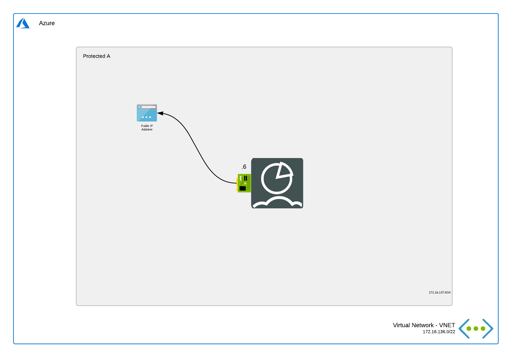

# FortiAnalyzer
*Terraform deployment template for Microsoft Azure*

## Introduction

This deployment is similar to the [FortiAnalyzer Single 1 NIC](../single-1nic/README.md) deployment but it doesn't deploy any public IP. This is useful for deploy behind a FortiGate.

## Design

In Microsoft Azure, this single FortiAnalyzer-VM setup a basic setup to start exploring the capabilities of the management platform for the FortiGate next generation firewall.

This Azure ARM template will automatically deploy a full working environment containing the following components.

- 1 FortiAnalyzer VM with a 1Tb data disk for log storage
- 1 VNETs containing a subnet for the FortiAnalyzer
- 1 Basic public IP

The VM will have the sixth IP in the network range as his static IP. You can adapt the 'sn1IPfg1' variable in the ARM template to change this.

This Azure ARM template can also be extended or customized based on your requirements. Additional subnets besides the ones mentioned above are not automatically generated.

## Deployment

For the deployment Terraform is required. This multi-cloud deployment tool can be downloaded from the website of [Hashicorp](https://www.terraform.io/) who created and maintains it. You can either run the different stage manually (terraform init, plan, apply). Additionally, a `deploy.sh` script is provided to facilitate the deployment. You'll be prompted to provide the 4 required variables:

- PREFIX : This prefix will be added to each of the resources created by the template for ease of use and visibility.
- LOCATION : This is the Azure region where the deployment will be deployed.
- USERNAME : The username used to login to the FortiGate GUI and SSH management UI.
- PASSWORD : The password used for the FortiGate GUI and SSH management UI.

### Azure CLI

To fast track the deployment, use the Azure Cloud Shell. The Azure Cloud Shell is an in-browser CLI that contains Terraform and other tools for deployment into Microsoft Azure. It is accessible via the Azure Portal or directly at [https://shell.azure.com/](https://shell.azure.com). You can copy and paste the below one-liner to get started with your deployment.

`cd ~/clouddrive/ && wget -qO- https://github.com/fortinet/azure-templates/archive/main.tar.gz | tar zxf - && cd ~/clouddrive/azure-templates-main/FortiAnalyzer/Terraform/single-1nic/ && ./deploy.sh`

After deployment, you will be shown the IP addresses of all deployed components. You can access using the private IP assigned to the FortiAnalyzer on port 443.

!!! Beware that the output directory, Terraform Plan file and Terraform State files contain deployment information such as password, usernames, IP addresses and others.

## Requirements and limitations

More documentation can be found [here](../../single-1nic/README.md).

## Support

Fortinet-provided scripts in this and other GitHub projects do not fall under the regular Fortinet technical support scope and are not supported by FortiCare Support Services.
For direct issues, please refer to the [Issues](https://github.com/fortinet/azure-templates/issues) tab of this GitHub project.

## License

[License](LICENSE) © Fortinet Technologies. All rights reserved.
