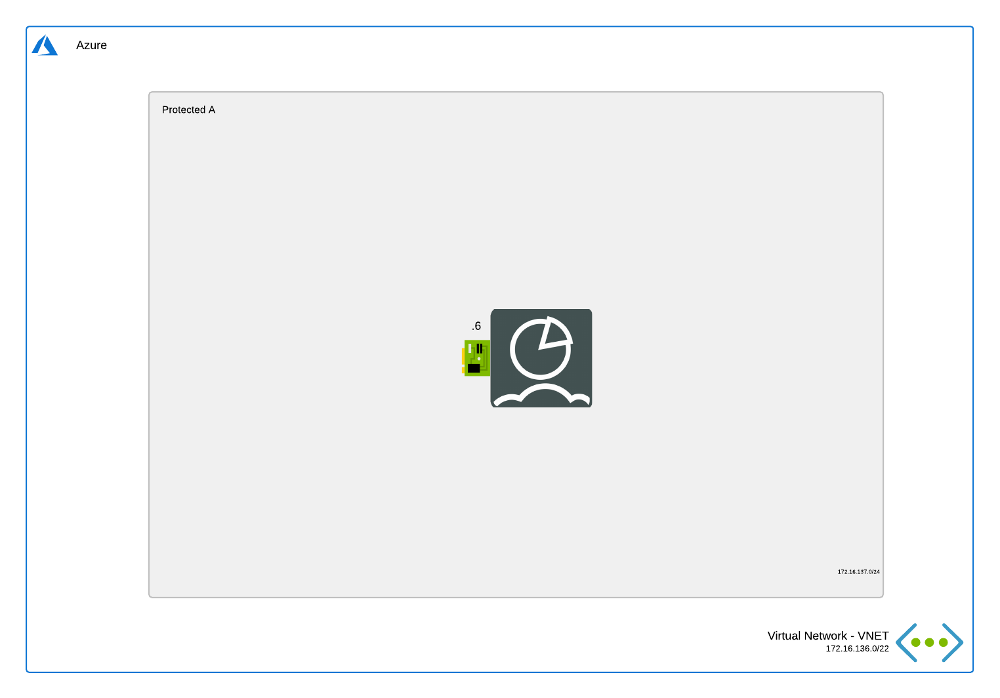

# FortiAnalyzer

## Introduction

This deployment is similar to the [FortiAnalyzer Single 1 NIC](../single-1nic/README.md) deployment but it doesn't deploy any public IP. This is useful for deployment behind a FortiGate.

## Design

In Microsoft Azure, this single FortiAnalyzer-VM setup a basic setup to start exploring the capabilities of the analytics platform for the different Fortinet solutions.

This Azure ARM template will automatically deploy a full working environment containing the following components.

- 1 FortiAnalyzer VM with a 1Tb data disk for log storage
- 1 VNETs containing a subnet for the FortiAnalyzer

This Azure ARM template can also be extended or customized based on your requirements. Additional subnets besides the ones mentioned above are not automatically generated.

## Deployment

For the deployment, you can use the Azure Portal, Azure CLI, Powershell or Azure Cloud Shell. The Azure ARM templates are exclusive to Microsoft Azure and can't be used in other cloud environments. The main template is the `azuredeploy.json` which you can use in the Azure Portal. A `deploy.sh` script is provided to facilitate the deployment. You'll be prompted to provide the 4 required variables:

- PREFIX : This prefix will be added to each of the resources created by the template for ease of use and visibility.
- LOCATION : This is the Azure region where the deployment will be deployed.
- USERNAME : The username used to login to the FortiAnalyzer GUI and SSH management UI.
- PASSWORD : The password used for the FortiAnalyzer GUI and SSH management UI.

### Azure Portal

### Azure CLI
To fast track the deployment, use the Azure Cloud Shell. The Azure Cloud Shell is an in-browser CLI that contains Terraform and other tools for deployment into Microsoft Azure. It is accessible via the Azure Portal or directly at [https://shell.azure.com/](https://shell.azure.com). You can copy and paste the below one-liner to get started with your deployment.

`cd ~/clouddrive/ && wget -qO- https://github.com/40net-cloud/fortinet-azure-solutions/archive/main.zip | jar x && cd ~/clouddrive/fortinet-azure-solutions-main/FortiAnalyzer/single-1nic-private/ && ./deploy.sh`

After deployment, you will be shown the IP addresses of all deployed components. This information is also stored in the output directory in the 'summary.out' file. You can access both management GUI's using the public management IP addresses using HTTPS on port 443.

## Requirements and limitations

More information can be found [here](../single-1nic/README.md).

## Support
Fortinet-provided scripts in this and other GitHub projects do not fall under the regular Fortinet technical support scope and are not supported by FortiCare Support Services.
For direct issues, please refer to the [Issues](https://github.com/40net-cloud/fortinet-azure-solutions/issues) tab of this GitHub project.

## License
[License](LICENSE) © Fortinet Technologies. All rights reserved.
