# FortiGate Next-Generation Firewall - A Single VM

:wave: - [Introduction](#introduction) - [Design](#design) - [Deployment](#deployment) - [Requirements](#requirements-and-limitations) - [Configuration](#configuration) - :wave:

## Introduction

More and more enterprises are turning to Microsoft Azure to extend or replace internal data centers and take advantage of the elasticity of the public cloud. While Azure secures the infrastructure, you are responsible for protecting the resources you put in it. As workloads are being moved from local data centers, connectivity and security are key elements to take into account. FortiGate-VM offers a consistent security posture and protects connectivity across public and private clouds, while high-speed VPN connections protect data.

This ARM template deploys a single FortiGate Next-Generation Firewall accompanied by the required infrastructure. Additionally, Fortinet Fabric Connectors deliver the ability to create dynamic security policies.

## Design

In Microsoft Azure, this single FortiGate-VM setup a basic setup to start exploring the capabilities of the next generation firewall. The central system will receive, using user-defined routing (UDR), all or specific traffic that needs inspection going to/coming from on-premises networks or the public internet.

This Azure ARM template will automatically deploy a full working environment containing the following components.

- 1 standalone FortiGate-VM
- 1 VNET containing a protected subnet
- 1 User Defined Routes (UDR) for the protected subnet


This Azure ARM template can also be extended or customized based on your requirements. Additional subnets besides the one mentioned above are not automatically generated. By extending the Azure ARM templates additional subnets can be added. Additional subnets can be added to an existing route table or may require their own routing tables.

## Deployment

For the deployment, you can use the Azure Portal, Azure CLI, Powershell or Azure Cloud Shell. The Azure ARM templates are exclusive to Microsoft Azure and can't be used in other cloud environments. The main template is the `azuredeploy.json` which you can use in the Azure Portal. A `deploy.sh` script is provided to facilitate the deployment. You'll be prompted to provide the 4 required variables:

- PREFIX : This prefix will be added to each of the resources created by the template for ease of use and visibility.
- LOCATION : This is the Azure region where the deployment will be deployed.
- USERNAME : The username used to login to the FortiGate-VM GUI and SSH management UI.
- PASSWORD : The password used for the FortiGate-VM GUI and SSH management UI.

### Azure Portal

Azure Portal Wizard:
[](https://portal.azure.com/#create/Microsoft.Template/uri/https%3A%2F%2Fraw.githubusercontent.com%2Ffortinet%2Fazure-templates%2Fmain%2FFortiGate%2FA-Single-VM%2Fazuredeploy.json/createUIDefinitionUri/https%3A%2F%2Fraw.githubusercontent.com%2Ffortinet%2Fazure-templates%2Fmain%2FFortiGate%2FA-Single-VM%2FcreateUiDefinition.json)

Custom Deployment:
[](https://portal.azure.com/#create/Microsoft.Template/uri/https%3A%2F%2Fraw.githubusercontent.com%2Ffortinet%2Fazure-templates%2Fmain%2FFortiGate%2FA-Single-VM%2Fazuredeploy.json)
[](http://armviz.io/#/?load=https%3A%2F%2Fraw.githubusercontent.com%2Ffortinet%2Fazure-templates$2Fmain%2FFortiGate%2FA-Single-VM%2Fazuredeploy.json)

### Azure CLI

To fast track the deployment, use the Azure Cloud Shell. The Azure Cloud Shell is an in-browser CLI that contains Terraform and other tools for deployment into Microsoft Azure. It is accessible via the Azure Portal or directly at [https://shell.azure.com/](https://shell.azure.com). You can copy and paste the below one-liner to get started with your deployment.

```
cd ~/clouddrive/ && wget -qO- https://github.com/fortinet/azure-templates/archive/main.tar.gz | \
tar zxf - && cd ~/clouddrive/azure-templates-main/FortiGate/A-Single-VM/ && ./deploy.sh
```


After deployment, you will be shown the IP addresses of all deployed components. This information is also stored in the output directory in the 'summary.out' file. You can access the management GUI using the public management IP address using HTTPS on port 443.

## Requirements and limitations

The ARM template deploys several resources and it is required to have the access rights and quota in your Microsoft Azure subscription to deploy the resources.

- By default the template will deploy Standard F2s VMs for this architecture. Other VM instances are supported as well, a minimum of 2 NICs is required. A list of supported Azure instance types can be found [here](https://docs.fortinet.com/document/fortigate-public-cloud/7.4.0/azure-administration-guide/562841/instance-type-support)
- Licenses for FortiGate-VM
  - BYOL: A demo license can be made available via your Fortinet partner or on our website. The license can be injected during deployment or added after deployment. Purchased licenses need to be registered on the [Fortinet support site](http://support.fortinet.com). Download the .lic file after registration. Note, these files may not work until 60 minutes after it's initial creation.
  - FLEX: A demo FortiFlex evaluation account can be made available via you Fortinet partner. The FortiFlex token can be injected during deployment or added after deployment.
  - PAYG or OnDemand: These licenses are automatically generated during the deployment of the FortiGate-VM systems.
  - The password provided during deployment must need password complexity rules from Microsoft Azure:
  - It must be 12 characters or longer
  - It needs to contain characters from at least 3 of the following groups: uppercase characters, lowercase characters, numbers, and special characters excluding '\' or '-'
- The terms for the FortiGate-VM PAYG or BYOL image in the Azure Marketplace needs to be accepted once before usage. This is done automatically during deployment via the Azure Portal. For the Azure CLI the commands below need to be run before the first deployment in a subscription.
  - BYOL/FLEX
`az vm image terms accept --publisher fortinet --offer fortinet_fortigate-vm_v5 --plan fortinet_fg-vm`
  - PAYG
`az vm image terms accept --publisher fortinet --offer fortinet_fortigate-vm_v5 --plan fortinet_fg-vm_payg_2023`

## Configuration

The FortiGate-VMs need a specific configuration to match the deployed environment. This configuration can be injected during provisioning or afterwards via the different options including GUI, CLI, FortiManager or REST API.

- [Fabric Connector](#fabric-connector)
- [VNET peering](#vnet-peering)
- [East-West connections](#east-west-connections)
- [Inbound connections](#inbound-connections)
- [Outbound connections](#outbound-connections)
- [Availability Zone](#availability-zone)
- [Default configuration using this template](#default-configuration)
- [Upload VHD](../Documentation/faq-upload-vhd.md)

### Fabric Connector

The FortiGate-VM uses [Managed Identities](https://docs.microsoft.com/en-us/azure/active-directory/managed-identities-azure-resources/) or [Service Principals](https://learn.microsoft.com/en-us/entra/identity-platform/app-objects-and-service-principals) for the SDN Fabric Connector. A SDN Fabric Connector is created automatically during deployment. After deployment, it is required to apply the 'Reader' role to the Azure Subscription you want to resolve Azure Resources from. More information can be found in the Fortinet Documentation

- [Managed Identity](https://docs.fortinet.com/document/fortigate-public-cloud/7.6.0/azure-administration-guide/236610/configuring-an-sdn-connector-using-a-managed-identity)
- [Service Principal](https://docs.fortinet.com/document/fortigate-public-cloud/7.6.0/azure-administration-guide/948968/azure-sdn-connector-service-principal-configuration-requirements)

### VNET peering

In Microsoft Azure, this central security services hub is commonly implemented using VNET peering. The central security services hub component will receive, using user-defined routing (UDR), all or specific traffic that needs inspection going to/coming from on-premises networks or the public internet. This deployment can be used as the hub section of such a [Hub-Spoke network topology](https://learn.microsoft.com/en-us/azure/architecture/networking/architecture/hub-spoke?tabs=cli#communication-through-an-nva)

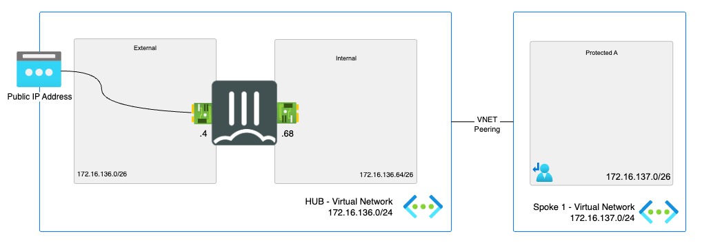

### East-West connections

#### Introduction - East-West connections

East-West connections are considered the connections between internal subnets within the VNET or peered VNETs. The goal is to direct this traffic via the FortiGate-VM.

To direct traffic to the FortiGate-VM, routing needs to be adapted on Microsoft Azure using User Defined Routing (UDR). With UDRs the routing in Azure can be adapted to send traffic destined for a specific network IP range to a specific destination such as Internet, VPN Gateway, Virtual Network (VNET), ... In order for the FortiGate-VM to become the destination there is a specific destination called Virtual Appliance. The private IP of the FortiGate-VM is provided. More information about User Defined Routing can be found [here](https://docs.microsoft.com/en-us/azure/virtual-network/virtual-networks-udr-overview)

#### East-West Flow

In the diagram the different steps to establish a session are layed out. This flow is based on the configuration as deployed in this template.

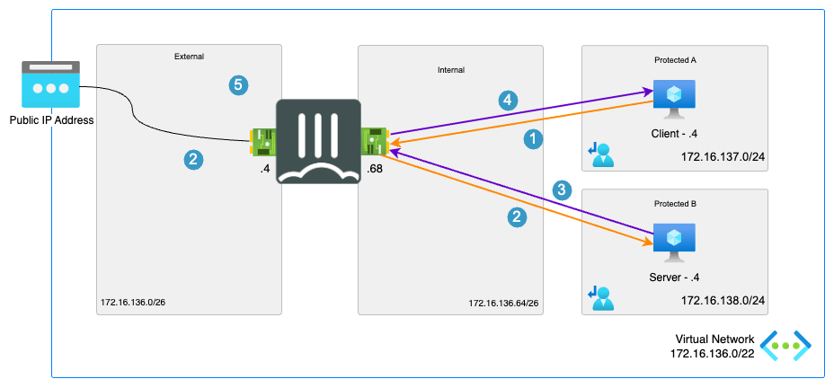

1. Connection from client to the private IP of server. Azure routes the traffic using UDR to the internal network interface - s: 172.16.137.4 - d: 172.16.138.4
2. FortiGate-VM inspects the packet and when allowed sends the packet to the server - s: 172.16.137.4 - d: 172.16.138.4
3. The server responds to the request, th Azure fabric sends the packet for inspection to the FortiGate-VM internal network interface using UDR - s: 172.16.137.4 - d: 172.16.138.4
4. The FortiGate-VM accepts the return packet after inspection and sends it to the client - s: 172.16.137.4 - d: 172.16.138.4

#### East-West Configuration

To configure the east-west connectivity to a service there are 2 resources that need to be verified/configured:

- FortiGate-VM
- Azure user defined routing

The drawing in the [flow](#east-west-flow) section is used in the configuration screenshots.

##### Azure User Defined Routing

<p align="center">
  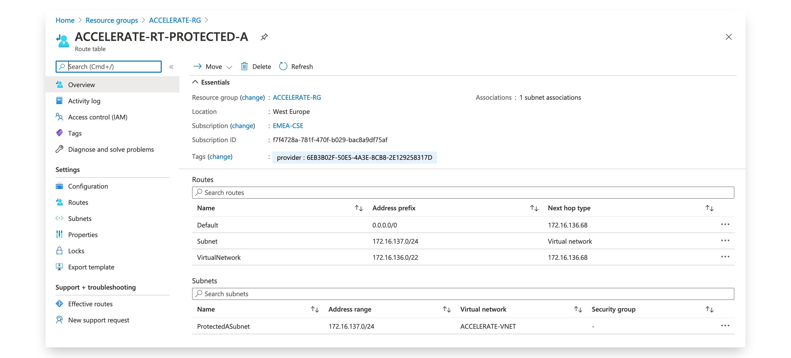
</p>

<p align="center">
  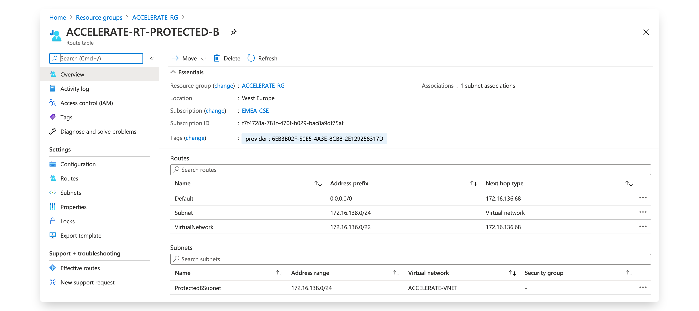
</p>

<p align="center">
  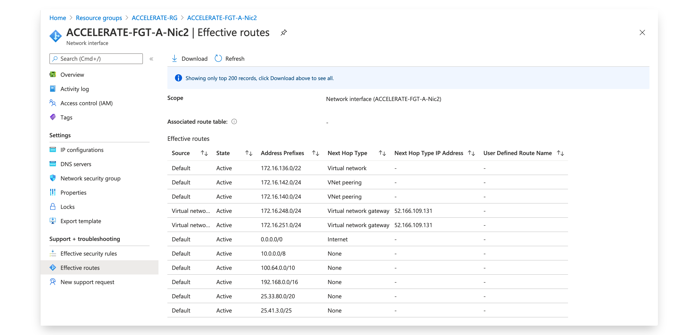
</p>

##### FortiGate

On the FortiGate-VM, a firewall policy rule needs to be created to allow traffic from specific IP ranges going in and out of the same internal interface (port2). It is also possible to use dynamic addresses using the SDN Connector to have more dynamic firewall policies.

### Inbound Connections

#### Introduction - Inbound Connections

Inbound connections are considered the connections coming from the internet towards the public IP address to publish services like a webserver or other, hosted in the VNET or peered VNETs.

This template will use the Standard SKU public IPs. The standard public IP by default is a static allocation. More information can be found [in the Microsoft documentation](https://docs.microsoft.com/en-us/azure/virtual-network/public-ip-addresses).

#### Inbound Flow

In the diagram the different steps to establish a session are layed out. This flow is based on the configuration as deployed in this template.

<p align="center">
  
</p>

1. Connection from client to the public IP attached to a private IP on the FortiGate-VM - s: w.x.y.z - d: a.b.c.d
2. The Azure Fabric will translate (DNAT) from the public IP to the private IP attached to the FortiGate-VM - s: w.x.y.z - d: 172.16.136.4
3. FortiGate-VM VIP linked to the private IP picks up the packet, translates (DNAT) the packet destined for the private IP on the FortiGate-VM. - s: w.x.y.z - d: 172.16.137.4
4. Server responds to the request and the Azure Fabric using UDR will route the packet to the internal interface of the FortiGate-VM - s: 172.16.137.4 - d: w.x.y.z
5. FortiGate-VM receives the packet and translates the source to the FortiGate-VM VIP on the external interface - s: 172.16.136.4 - d: w.x.y.z
6. Azure Fabric translates (SNAT) the packet using the public IP to return to the client - s: a.b.c.d - d: w.x.y.z

#### Inbound Configuration

To configure the inbound connectivity to a service via the FortiGate-VM, configuration needs to happen on the Azure and FortiGate-VM level:

- Azure user-defined route (UDR)
- Azure network security group (NSG)
- FortiGate-VM

The drawing in the [flow](#inbound-flow) section is used in the configuration screenshots.

##### Azure user-defined route (UDR) - Inbound

The user-defined route (UDR) is required to route return traffic back from the internal server to the FortiGate-VM. If the UDR is not configured, one needs to SNAT the inbound packet behind the FortiGate-VM internal interface to ensure the return packet send back via the FortiGate-VM.

It is possible to create more specific routes instead of the general 0.0.0.0/0 route if only specific traffic needs to pass through the FortiGate-VM.

<p align="center">
  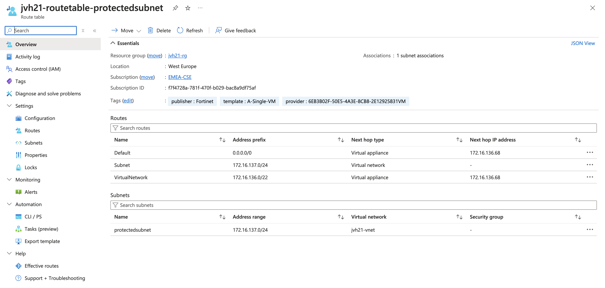
</p>

The route needed to route internet traffic back to the FortiGate-VM contains the following values and is attached to one or more protected subnets:

``` text
Name: Default
Address Prefix: 0.0.0.0/0
Next hop type: Virtual Appliance
Next hop IP address: 172.16.136.68
```

The additional routes on the screenshot will provide additional functionality. The 'Subnet' route will ensure virtual machines can talk to each other without being send to the FortiGate-VM. The 'VirtualNetwork' route will send traffic for all the subnets in the VNET to the FortiGate-VM for inspection.

It is recommended to deploy servers in different subnets behind the FortiGate-VM or in peered VNETs/subnets, these networks are indicated in documentation as protected subnets. It is not recommended to deploy virtual machines whose traffic needs to pass through the FortiGate-VM to be deployed in the same network as an interface of the FortiGate-VM (external or internal). This will cause routing loops when traffic needs to be routed between a protected subnet virtual machine and a internal subnet virtual machine via the FortiGate-VM.

##### Azure network security group (NSG) - Inbound

The default deployment of the FortiGate-VM deploys a network security group (NSG) on the network interfaces. This NSG ensures that all traffic is allowed and that inbound traffic is allowed when using Standard SKU public IP addresses.

<p align="center">
  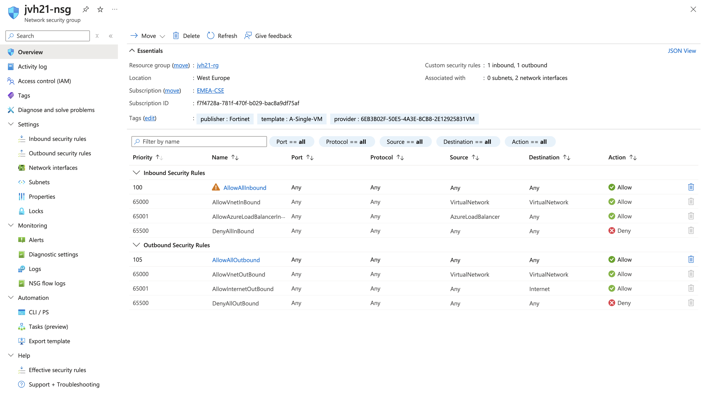
</p>

If any additional NSGs are configured, they need to allow traffic to and from the FortiGate-VM for this specific traffic.

##### FortiGate-VM

On the Azure level, the FortiGate-VM needs to have a Standard SKU public IP address connected to a private IP address. Up to 255 additional public IP addresses can be attached as secondary public IP addresses.

<p align="center">
  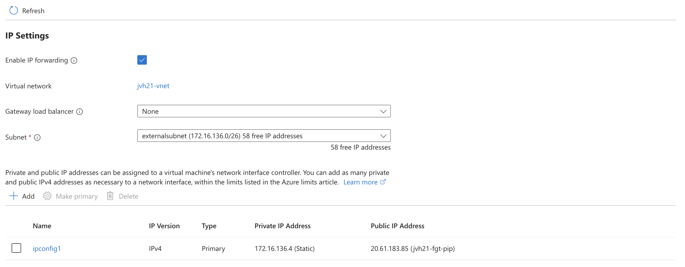
</p>

On the FortiGate-VM, the first task is to create a virtual IP. Be aware that the primary IP is also used for management of the FortiGate and some ports are reserved.

<p align="center">
  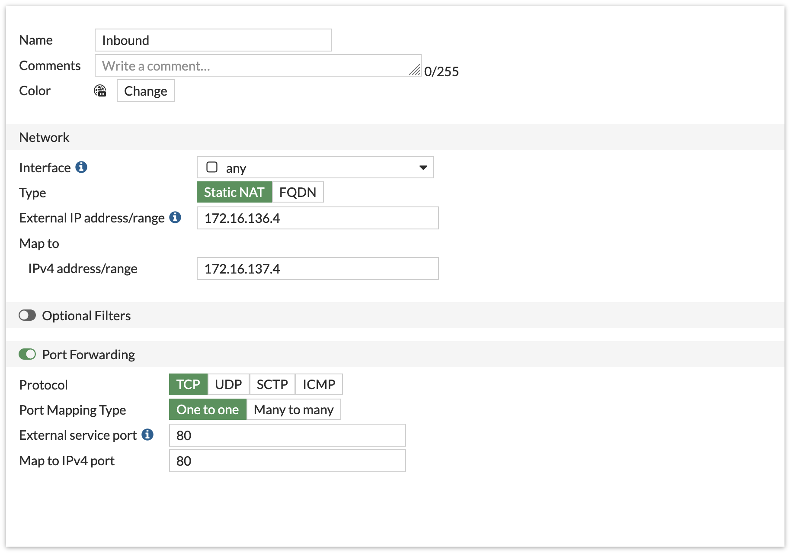
</p>

Once the virtual IP is configured, a firewall policy needs to be created based on the virtual IP. It is possible to have a different port on the outside map to the port running on the server internally, resulting in port address translation (PAT)

<p align="center">
  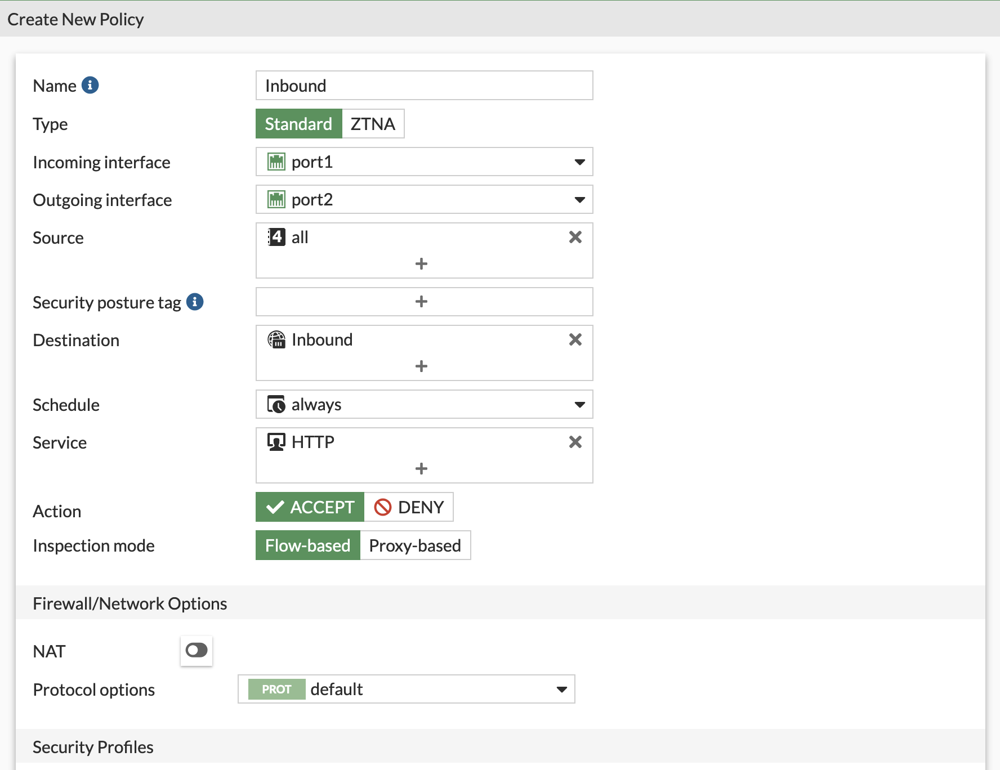
</p>

### Outbound Connections

#### Introduction Outbound Connections

Outbound connections are considered the connections coming from the internal subnets within the VNET or peered VNETs via the FortiGate-VM towards the internet.

To direct traffic to the FortiGate-VM routing needs to be adapted on Microsoft Azure using User Defined Routing (UDR). With UDRs the routing in Azure can be adapted to send traffic destined for a specific network IP range to a specific destination such as Internet, VPN Gateway, Virtual Network (VNET), ... In order for the FortiGate-VM to become the destination there is a specific destination called Virtual Appliance. The private IP of the FortiGate-VM is provided. More information about User Defined Routing can be found [here](https://docs.microsoft.com/en-us/azure/virtual-network/virtual-networks-udr-overview)

Which public IP is used for the outbound connections depends on the configuration and layout of your deployed setup. There are 3 options

- Public IP directly connected to a primary or secondary private IP on the NIC of the FortiGate-VM
- NAT Gateway attached to the subnet of the external NIC of the FortiGate-VM

NAT Gateway takes precedence over a public IP directly connected to a NIC as second which takes precedence over an external Azure Load Balancer with or without outbound rules. More information can be found on the links below:

- [Default outbound access in Azure](https://learn.microsoft.com/en-us/azure/virtual-network/ip-services/default-outbound-access)
- [Use Source Network Address Translation (SNAT) for outbound connections](https://learn.microsoft.com/en-us/azure/load-balancer/load-balancer-outbound-connections)
- [Outbound connectivity with a NAT Gateway](https://learn.microsoft.com/en-us/azure/nat-gateway/faq#how-can-i-use-a-nat-gateway-to-connect-outbound-in-a-setup-where-i-m-currently-using-a-different-service-for-outbound)
- [Quickstart: Create a public load balancer to load balance VMs using the Azure portal](https://learn.microsoft.com/en-us/azure/load-balancer/quickstart-load-balancer-standard-public-portal)

#### Outbound Flow

In the diagram the different steps to establish a session are layed out.

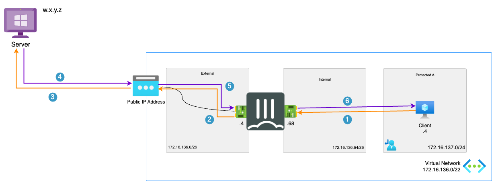

1. Connection from client to the public IP of the server. Azure routes the traffic using UDR to the internal network interface of the FortiGate-VM. - s: 172.16.137.4 - d: w.x.y.z
2. The FortiGate-VM inspects the packet and when allowed sends the packet translated to it's external port private IP outbound. - s: 172.16.136.4 - d: a.b.c.d
3. The Azure Fabric will translate the source private IP to the linked public IP - s: a.b.c.d - d: w.x.y.z
4. The server responds to the request - s: w.x.y.z - d: a.b.c.d
5. The Azure Fabric translates the destination public IP to the linked private IP - s: w.x.y.z - d: 172.16.136.4
6. The FortiGate-VM accepts the return packet after inspection. FortiGate-VM translates and routes the packet to the client - s: w.x.y.z - d: 172.16.137.4

#### Outbound Configuration

To configure the outbound connectivity via the FortiGate-VM, configuration needs to happen on the Azure and FortiGate-VM level:

- Azure user-defined route (UDR)
- Azure network security group (NSG)
- FortiGate-VM

The drawing in the [flow](#outbound-flow) section is used in the configuration screenshots.

##### Azure user-defined route (UDR) - Outbound

The user-defined route (UDR) is required to route outbound traffic from the internal client via the FortiGate-VM. The UDR is the same as the one required for the inbound return traffic.

It is possible to create more specific routes instead of the general 0.0.0.0/0 route if only specific traffic needs to pass through the FortiGate-VM.

<p align="center">
  
</p>

The route needed to route internet traffic to the FortiGate-VM contains the following values and attached to one or more protected subnets:

``` text
Name: Default
Address Prefix: 0.0.0.0/0
Next hop type: Virtual Appliance
Next hop IP address: 172.16.136.68
```

##### Azure network security group (NSG) - Outbound

The default deployment of the FortiGate-VM deploys a network security group (NSG) on the network interfaces. This NSG ensure that all traffic is allowed and that inbound traffic is allowed when using Standard SKU public IP addresses.

<p align="center">
  
</p>

If any additional NSGs are configured, they need to allow traffic to and from the FortiGate-VM for this specific traffic.

##### FortiGate-VM

On the FortiGate-VM, a firewall policy needs to be created to allow traffic from the port2 (internal) side to the port1 (external) side. NAT is enabled to NAT behind the primary interface private IP address. Alternatively, it is also possible to NAT behind secondary private IP address in case they have a public IP address attached to it.

<p align="center">
  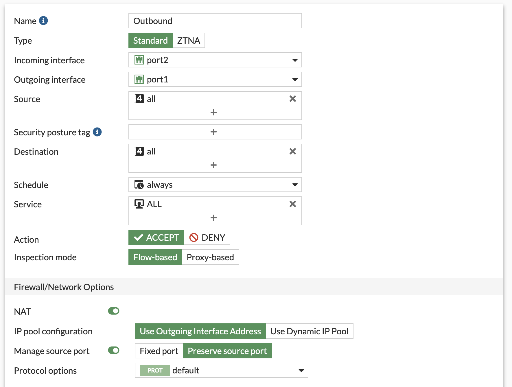
</p>

### Availability Zone

Each of the architecture options listed in the design section will have the possibility to enable Availability Zones.

Microsoft defines an Availability Zone to have the following properties:

- Unique physical location with an Azure Region
- Each zone is made up of one or more datacenter(s)
- Independent power, cooling and networking
- Inter Availability Zone network latency < 2ms (radius of +/- 100km)
- Fault-tolerant to protect from datacenter failure

Based on information in the presentation ['Inside Azure datacenter architecture with Mark Russinovich' at Microsoft Ignite 2019](https://www.youtube.com/watch?v=X-0V6bYfTpA)

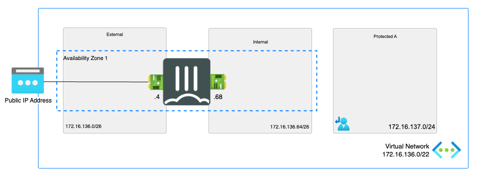

### Default Configuration

After deployment, the below configuration has been automatically injected during the deployment. The bold sections are the default values. If parameters have been changed during deployment these values will be different.

#### FortiGate-VM - base configuration

<pre><code>
config system sdn-connector
  edit AzureSDN
    set type azure
  next
end
config router static
  edit 1
    set gateway <b>172.16.136.1</b>
    set device port1
  next
  edit 2
    set dst <b>172.16.136.0/22</b>
    set device port2
    set gateway <b>172.16.136.65</b>
  next
end
config system interface
  edit port1
    set mode static
    set ip <b>172.16.136.5/26</b>
    set description external
    set allowaccess ping ssh https
  next
  edit port2
    set mode static
    set ip <b>172.16.136.69/24</b>
    set description internal
    set allowaccess ping ssh https
  next
end
</code></pre>

## Support

Fortinet-provided scripts in this and other GitHub projects do not fall under the regular Fortinet technical support scope and are not supported by FortiCare Support Services.
For direct issues, please refer to the [Issues](https://github.com/fortinet/azure-templates/issues) tab of this GitHub project.

## License

[License](/../../blob/main/LICENSE) © Fortinet Technologies. All rights reserved.
