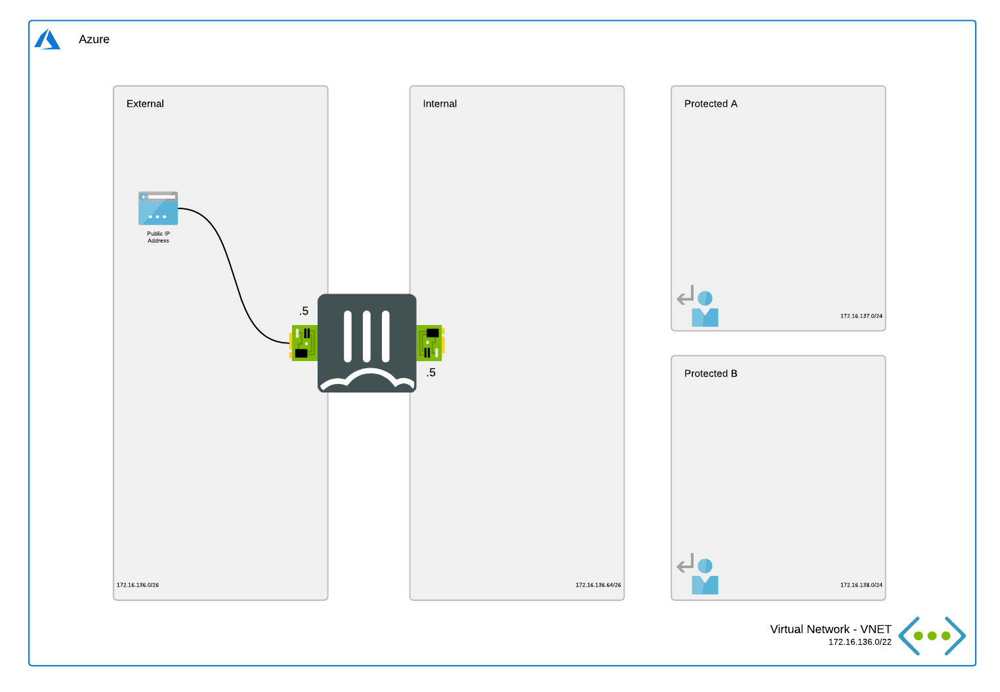
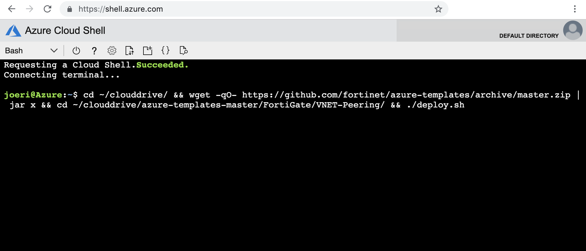

# FortiGate Next-Generation Firewall - A Single VM

## Introduction

More and more enterprises are turning to Microsoft Azure to extend or replace internal data centers and take advantage of the elasticity of the public cloud. While Azure secures the infrastructure, you are responsible for protecting the resources you put in it. As workloads are being moved from local data centers connectivity and security are key elements to take into account. FortiGate-VM offers a consistent security posture and protects connectivity across public and private clouds, while high-speed VPN connections protect data.

This ARM template deploys a single FortiGate Next-Generation Firewall accompanied by the required infrastructure. Additionally, Fortinet Fabric Connectors deliver the ability to create dynamic security policies.

## Design

In Microsoft Azure, this single FortiGate-VM setup a basic setup to start exploring the capabilities of the next generation firewall. The central system will receive, using user-defined routing (UDR), all or specific traffic that needs inspection going to/coming from on-prem networks or the public internet.

This Azure ARM template will automatically deploy a full working environment containing the following components.

- 1 FortiGate firewalls in an active/passive deployment
- 1 VNETs containing a protected subnet
- User Defined Routes (UDR) for the protected subnets

This Azure ARM template can also be extended or customized based on your requirements. Additional subnets besides the ones mentioned above are not automatically generated. By extending the Azure ARM templates additional subnets can be added. Additional subnets will require their own routing tables.

## Deployment

For the deployment, you can use the Azure Portal, Azure CLI, Powershell or Azure Cloud Shell. The Azure ARM templates are exclusive to Microsoft Azure and can't be used in other cloud environments. The main template is the `azuredeploy.json` which you can use in the Azure Portal. A `deploy.sh` script is provided to facilitate the deployment. You'll be prompted to provide the 4 required variables:

- PREFIX : This prefix will be added to each of the resources created by the template for ease of use and visibility.
- LOCATION : This is the Azure region where the deployment will be deployed.
- USERNAME : The username used to login to the FortiGate GUI and SSH management UI.
- PASSWORD : The password used for the FortiGate GUI and SSH management UI.

### Azure Portal

### Azure CLI
To fast track the deployment, use the Azure Cloud Shell. The Azure Cloud Shell is an in-browser CLI that contains Terraform and other tools for deployment into Microsoft Azure. It is accessible via the Azure Portal or directly at [https://shell.azure.com/](https://shell.azure.com). You can copy and paste the below one-liner to get started with your deployment.

`cd ~/clouddrive/ && wget -qO- https://github.com/fortinet/azure-templates/archive/main.tar.gz | tar zxf - && cd ~/clouddrive/azure-templates-main/FortiGate/A-Single-VM/ && ./deploy.sh`

After deployment, you will be shown the IP addresses of all deployed components. This information is also stored in the output directory in the 'summary.out' file. You can access both management GUI's using the public management IP addresses using HTTPS on port 443.

## Requirements and limitations

The ARM template deploys different resources and it is required to have the access rights and quota in your Microsoft Azure subscription to deploy the resources.

- The template will deploy Standard F2s VMs for this architecture. Other VM instances are supported as well with a minimum of 2 NICs. A list can be found [here](https://docs.fortinet.com/document/fortigate/6.4.0/azure-cookbook/562841/instance-type-support)
- Licenses for Fortigate
  - BYOL: A demo license can be made available via your Fortinet partner or on our website. These can be injected during deployment or added after deployment. Purchased licenses need to be registered on the [Fortinet support site](http://support.fortinet.com). Download the .lic file after registration. Note, these files may not work until 30 minutes after it's initial creation.
  - PAYG or OnDemand: These licenses are automatically generated during the deployment of the FortiGate systems.
- The password provided during deployment must need password complexity rules from Microsoft Azure:
  - It must be 12 characters or longer
  - It needs to contain characters from at least 3 of the following groups: uppercase characters, lowercase characters, numbers, and special characters excluding '\' or '-'
- The terms for the FortiGate PAYG or BYOL image in the Azure Marketplace needs to be accepted once before usage. This is done automatically during deployment via the Azure Portal. For the Azure CLI the commands below need to be run before the first deployment in a subscription.
  - BYOL
`az vm image accept-terms --publisher fortinet --offer fortinet_fortigate-vm_v5 --plan fortinet_fg-vm`
  - PAYG
`az vm image accept-terms --publisher fortinet --offer fortinet_fortigate-vm_v5 --plan fortinet_fg-vm_payg_20190624`

## FortiGate configuration

The FortiGate VMs need a specific configuration to match the deployed environment. This configuration can be injected during provisioning or afterwards via the different options including GUI, CLI, FortiManager or REST API.

- [Default configuration using this template](doc/config-provisioning.md)

### Fabric Connector

The FortiGate-VM uses [Managed Identities](https://docs.microsoft.com/en-us/azure/active-directory/managed-identities-azure-resources/) for the SDN Fabric Connector. A SDN Fabric Connector is created automatically during deployment. After deployment, it is required apply the 'Reader' role to the Azure Subscription you want to resolve Azure Resources from. More information can be found on the [Fortinet Documentation Libary](https://docs.fortinet.com/vm/azure/fortigate/7.0/azure-administration-guide/7.0.0/236610/creating-a-fabric-connector-using-a-managed-identity).

## Support

Fortinet-provided scripts in this and other GitHub projects do not fall under the regular Fortinet technical support scope and are not supported by FortiCare Support Services.
For direct issues, please refer to the [Issues](https://github.com/fortinet/azure-templates/issues) tab of this GitHub project.

## License

[License](LICENSE) © Fortinet Technologies. All rights reserved.
