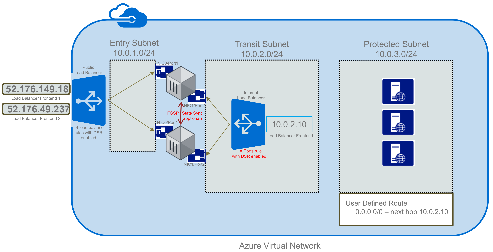
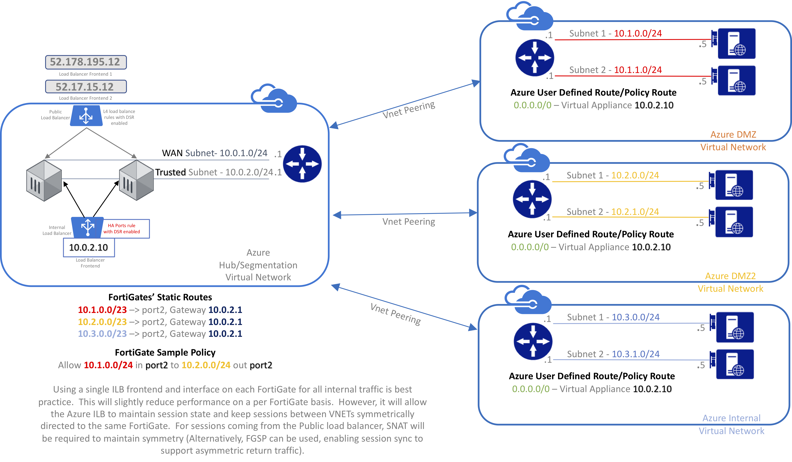

## Active/Active loadbalanced pair of standalone FortiGates for resilience and scale
The following resources are defined:
- vnet with three subnets
                or allows an existing vnet of your selection.  If using an existing vnet, it must already have 3 subnets.

- Two standard load balancers - one public and one internal
                The internal load balancer has an HA Ports rule enabled to forward all traffic to the FortiGates' internal NICs
                The public load balancer has admin ports (22 & 443) configured to forward individually to each FortiGate as "NAT Rules"
                The public load balancer also has sample port 80 load balancer rules and a udp rule on port 10551.  At least one tcp and one udp rule must be enabled to allow outbound SNAT (https://docs.microsoft.com/en-us/azure/load-balancer/load-balancer-outbound-connections#preallocatedports)

- Two public IPs connected as frontends to an Azure public load balancer.

- Two FortiGates

The deployed template will look like the following diagram:
---

---

Although a "Protected Subnet" is created within the VNET for testing and example purposes, recommended best practice would be to use peered VNETs rather than internal subnets.  Each peered VNET can easily be protected from other peered VNETs to provide isolation without the need for distributed and potentially confusing NSGs.  Further, this model provides best practice for Azure routing.  Each Peered VNET can be treated as a stub network, and thus only a default route (0.0.0.0/0) will be needed for the Azure UDR assigned to the subnets within the peered (aka Spoke) subnets.  Note: Azure now has an option to disable BGP route replication as part of UDR configuration.  This will remove any BGP routes which may be coming in via ExpressRoute or Azure VPN Gateways.

A best practice full deployment will look like the following diagram:
---

---

### In order to configure FortiGates:

    FortiGate-A:
    Connect via https to public IP1 or private IP if already connected to the vnet via ExpressRoute or Azure VPN (both of these IPs can be obtained from the portal)
    Connect via SSH on port 22 to public IP1 to directly access the CLI
    FortiGate-B:
    Connect via https to public IP2 or private IP if already connected to the vnet via ExpressRoute or Azure VPN (both of these IPs can be obtained from the portal)
    Connect via SSH on port 22 to public IP2 to directly access the CLI

The Azure Load Balancer only has management ports configured in the NAT rules.  For highly available access through the FortiGates, it's recommended that you use additional frontends and public IPs with floating IP load balance rules (two samples are configured on port 80).  Then, you can configure Virtual IPs on the FortiGate to match the associated public IP.

When configuring the policies on the FortiGates to allow and forward traffic to internal hosts, it is recommended that you enable the NAT checkbox (this will S-NAT the packets to the IP of port2).  Doing so will enforce symmetric return.  It is possible to use FGSP  to synchronize sessions and thereby allow assymetric return traffic. However this is not best practice from a security perspective, because it limits the ability of IPS by potentially only seeing one side of the conversation on each FGT.  One advantage the FortiGate has over competing products is that it does take into consideration both sides of the conversation for IPS.  So, reducing visibility in this regard may decrease IPS efficacy to similar levels with competing products.  Often S-NAT is not desired because it's necessary to retain the original source IP.  If that's the case, and your concerned about HTTP or HTTPS traffic in particular, you can enable the Load Balancing feature on the FortiGate which gives you the option to copy the source IP into the X-Forwarded-For header (See https://docs.fortinet.com/uploaded/files/3637/fortigate-load-balancing-56.pdf)

If you do prefer to use FGSP for session synchronization.  Here's the recommended configuration:

    config system ha
        set session-pickup enable
        set session-pickup-connectionless enable
        set session-pickup-nat enable
        set session-pickup-expectation enable
        set override disable
    end

    config system cluster-sync
        edit 0
            set peerip 10.0.1.x
            set syncvd "root"
        next
    end

*Where x in 10.0.1.x is the IP of port1 of the opposite FortiGate

#### Routing Configuration

On the FortiGate, you will need to create a route to 168.63.129.16/32 out port2 with a gateway of the first IP of the transit subnet (in the diagram example 10.0.2.1).  This will allow port2 to respond to probe requests from the internal load balancer probe.  Note: You will also need to enable SSH on port2 since the probe is set to test TCP connection on port 22.

In addition, you will need to add routes on the FortiGate to any "internal" subnets and VNETs, with the same gateway address as above.

Here's the example routing table configuration:

    config router static
        edit 1
            set dst 168.63.129.16 255.255.255.255
            set gateway 10.0.2.1
            set device "port2"
        next
        edit 2
            set dst 10.0.3.0 255.255.255.0
            set gateway 10.0.2.1
            set device "port2"
        next
    end

