# Active/Active loadbalanced pair of standalone FortiGates for resilience and scale

:wave: - [Introduction](#introduction) - [Design](#design) - [Deployment](#deployment) - [Requirements](#requirements-and-limitations) - [Configuration](#configuration) - :wave:

## Introduction

More and more enterprises are turning to Microsoft Azure to extend or replace internal data centers and take advantage of the elasticity of the public cloud. While Azure secures the infrastructure, you are responsible for protecting the resources you put in it. As workloads are being moved from local data centers connectivity and security are key elements to take into account. FortiGate-VM offers a consistent security posture and protects connectivity across public and private clouds, while high-speed VPN connections protect data.

This Azure ARM template deploys up to 8 FortiGate VM instances, all active combined different load balancing, public IP and/or gateway options. Additionally, Fortinet Fabric Connectors deliver the ability to create dynamic security policies.

## Design

In Microsoft Azure, you can deploy op to 8 FortiGate VM instances, all active that communicate with each other and the Azure fabric. This FortiGate setup will receive the to be inspected traffic using user defined routing (UDR) and public IPs. You can send all or specific traffic that needs inspection, going to/coming from on-prem networks or public internet by adapting the UDR routing. Depending on the options selected you will have one of the following architectures deployed:

1. [External and internal Azure Standard Load Balancer](#external-and-internal-azure-standard-load-balancer)
2. [Internal Azure Standard Load Balancer only](#internal-azure-standard-load-balancer-only)
3. [External public IP per instance and a internal Azure Standard Load Balancer](#external-public-ip-per-instance-and-a-internal-azure-standard-load-balancer)
4. [External and internal Azure Standard Load Balancer and a public IP per instance](#external-and-internal-azure-standard-load-balancer-and-a-public-ip-per-instance) 
5. [Internal Azure Standard Load Balancer and an Azure NAT Gateway for outbound connections](#internal-azure-standard-load-balancer-and-an-azure-nat-gateway-for-outbound-connections)
6. [External and internal Azure Standard Load Balancer combined with an Azure NAT Gateway for outbound connections](#external-and-internal-azure-standard-load-balancer-and-an-azure-nat-gateway-for-outbound-connections)

This Azure ARM template will automatically deploy a full working environment containing the the following components.

- 2 or more FortiGate firewalls in an active/active deployment
- (Optional) 1 external Azure Standard Load Balancer for communication with internet
- (Optional) 1 or more public IP for services and FortiGate management
- (Optional) 1 Azure NAT Gateway for outbound communication
- 1 internal Azure Standard Load Balancer to receive all internal traffic and forwarding towards Azure Gateways connecting ExpressRoute or Azure VPNs.
- 1 VNET with an external and internal subnet (can be an existing VNET)
- An example User Defined Route table (UDR) for the protected or spoke subnets

The protected or spoke subnets are example subnets to be used to deploy your servers into. It is not recomended to deploy the services directly in the internal subnet where the FortiGate VM is also deployed. An example UDR routing table is created but not attached to a protected or spoke subnet.

### External and internal Azure Standard Load Balancer

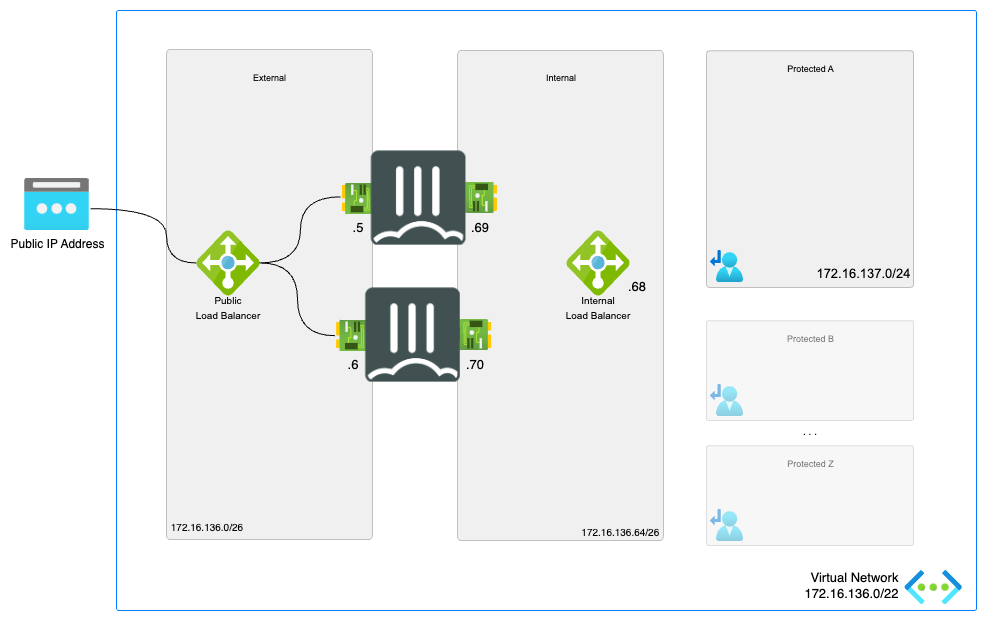

To enhance the availability of the solution VM can be installed in different Availability Zones instead of an Availability Set. If Availability Zones deployment is selected but the location does not support Availability Zones an Availability Set will be deployed. If Availability Zones deployment is selected and Availability Zones are available in the location, FortiGate A will be placed in Zone 1, FortiGate B will be placed in Zone 2.


### Internal Azure Standard Load Balancer only

It is possible with the template to not deploy the public IP and the external load balancer. This results in a setup used for east-west inspection of the traffic. For validation of the licenses and updates to the FortiGate a route towards internet needs to exist using one of the following options: public IP on each FortiGate, Azure NAT Gateway, forced tunneling via a VPN gateway or Azure ExpressRoute or a different FortiGate deployment. The external subnet needs to be referenced and created during deployment. No FortiGate will be deployed in this external subnet however.

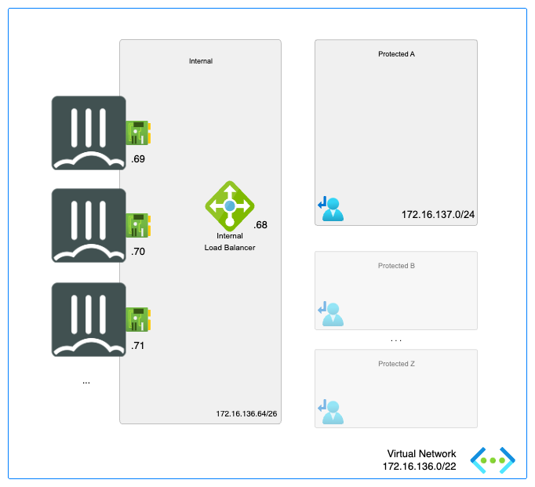

### External public IP per instance and a internal Azure Standard Load Balancer

This design can be a use case where the public IP per instance is used for management of the FortiGate VMs or for the Azure SDN connector outbound connections to Azure. Alternatively, the public IPs can be used for outbound connections.

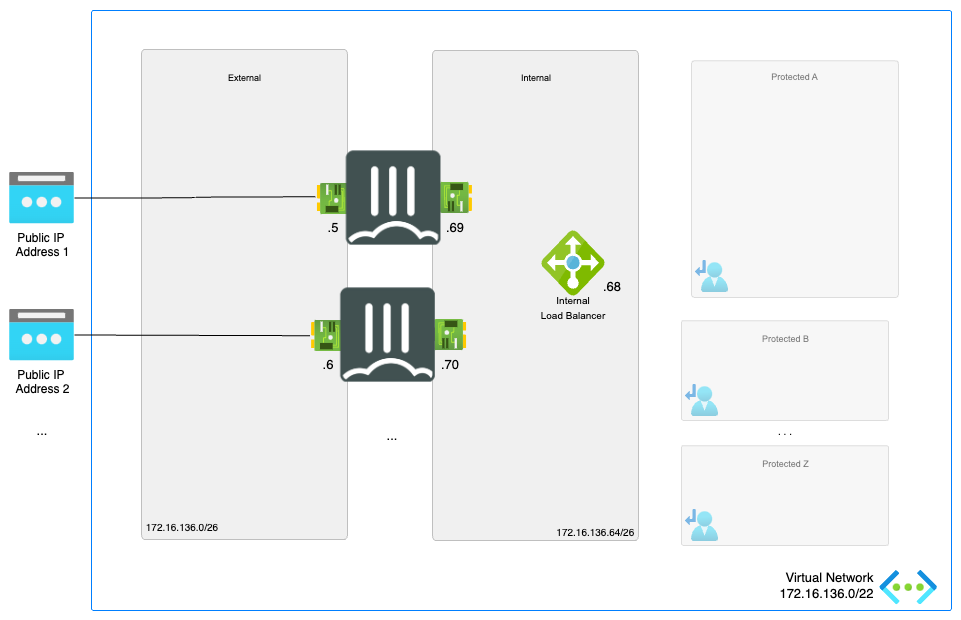

### External and internal Azure Standard Load Balancer and a public IP per instance 

It is also possible to combine the External Load Balancer with the public IPs per instance. This allows the ingress flow to be different than the egress flow.

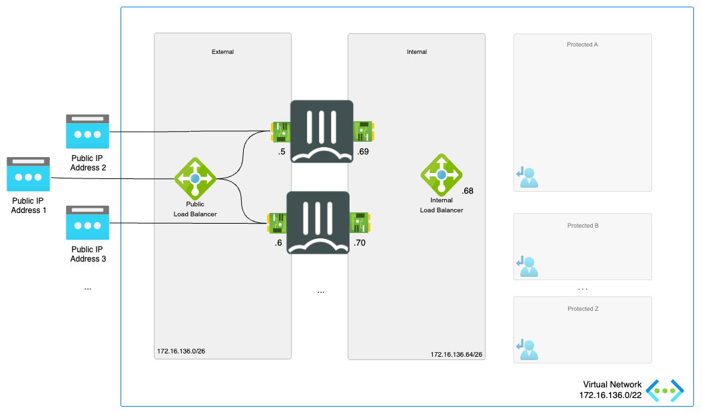

### Internal Azure Standard Load Balancer and an Azure NAT Gateway for outbound connections

Instead of an Azure External Load Balancer it is also possible to use an Azure NAT Gateway for all your outbound connections. No inbound connections are available in this design.

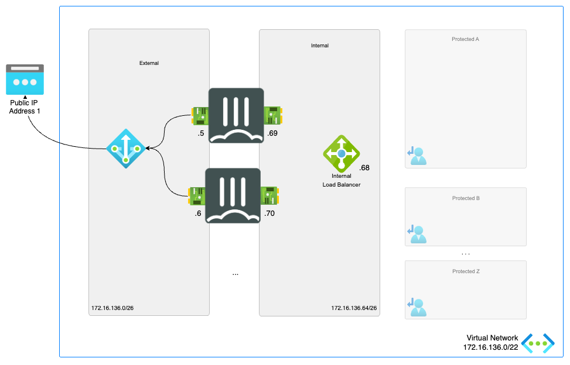

### External and internal Azure Standard Load Balancer and an Azure NAT Gateway for outbound connections

For inbound the external Azure Standard Load Balancer can be used and combined with an Azure NAT Gateway for all your outbound connections.

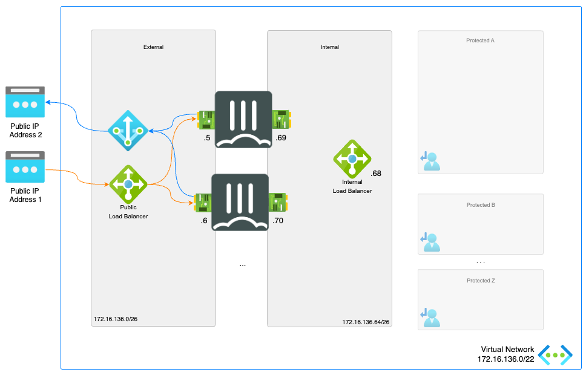

This ARM template can also be used to extend or customized based on your requirements. Additional subnets besides the one's mentioned above are not automatically generated. By adapting the ARM templates you can add additional subnets which prefereably require their own routing tables.

## Deployment

The FortiGate solution can be deployed using the Azure Portal or Azure CLI. There are 4 variables needed to complete kickstart the deployment. The deploy.sh script will ask them automatically. When you deploy the ARM template the Azure Portal will request the variables as a requirement.

- PREFIX : This prefix will be added to each of the resources created by the templates for easy of use, manageability and visibility.
- LOCATION : This is the Azure region where the deployment will be deployed
- USERNAME : The username used to login to the FortiGate GUI and SSH mangement UI.
- PASSWORD : The password used for the FortiGate GUI and SSH management UI.

### Azure Portal

Azure Portal Wizard:
[](https://portal.azure.com/#create/Microsoft.Template/uri/https%3A%2F%2Fraw.githubusercontent.com%2Ffortinet%2Fazure-templates%2Fmain%2FFortiGate%2FActive-Active-ELB-ILB%2Fazuredeploy.json/createUIDefinitionUri/https%3A%2F%2Fraw.githubusercontent.com%2Ffortinet%2Fazure-templates%2Fmain%2FFortiGate%2FActive-Active-ELB-ILB%2FcreateUiDefinition.json)

Custom deployment:
[](https://portal.azure.com/#create/Microsoft.Template/uri/https%3A%2F%2Fraw.githubusercontent.com%2Ffortinet%2Fazure-templates%2Fmain%2FFortiGate%2FActive-Active-ELB-ILB%2Fazuredeploy.json)
[](http://armviz.io/#/?load=https%3A%2F%2Fraw.githubusercontent.com%2Ffortinet%2Fazure-templates$2Fmain%2FFortiGate%2FActive-Active-ELB-ILB%2Fazuredeploy.json)

### Azure CLI

To deploy via Azure Cloud Shell you can connect via the Azure Portal or directly to [https://shell.azure.com/](https://shell.azure.com/).

- Login into the Azure Cloud Shell
- Run the following command in the Azure Cloud:

`cd ~/clouddrive/ && wget -qO- https://github.com/fortinet/azure-templates/archive/main.tar.gz | tar zxf - && cd ~/clouddrive/azure-templates/FortiGate/Active-Active-ELB-ILB/ && ./deploy.sh`

- The script will ask you a few questions to bootstrap a full deployment.


After deployment you will be shown the IP address of all deployed components. You can access both management GUIs and SSH using the public IP address of the load balancer using HTTPS on port 40030, 40031 and for SSH on port 50030 and 50031. THe FortiGate VMs are also acessible using their private IPs on the internal subnet using HTTPS on port 443 and SSH on port 22.

## Requirements and limitations

The ARM template deploys different resources and it is required to have the access rights and quota in your Microsoft Azure subscription to deploy the resources.

- The template will deploy Standard F2s VMs for this architecture. Other VM instances are supported as well with a minimum of 2 NICs. A list can be found [here](https://docs.fortinet.com/document/fortigate-public-cloud/7.4.0/azure-administration-guide/562841/instance-type-support)
- Licenses for FortiGate
  - BYOL: A demo license can be made available via your Fortinet partner or on our website. These can be injected during deployment or added after deployment. Purchased licenses need to be registered on the [Fortinet support site](http://support.fortinet.com). Download the .lic file after registration. Note, these files may not work until 60 minutes after it's initial creation.
  - PAYG or OnDemand: These licenses are automatically generated during the deployment of the FortiGate systems.
- The password provided during deployment must need password complexity rules from Microsoft Azure:
  - It must be 12 characters or longer
  - It needs to contain characters from at least 3 of the following groups: uppercase characters, lowercase characters, numbers, and special characters excluding '\' or '-'
- The terms for the FortiGate PAYG or BYOL image in the Azure Marketplace needs to be accepted once before usage. This is done automatically during deployment via the Azure Portal. For the Azure CLI the commands below need to be run before the first deployment in a subscription.
  - BYOL
`az vm image terms accept --publisher fortinet --offer fortinet_fortigate-vm_v5 --plan fortinet_fg-vm`
  - PAYG
`az vm image terms accept --publisher fortinet --offer fortinet_fortigate-vm_v5 --plan fortinet_fg-vm_payg_2023`

## Configuration

The FortiGate VMs need a specific configuration to match the deployed environment. This configuration can be injected during provisioning or afterwards via the different options including GUI, CLI, FortiManager or REST API.

- [Fabric Connector](#fabric-connector)
- [VNET peering](#vnet-peering)
- [East-West connections](#east-west-connections)
- [Inbound connections](#inbound-connections)
- [Outbound connections](#outbound-connections)
- [Session Synchronization](#session-synchronization)
- [Availability Zone](#availability-zone)
- [Default configuration using this template](#default-configuration)
- [Upload VHD](https://community.fortinet.com/t5/FortiGate-Azure-Technical/Deployment-of-FortiGate-VM-using-a-VHD-image-file/ba-p/320338)

### Fabric Connector

The FortiGate-VM uses [Managed Identities](https://docs.microsoft.com/en-us/azure/active-directory/managed-identities-azure-resources/) for the SDN Fabric Connector. A SDN Fabric Connector is created automatically during deployment. After deployment, it is required apply the 'Reader' role to the Azure Subscription you want to resolve Azure Resources from. More information can be found on the [Fortinet Documentation Libary](https://docs.fortinet.com/document/fortigate-public-cloud/7.6.0/azure-administration-guide/236610/configuring-an-sdn-connector-using-a-managed-identity).

### VNET peering

In Microsoft Azure, this central security services hub is commonly implemented using VNET peering. The central security services hub component will receive, using user-defined routing (UDR), all or specific traffic that needs inspection going to/coming from on-prem networks or the public internet. This deployment can be used as the hub section of such a [Hub-Spoke network topology](https://learn.microsoft.com/en-us/azure/architecture/networking/architecture/hub-spoke?tabs=cli#communication-through-an-nva)

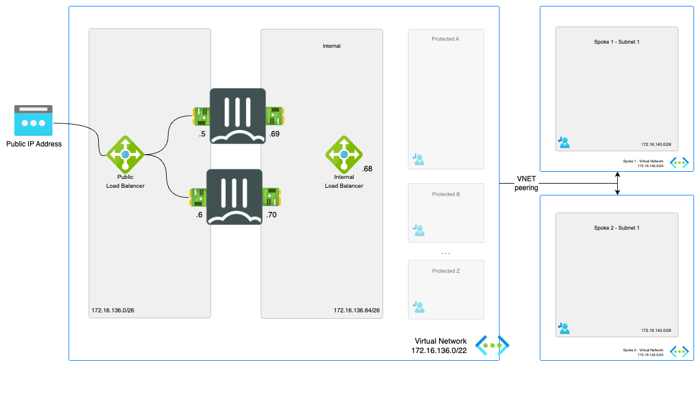

### East-West connections

East-West connections are considered the connections between internal subnets within the VNET or peered VNETs. The goal is to direct this traffic via the FortiGate.

To direct traffic to the FortiGate NGFW routing needs to be adapted on Microsoft Azure using User Defined Routing (UDR). With UDRs the routing in Azure can be adapted to send traffic destined for a specific network IP range to a specific destination such as Internet, VPN Gateway, Virtual Network (VNET), ... In order for the FortiGate to become the destination there is a specific destination called Virtual Appliance. Either the private IP of the FortiGate or the private IP of the internal Load Balancer is provided. More information about User Defined Routing can be found [here](https://docs.microsoft.com/en-us/azure/virtual-network/virtual-networks-udr-overview)

In this design an Azure Standard Load Balancer Internal is used with a specific feature called HA Ports. This feature allows fast failover between the different members of the FortiGate HA custer for all TCP, UDP and ICMP protocols. It is only available in the Standard Load Balancer and as such all load balancers connected to the FortiGate need to be of the Standard type. ALso the public IPs connected to the FortiGate need to be of the Standard type. These is no possibility to migrate between basic and standard public IP sku's. More information about HA Ports can be found [here](https://docs.microsoft.com/en-us/azure/load-balancer/load-balancer-ha-ports-overview)

#### East-West flow

In the diagram the different steps to establish a session are layed out. This flow is based on the configuration as deployed in this template.

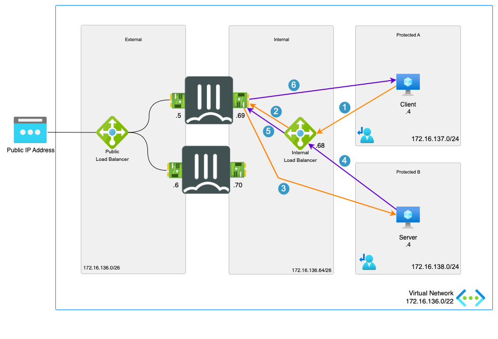

1. Connection from client to the private IP of server. Azure routes the traffic using UDR to the internal Load Balancer - s: 172.16.137.4 - d: 172.16.138.4
2. Azure Internal Load Balancer probes and send the packet to the active FGT - s: 172.16.137.4 - d: 172.16.138.4
3. FGT inspects the packet and when allowed sends the packet to the server - s: 172.16.137.4 - d: 172.16.138.4
4. The server responds to the request - s: 172.16.137.4 - d: 172.16.138.4
5. The Azure External Load Balancer sends the returns packet to the active FortiGate - s: 172.16.137.4 - d: 172.16.138.4
6. The active FGT accepts the return packet after inspection - s: 172.16.137.4 - d: 172.16.138.4

#### East-West configuration

To configure the east-west connectivity to a service there are 2 resources that need to be verified/configured:

- FortiGate
- Azure user defined routing

The drawing in the [flow](#east-west-flow) section is used in the configuration screenshots.

##### Azure User Defined Routing

<p align="center">
  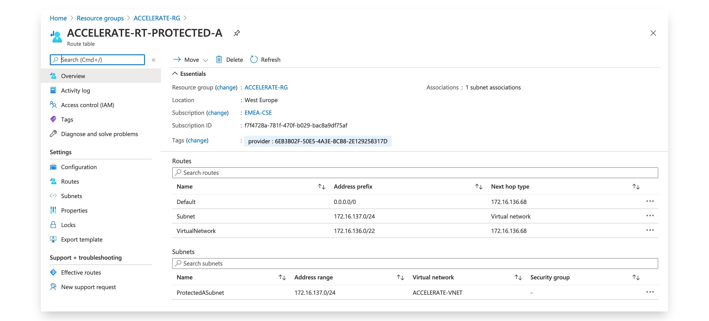
</p>

<p align="center">
  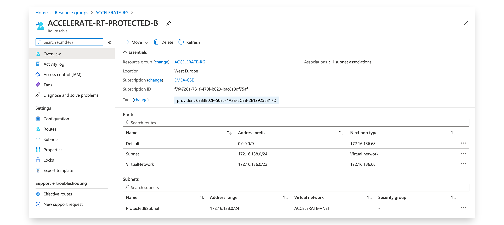
</p>

<p align="center">
  
</p>

##### FortiGate

On the FortiGate VM, a firewall policy rule needs to be created to allow traffic from specific IP ranges going in and out of the same internal interface (port2).

Make sure to verify that the option allow-traffic-redirect is disabled to make sure the FortiGate handles the ingress and egress traffic on the same logical interface. More information can be found in [in this article](https://community.fortinet.com/t5/FortiGate/Technical-Tip-Traffic-handled-by-FortiGate-for-packet-which/ta-p/196651).

### Inbound connections

#### Introduction

Inbound connections are considered the connections coming from the internet towards the Azure Load Balancer to publish services like a webserver or other hosted in the VNET or peered VNETs. The published services via the Azure Load Balancer are limited to the TCP and UDP protocols, as the Azure Load Balancer does not support any other protocols..

To go beyond the limitation of the Azure Load Balancer and use other protocols (e.g. ICMP,ESP,FTP,...), an instance level public IP on each of the VMs in the cluster is required. Load Balancing would then be possible using Azure Traffic Manager, Azure FrontDoor or FortiGSLB services using DNS or Anycast mechanisms. Using an instance level public IP will change the behaviour of the outbound connections. The use of Azure Traffic Manager or FortiGSLB services is out of the scope of this article.

There are 2 public IP SKU's: Basic and Standard. This template will use the Standard SKU as we are using the Azure Standard Load Balancer. The standard public IP by default is a static allocation. More information can be found [in the Microsoft documentation](https://docs.microsoft.com/en-us/azure/virtual-network/public-ip-addresses).

#### Inbound flow

In the diagram the different steps to establish a session are layed out. This flow is based on the configuration as deployed in this template.

<p align="center">
  
</p>

1. Connection from client to the public IP of the Azure Standard Load Balancer - s: w.x.y.z - d: a.b.c.d
2. Azure LB probes and sends the packet to one of the active FGTs using Floating IP. No NAT - s: w.x.y.z - d: a.b.c.d
3. FGT VIP picks up the packet, translates (DNAT) the packet destined for the Public IP of the Azure LB and sends the packet to the server. SNAT behind the firewall to make sure return traffic arrives on the FGT that has the session - s: 172.16.136.69 - d: 172.16.137.4
4. Server responds to the request to the FGT A - s: 172.16.137.4 - d: 172.16.136.69
5. FGT A translates the source to the FGT VIP on the external interface - s: a.b.c.d - d: w.x.y.z
6. Packet is routed to the client using DSR (Direct Server Return) - s: a.b.c.d - d: w.x.y.z

#### Inbound configuration

To configure the inbound connectivity to a service there are 2 resources that need to be adapted:

- Azure Standard Load Balancer rules
- FortiGate

The drawing in the [flow](#inbound-flow) section is used in the configuration screenshots with a standard public IP in Azure of 51.124.146.120 and the backend VM having the internal IP 172.16.137.4.

##### Azure Standard Load Balancer

After deployment of the template, the External Azure Load Balancer is available in the resource group. Once opened, the Load balancing rules will show you 2 default rules one for TCP/80 and one for UDP/10551. These rules are not required and are created as the Azure Load Balancer needs these to allow TCP/UDP traffic outbound.

<p align="center">
  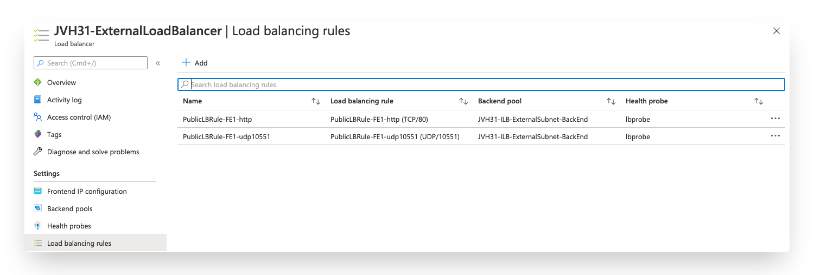
</p>

To create a new rule you can follow the settings from the TCP/80 rule that was automatically created. The following variables need verification and/or completion:

- Name: Complete with a name for this specific rule
- Frontend IP address: Select the default frontend public IP or any additional frontend IP that was added to the Azure Load Balancer
- Protocol: What protocol is the inbound connection using TCP or UDP
- Port: The port used by the client to connect to the public IP on the Azure Load Balancer
- Backend port: If you want to configure port translation you can specific a different port. Otherwise the same port as in the port field is used
- Backend pool: This needs to be the backend pool created by the template which contains FortiGate instances
- Health probe: The Azure Load Balancer sends out a probe to a TCP/UDP port to verify if the VM is up and running. In the FortiGate a specific probe config is activate on TCP/8008
- Session persistance: By default the Azure Load Balancer uses a 5 tuple distribution mode. If only the client IP and optionally the protocol need to provide persistancy you change this here. More information on this topic can be found [here](https://docs.microsoft.com/en-us/azure/load-balancer/load-balancer-distribution-mode)
- Floating IP (direct server return): This settings needs to be enable for any service located behind the FortiGate. This will allow the packet towards the FortiGate to contain the public IP as the destination IP. That allows for easy identification and policy enforcement of the inbound connection on the FortiGate. Services running on the FortiGate like IPSEC disable this option. It allows the IPSEC engine to pick up the traffic to the local process on the private IP of the VM.
- Create implicit outbound rules: Enabling this option will create an outbound SNAT rule for this protocol (TCP, UDP) and frontend IP address. This allows the Azure Load Balancer to use this frontend IP address for outbound connections.

<p align="center">
  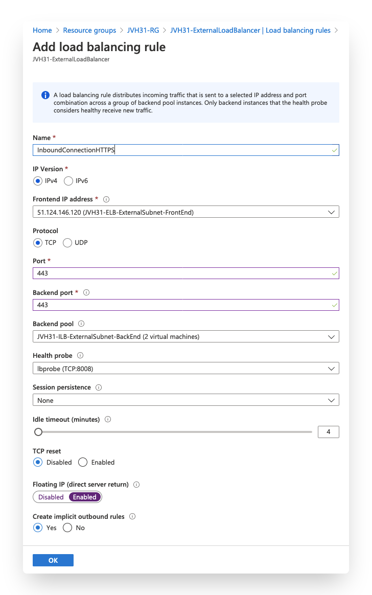
</p>

##### FortiGate

On the FortiGate a Virtual IP (VIP) needs to be created as well as a firewall policy to allow traffic to be translated and passed to the backend server.

The Virtual IP (VIP) is used to translate the inbound packets destination IP and optionally destination port towards the backend server.

- Name: A name for this VIP
- External IP address/range: The frontend IP configured on the Azure Load Balancer for this service
- Internal IP address/range: The internal IP of the service or internal Azure Load Balancer used to load balance multiple servers
- Port Forwarding: The port used for the service e.g. port 80.
***CAVEAT:***** If the Port Forwarding option is not enabled outbound connectivity might be impacted. The FortiGate will translate all outbound traffic from the internal IP address/range to the External IP address which causes Azure to drop these packet. NAT to a public IP is always managed by Microsoft Azure.**

<p align="center">
  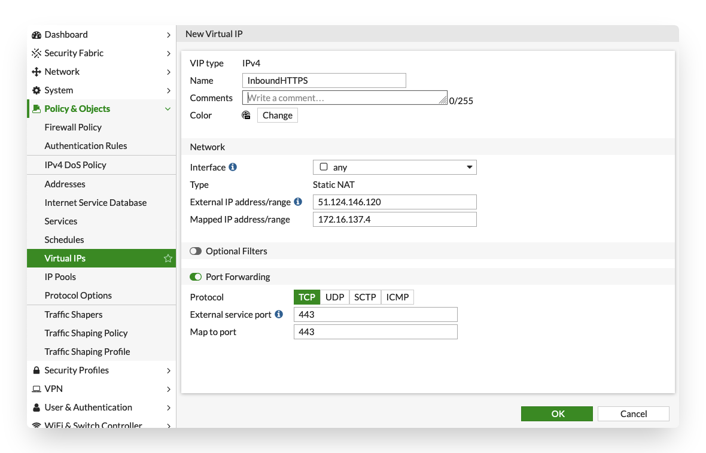
</p>

Secondly, a firewall policy rule needs to be created to allow the packets to traverse the FortiGate and configure any security inspection for the communication.

- Name: A name for this VIP
- Incoming Interface: The interface where the packet is coming from. In this template it is port1
- Outgoing Interface: The interface where the packet is routed to, to connect to the internal server
- Source: Restrict which IP can connect to the service here or set this to all
- Destination:  The VIP created in step one
- Service: The destination port on the internal server
- NAT: Source NAT is not needed for an Active/Passive setup. For an Active/Active setup it is recommended so the packet is returning to the firewall that maintains the state of the session. Alternatively, the FGSP protocol can be used to sync the state and have assymetric traffic across 2 active FortiGate VMs

<p align="center">
  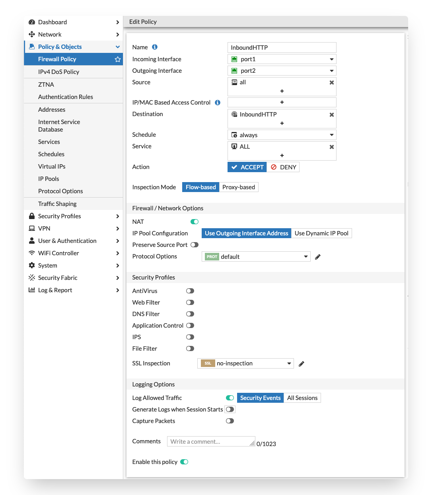
</p>

### Outbound connections

Outbound connections are considered the connections coming from the internal subnets within the VNET or peered VNETs via the FortiGate towards the internet.

To direct traffic to the FortiGate NGFW routing needs to be adapted on Microsoft Azure using User Defined Routing (UDR). With UDRs the routing in Azure can be adapted to send traffic destined for a specific network IP range to a specific destination such as Internet, VPN Gateway, Virtual Network (VNET), ... In order for the FortiGate to become the destination there is a specific destination called Virtual Appliance. Either the private IP of the FortiGate or the frontend IP of the internal Load Balancer is provided. More information about User Defined Routing can be found [here](https://docs.microsoft.com/en-us/azure/virtual-network/virtual-networks-udr-overview)

In this design an Azure Standard Load Balancer Internal is used with a specific feature called HA Ports. This feature allows fast failover between the different members of the FortiGate HA custer for all TCP, UDP and ICMP protocols. It is only available in the Standard Load Balancer and as such all load balancers connected to the FortiGate need to be of the Standard type. ALso the public IPs connected to the FortiGate need to be of the Standard type. These is no possibility to migrate between basic and standard public IP sku's. More information about HA Ports can be found [here](https://docs.microsoft.com/en-us/azure/load-balancer/load-balancer-ha-ports-overview)

Which public IP is used for the outbound connections depends on the configuration and layout of your deployed setup. There are 3 options 

- Public IP directly connected to a NIC of the FortiGate VM
- One or more public IPs attached to the external Azure Load Balancer with the FortiGate VM as a backend server
- NAT Gateway attached to the subnet of the external NIC of the FortiGate VM

NAT Gateway takes precedence over a public IP directly connected to a NIC as second which takes precedence over an external Azure Load Balancer with or without outbound rules. More information can be found on the links below:

- [Default outbound access in Azure](https://learn.microsoft.com/en-us/azure/virtual-network/ip-services/default-outbound-access)
- [Use Source Network Address Translation (SNAT) for outbound connections](https://learn.microsoft.com/en-us/azure/load-balancer/load-balancer-outbound-connections)
- [Outbound connectivity with a NAT Gateway](https://learn.microsoft.com/en-us/azure/nat-gateway/faq#how-can-i-use-a-nat-gateway-to-connect-outbound-in-a-setup-where-i-m-currently-using-a-different-service-for-outbound)
- [Quickstart: Create a public load balancer to load balance VMs using the Azure portal](https://learn.microsoft.com/en-us/azure/load-balancer/quickstart-load-balancer-standard-public-portal)

#### Outbound flow

In the diagram the different steps to establish a session are layed out. 

> **_NOTE:_** This flow is based on the configuration as deployed by default in this template using an external load balancer and no public IPs on the external NIC or a NAT Gateway.

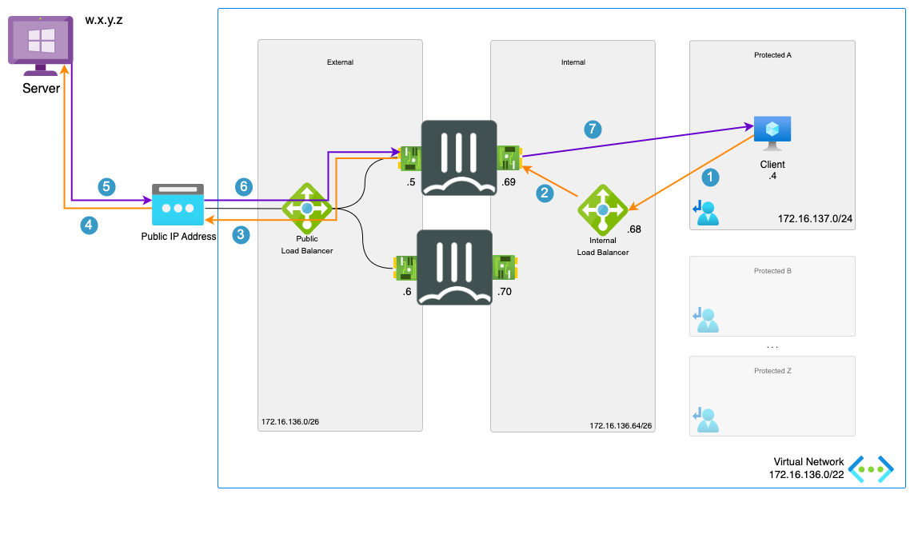

1. Connection from client to the public IP of server. Azure routes the traffic using UDR to the internal Load Balancer. - s: 172.16.137.4 - d: a.b.c.d
2. Azure Internal Load Balancer probes and send the packet to the active FGT. - s: 172.16.137.4 - d: a.b.c.d
3. FGT inspects the packet and when allowed sends the packet translated to it's external port private IP to the Azure External Load Balancer. - s: 172.16.136.5 - d: a.b.c.d
4. The Azure External Load Balancer picks one of the available public IP address attached and translates the source IP - s: w.x.y.z - d: a.b.c.d
5. The server responds to the request - s: a.b.c.d d: w.x.y.z
6. The Azure External Load Balancer sends the returns packet to the active FortiGate - s: a.b.c.d - d: 172.16.136.5
7. The active FGT accepts the return packet after inspection. It translates and routes the packet to the client - s: a.b.c.d - d: 172.16.137.4

#### Outbound configuration

Outbound connectivity in Azure has several properties that are specific to the platform. These need to be taken into account. This configuration is a basic configuration that will NAT all outbound connections behind 1 or more public IPs on the Azure Load Balancer.

This template deploys 2 Azure Load Balancers with a standard SKU which requires standard SKU public IP connected to the VM or Load Balancer. A standard SKU public IP requires a network security group, is zone aware and always has a static assignment.

For more information on outbound connections in Azure the Microsoft documentation can be found [here](https://docs.microsoft.com/en-us/azure/load-balancer/load-balancer-outbound-connections)

To configure the outbound connectivity to a service there are 2 resources that need to be verified/configured:

- FortiGate
- Azure Standard Load Balancer rules

The drawing in the [flow](#outbound-flow) section is used in the configuration screenshots with a standard public IP in Azure of 40.114.187.146 on the Azure Load Balancer, the FortiGate private IP of 172.16.136.5 (primary) or 172.16.136.6 (secondary) and the backend VM having the internal IP 172.16.137.4.

##### Azure Standard Load Balancer

After deployment of the template, the External Azure Load Balancer is available in the resource group. Once opened, the Load balancing rules will show you 2 default rules one for TCP/80 and one for UDP/10551. These rules are not required and are created as the Azure Load Balancer needs these to allow TCP/UDP traffic outbound.

If there is a public IP assigned to the port1 network interface of the FortiGate where also the Azure Load Balancer is connected this will take precedence outbound NAT.

The inbound rules have the option enabled to create outbound rules automatically. This enables outbound SNAT using the configured frontend ip for traffic coming from the FortiGate VM with it's private ip.

<p align="center">
  
</p>

##### FortiGate

On the FortiGate VM, a firewall policy rule needs to be created to allow traffic from the internal interface to the external interface with any or specific ip ranges and NAT enabled using the "Outgoing Interface Address".

<p align="center">
  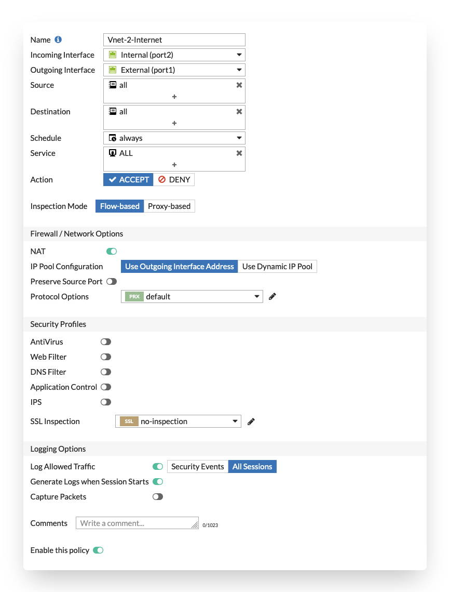
</p>

The NAT behind the FortiGate outgoing interface allows for a very simple configuration. On failover the private IP of the FortiGate outgoing interface changes but there is no configuration change needed.

#### Limitations

- Azure has certain limitations on outbound connections [more info](https://docs.microsoft.com/en-us/azure/load-balancer/load-balancer-outbound-connections#limitations)
- Azure has a limited number of outbound ports it can allocated per public ip. More information and optimisations can be found [here](https://docs.microsoft.com/en-us/azure/load-balancer/load-balancer-outbound-connections#preallocatedports)
- In case of failover the Azure Load Balancer will sends existing sessions to the failed VM as explained [here](https://docs.microsoft.com/en-us/azure/load-balancer/load-balancer-custom-probe-overview#probedown).

### Session synchronization

Session synchronization can be configured during deployment using the templates or Azure Marketplace in the Advanced Section for deployments from 7.2.1 and above:

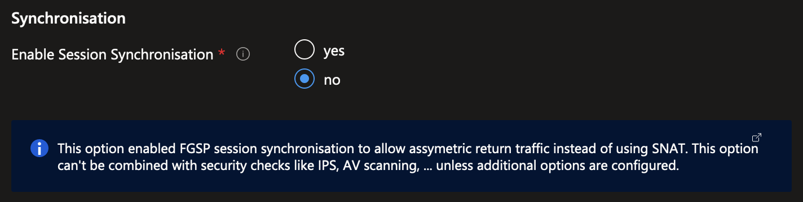

When configuring the policies on the FortiGates to allow and forward traffic to internal hosts, it is recommended that you enable the NAT checkbox (this will S-NAT the packets to the IP of port2). Doing so will enforce symmetric return.

It is possible to use FGSP to synchronize sessions and thereby allow assymetric return traffic. However this is not best practice from a security perspective, because it limits the ability of IPS by potentially only seeing one side of the conversation on each FGT. The FortiGate IPS takes both sides of the conversation into account for increased security and visibility. Reducing this visibility on the FortiGate may decrease the IPS efficacy.

Often S-NAT is not desired because it's necessary to retain the original source IP. For HTTP or HTTPS traffic in particular, you can enable the Load Balancing feature on the FortiGate which gives you the option to copy the source IP into the X-Forwarded-For header (See [https://community.fortinet.com/t5/FortiGate/Technical-Tip-How-to-add-X-forwarded-headers-to-the-traffic/ta-p/191355](https://community.fortinet.com/t5/FortiGate/Technical-Tip-How-to-add-X-forwarded-headers-to-the-traffic/ta-p/191355) )

If you do prefer to use FGSP for session synchronization. It can be enable during deployment by uncommenting the section in the customdata.tpl file or adding this recommended configuration to both FortiGate VMs.

```text
config system ha
    set session-pickup enable
    set session-pickup-connectionless enable
    set session-pickup-nat enable
    set session-pickup-expectation enable
    set override disable
end

config system cluster-sync
    edit 0
        set peerip 10.0.1.x
        set syncvd "root"
    next
end
```

In version 7.2.1 and above the syntax has changed as reported [here](https://docs.fortinet.com/document/fortigate/7.2.1/fortios-release-notes/517622/changes-in-cli).

```text
config system ha
    set session-pickup enable
    set session-pickup-connectionless enable
    set session-pickup-nat enable
    set session-pickup-expectation enable
    set override disable
end

config system standalone-cluster
  config cluster-peer
    edit 0
        set peerip 10.0.1.x
        set syncvd "root"
    next
  end
end
```

*Where x in 10.0.1.x is the IP of port 1 of the opposite FortiGate. With the default values this would be either 5 or 6.*

If the firewall policies include UTM profiles it is required to enable specific UTM inspection. When enabled, the packets arriving on FortiGate that has not seen the initial packet will be send back to the FortiGate that processed the initial packet. A maximum of 4 FortiGate devices can be linked using this method: [UTM inspection on asymmetric traffic on L3](https://docs.fortinet.com/document/fortigate/7.6.0/administration-guide/324430/utm-inspection-on-asymmetric-traffic-on-l3)

### Configuration synchronization

The FortiGate VMs are, in this Active/Active setup, independent units. The FGCP protocol, used in the Active/Passive setup, to sync the configuration is not applicable here. To enable configuration sync between both unit the sync from the autoscaling setup can be used. This will sync all configuration except for the specific configuration item proper to the specific VM like hostname, routing and others. To enable the configuration sync the config below can be used on both.

FortiGate A

```text
config system auto-scale
    set status enable
    set role primary
    set sync-interface "port2"
    set psksecret "a big secret"
end
```

FortiGate B

```text
config system auto-scale
    set status enable
    set role secondary
    set sync-interface "port2"
    set primary-ip 172.16.136.69
    set psksecret "a big secret"
end
```

### Availability Zone

Each of the architecture options listed in the design section will have the possibility enable Availability Zones.

Microsoft defines an Availability Zone to have the following properties:

- Unique physical location with an Azure Region
- Each zone is made up of one or more datacenter(s)
- Independent power, cooling and networking
- Inter Availability Zone network latency < 2ms (radius of +/- 100km)
- Fault-tolerant to protect from datacenter failure

Based on information in the presentation ['Inside Azure datacenter architecture with Mark Russinovich' at Microsoft Ignite 2019](https://www.youtube.com/watch?v=X-0V6bYfTpA)


### Default Configuration

After deployment, the below configuration has been automatically injected during the deployment. The bold sections are the default values. If parameters have been changed during deployment these values will be different.

#### FortiGate A

<pre><code>
config system sdn-connector
  edit AzureSDN
    set type azure
  next
end
config router static
  edit 1
    set gateway <b>172.16.136.1</b>
    set device port1
  next
  edit 2
    set dst <b>172.16.136.0/22</b>
    set device port2
    set gateway <b>172.16.136.65</b>
  next
  edit 3
    set dst 168.63.129.16 255.255.255.255
    set device port2
    set gateway <b>172.16.136.65</b>
  next
  edit 4
    set dst 168.63.129.16 255.255.255.255
    set device port1
    set gateway <b>172.16.136.1</b>
  next
end
config system probe-response
  set http-probe-value OK
  set mode http-probe
end
config system interface
  edit port1
    set mode static
    set ip <b>172.16.136.5/26</b>
    set description external
    set allowaccess ping ssh https probe-response
  next
  edit port2
    set mode static
    set ip <b>172.16.136.69/24</b>
    set description internal
    set allowaccess ping ssh https probe-response
  next
end
</code></pre>

#### FortiGate B

<pre><code>
config system sdn-connector
  edit AzureSDN
    set type azure
  next
end
config router static
  edit 1
    set gateway <b>172.16.136.1</b>
    set device port1
  next
  edit 2
    set dst <b>172.16.136.0/22</b>
    set device port2
    set gateway <b>172.16.136.65</b>
  next
  edit 3
    set dst 168.63.129.16 255.255.255.255
    set device port2
    set gateway <b>172.16.136.65</b>
  next
  edit 4
    set dst 168.63.129.16 255.255.255.255
    set device port1
    set gateway <b>172.16.136.1</b>
  next
end
config system probe-response
  set http-probe-value OK
  set mode http-probe
end
config system interface
  edit port1
    set mode static
    set ip <b>172.16.136.6/26</b>
    set description external
    set allowaccess ping ssh https probe-response
  next
  edit port2
    set mode static
    set ip <b>172.16.136.70/26</b>
    set description internal
    set allowaccess ping ssh https probe-response
  next
end
</code></pre>

## Support

Fortinet-provided scripts in this and other GitHub projects do not fall under the regular Fortinet technical support scope and are not supported by FortiCare Support Services.
For direct issues, please refer to the [Issues](https://github.com/fortinet/azure-templates/issues) tab of this GitHub project.

## License

[License](/../../blob/main/LICENSE) © Fortinet Technologies. All rights reserved.
