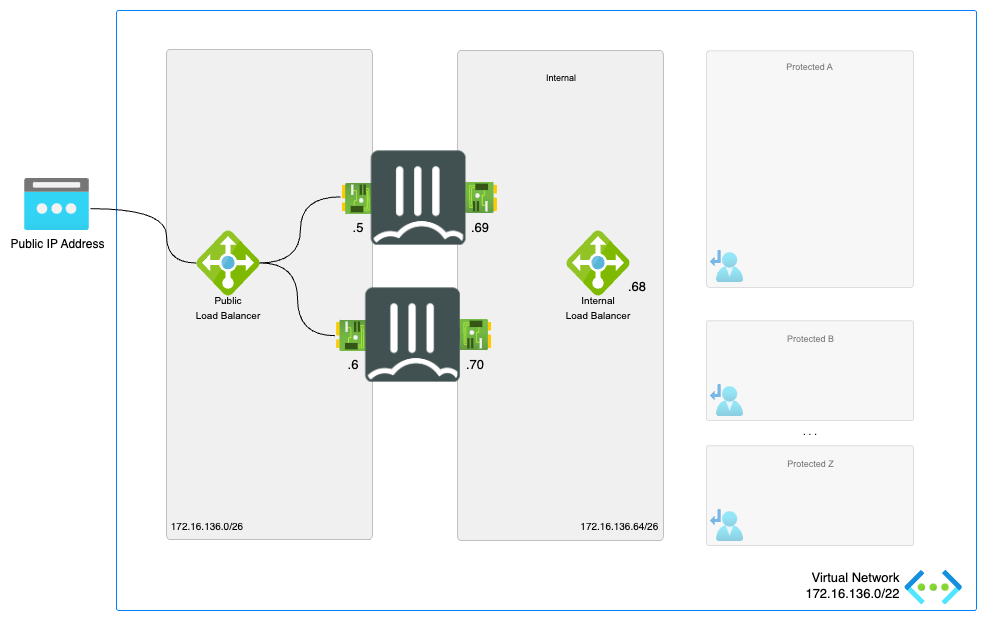

# Active/Active loadbalanced pair of standalone FortiGates for resilience and scale

[![[FGT] ARM - Active-Active-ELB-ILB](https://github.com/fortinet/azure-templates/actions/workflows/fgt-arm-active-active-elb-ilb.yml/badge.svg)](https://github.com/fortinet/azure-templates/actions/workflows/fgt-arm-active-active-elb-ilb.yml)

:wave: - [Introduction](#introduction) - [Design](#design) - [Deployment](#deployment) - [Requirements](#requirements-and-limitations) - [Configuration](#configuration) - :wave:

## Introduction

More and more enterprises are turning to Microsoft Azure to extend or replace internal data centers and take advantage of the elasticity of the public cloud. While Azure secures the infrastructure, you are responsible for protecting the resources you put in it. As workloads are being moved from local data centers connectivity and security are key elements to take into account. FortiGate-VM offers a consistent security posture and protects connectivity across public and private clouds, while high-speed VPN connections protect data.

This Azure ARM template deploys an Active/Active pair combined with the Microsoft Azure Standard Load Balancer both on the external and the internal side. Additionally, Fortinet Fabric Connectors deliver the ability to create dynamic security policies.

## Design

In Microsoft Azure, you can deploy an active/active pair of FortiGate VMs that communicate with each other and the Azure fabric. This FortiGate setup will receive the to be inspected traffic using user defined routing (UDR) and public IPs. You can send all or specific traffic that needs inspection, going to/coming from on-prem networks or public internet by adapting the UDR routing.

This Azure ARM template will automatically deploy a full working environment containing the the following components.

- 2 FortiGate firewalls in an active/active deployment
- 1 external Azure Standard Load Balancer for communication with internet
- 1 internal Azure Standard Load Balancer to receive all internal traffic and forwarding towards Azure Gateways connecting ExpressRoute or Azure VPNs.
- 1 VNET with 2 protected subnets
- 1 public IP for services and FortiGate management
- User Defined Routes (UDR) for the protected subnets



To enhance the availability of the solution VM can be installed in different Availability Zones instead of an Availability Set. If Availability Zones deployment is selected but the location does not support Availability Zones an Availability Set will be deployed. If Availability Zones deployment is selected and Availability Zones are available in the location, FortiGate A will be placed in Zone 1, FortiGate B will be placed in Zone 2.


This ARM template can also be used to extend or customized based on your requirements. Additional subnets besides the one's mentioned above are not automatically generated. By adapting the ARM templates you can add additional subnets which prefereably require their own routing tables.

## Deployment

The FortiGate solution can be deployed using the Azure Portal or Azure CLI. There are 4 variables needed to complete kickstart the deployment. The deploy.sh script will ask them automatically. When you deploy the ARM template the Azure Portal will request the variables as a requirement.

- PREFIX : This prefix will be added to each of the resources created by the templates for easy of use, manageability and visibility.
- LOCATION : This is the Azure region where the deployment will be deployed
- USERNAME : The username used to login to the FortiGate GUI and SSH mangement UI.
- PASSWORD : The password used for the FortiGate GUI and SSH management UI.

### Azure Portal

Azure Portal Wizard:
[](https://portal.azure.com/#create/Microsoft.Template/uri/https%3A%2F%2Fraw.githubusercontent.com%2Ffortinet%2Fazure-templates%2Fmain%2FFortiGate%2FActive-Active-ELB-ILB%2Fazuredeploy.json/createUIDefinitionUri/https%3A%2F%2Fraw.githubusercontent.com%2Ffortinet%2Fazure-templates%2Fmain%2FFortiGate%2FActive-Active-ELB-ILB%2FcreateUiDefinition.json)

Custom deployment:
[](https://portal.azure.com/#create/Microsoft.Template/uri/https%3A%2F%2Fraw.githubusercontent.com%2Ffortinet%2Fazure-templates%2Fmain%2FFortiGate%2FActive-Active-ELB-ILB%2Fazuredeploy.json)
[](http://armviz.io/#/?load=https%3A%2F%2Fraw.githubusercontent.com%2Ffortinet%2Fazure-templates$2Fmain%2FFortiGate%2FActive-Active-ELB-ILB%2Fazuredeploy.json)

### Azure CLI

To deploy via Azure Cloud Shell you can connect via the Azure Portal or directly to [https://shell.azure.com/](https://shell.azure.com/).

- Login into the Azure Cloud Shell
- Run the following command in the Azure Cloud:

`cd ~/clouddrive/ && wget -qO- https://github.com/fortinet/azure-templates/archive/main.tar.gz | tar zxf - && cd ~/clouddrive/fortinet-azure-solutions/FortiGate/Active-Active-ELB-ILB/ && ./deploy.sh`

- The script will ask you a few questions to bootstrap a full deployment.


After deployment you will be shown the IP address of all deployed components. You can access both management GUIs and SSH using the public IP address of the load balancer using HTTPS on port 40030, 40031 and for SSH on port 50030 and 50031. THe FortiGate VMs are also acessible using their private IPs on the internal subnet using HTTPS on port 443 and SSH on port 22.

## Requirements and limitations

The ARM template deploys different resources and it is required to have the access rights and quota in your Microsoft Azure subscription to deploy the resources.

- The template will deploy Standard F2s VMs for this architecture. Other VM instances are supported as well with a minimum of 2 NICs. A list can be found [here](https://docs.fortinet.com/document/fortigate-public-cloud/7.4.0/azure-administration-guide/562841/instance-type-support)
- Licenses for FortiGate
  - BYOL: A demo license can be made available via your Fortinet partner or on our website. These can be injected during deployment or added after deployment. Purchased licenses need to be registered on the [Fortinet support site](http://support.fortinet.com). Download the .lic file after registration. Note, these files may not work until 60 minutes after it's initial creation.
  - PAYG or OnDemand: These licenses are automatically generated during the deployment of the FortiGate systems.
- The password provided during deployment must need password complexity rules from Microsoft Azure:
  - It must be 12 characters or longer
  - It needs to contain characters from at least 3 of the following groups: uppercase characters, lowercase characters, numbers, and special characters excluding '\' or '-'
- The terms for the FortiGate PAYG or BYOL image in the Azure Marketplace needs to be accepted once before usage. This is done automatically during deployment via the Azure Portal. For the Azure CLI the commands below need to be run before the first deployment in a subscription.
  - BYOL
`az vm image terms accept --publisher fortinet --offer fortinet_fortigate-vm_v5 --plan fortinet_fg-vm`
  - PAYG
`az vm image terms accept --publisher fortinet --offer fortinet_fortigate-vm_v5 --plan fortinet_fg-vm_payg_2023`

## Configuration

The FortiGate VMs need a specific configuration to match the deployed environment. This configuration can be injected during provisioning or afterwards via the different options including GUI, CLI, FortiManager or REST API.

- [Default configuration using this template](doc/config-provisioning.md)
- [Inbound connections](doc/config-inbound-connections.md)
- [Outbound connections](doc/config-outbound-connections.md)
- [Availability Zone](doc/config-availability-zone.md)
- [Upload VHD](../Documentation/faq-upload-vhd.md)

### Fabric Connector

The FortiGate-VM uses [Managed Identities](https://docs.microsoft.com/en-us/azure/active-directory/managed-identities-azure-resources/) for the SDN Fabric Connector. A SDN Fabric Connector is created automatically during deployment. After deployment, it is required apply the 'Reader' role to the Azure Subscription you want to resolve Azure Resources from. More information can be found on the [Fortinet Documentation Libary](https://docs.fortinet.com/document/fortigate-public-cloud/7.2.0/azure-administration-guide/236610/configuring-an-sdn-connector-using-a-managed-identity).

### North South traffic

When configuring the policies on the FortiGates to allow and forward traffic to internal hosts, it is recommended that you enable the NAT checkbox (this will S-NAT the packets to the IP of port2). Doing so will enforce symmetric return.

It is possible to use FGSP to synchronize sessions and thereby allow assymetric return traffic. However this is not best practice from a security perspective, because it limits the ability of IPS by potentially only seeing one side of the conversation on each FGT. The FortiGate IPS takes both sides of the conversation into account for increased security and visibility. Reducing this visibility on the FortiGate may decrease the IPS efficacy.

Often S-NAT is not desired because it's necessary to retain the original source IP. For HTTP or HTTPS traffic in particular, you can enable the Load Balancing feature on the FortiGate which gives you the option to copy the source IP into the X-Forwarded-For header (See [https://community.fortinet.com/t5/FortiGate/Technical-Tip-How-to-add-X-forwarded-headers-to-the-traffic/ta-p/191355](https://community.fortinet.com/t5/FortiGate/Technical-Tip-How-to-add-X-forwarded-headers-to-the-traffic/ta-p/191355) )

If you do prefer to use FGSP for session synchronization. It can be enable during deployment by uncommenting the section in the customdata.tpl file or adding this recommended configuration to both FortiGate VMs.

```text
config system ha
    set session-pickup enable
    set session-pickup-connectionless enable
    set session-pickup-nat enable
    set session-pickup-expectation enable
    set override disable
end

config system cluster-sync
    edit 0
        set peerip 10.0.1.x
        set syncvd "root"
    next
end
```

In version 7.2.1 and above the syntax has changed as reported [here](https://docs.fortinet.com/document/fortigate/7.2.1/fortios-release-notes/517622/changes-in-cli).
```text
config system ha
    set session-pickup enable
    set session-pickup-connectionless enable
    set session-pickup-nat enable
    set session-pickup-expectation enable
    set override disable
end

config system standalone-cluster
  config cluster-peer
    edit 0
        set peerip 10.0.1.x
        set syncvd "root"
    next
  end
end
```

* Where x in 10.0.1.x is the IP of port 1 of the opposite FortiGate. With the default values this would be either 5 or 6.

### Configuration synchronization

The FortiGate VMs are, in this Active/Active setup, independent units. The FGCP protocol, used in the Active/Passive setup, to sync the configuration is not applicable here. To enable configuration sync between both unit the sync from the autoscaling setup can be used. This will sync all configuration except for the specific configuration item proper to the specific VM like hostname, routing and others. To enable the configuration sync the config below can be used on both.

FortiGate A

```text
config system auto-scale
    set status enable
    set role primary
    set sync-interface "port2"
    set psksecret "a big secret"
end
```

FortiGate B

```text
config system auto-scale
    set status enable
    set role secondary
    set sync-interface "port2"
    set primary-ip 172.16.136.69
    set psksecret "a big secret"
end
```

## Support

Fortinet-provided scripts in this and other GitHub projects do not fall under the regular Fortinet technical support scope and are not supported by FortiCare Support Services.
For direct issues, please refer to the [Issues](https://github.com/fortinet/azure-templates/issues) tab of this GitHub project.

## License

[License](/../../blob/main/LICENSE) © Fortinet Technologies. All rights reserved.
