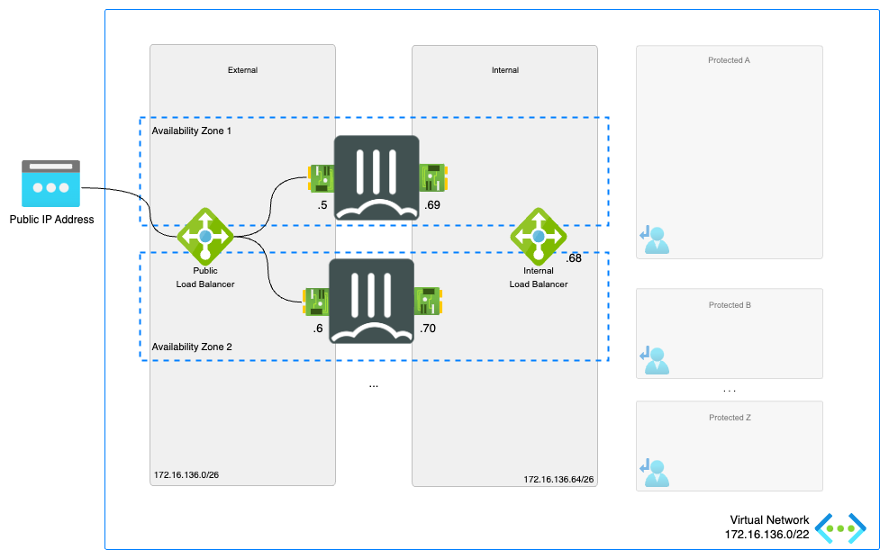

# Availability Zone

Microsoft defines an Availability Zone to have the following properties:

- Unique physical location with an Azure Region
- Each zone is made up of one or more datacenter(s)
- Independent power, cooling and networking
- Inter Availability Zone network latency < 2ms (radius of +/- 100km)
- Fault-tolerant to protect from datacenter failure

Based on information in the presentation ['Inside Azure datacenter architecture with Mark Russinovich' at Microsoft Ignite 2019](https://www.youtube.com/watch?v=X-0V6bYfTpA)

