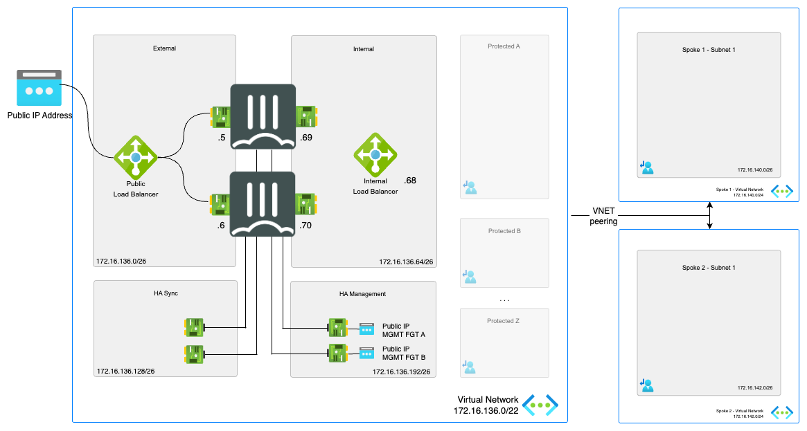

# Active/Passive High Available FortiGate pair with external and internal Azure Standard Load Balancer

:wave: - [Introduction](#introduction) - [Design](#design) - [Deployment](#deployment) - [Requirements](#requirements-and-limitations) - [Configuration](#configuration) - [Troubleshooting](#troubleshooting) :wave:

## Introduction

More and more enterprises are turning to Microsoft Azure to extend internal data centers and take advantage of the elasticity of the public cloud. While Azure secures the infrastructure, you are responsible for protecting everything you put in it. Fortinet Security Fabric provides Azure the broad protection, native integration and automated management enabling customers with consistent enforcement and visibility across their multi-cloud infrastructure.

This ARM template deploys a High Availability pair of FortiGate Next-Generation Firewalls accompanied by the required infrastructure. Additionally, Fortinet Fabric Connectors deliver the ability to create dynamic security policies.

## Design

In Microsoft Azure, you can deploy an active/passive pair of FortiGate VMs that communicate with each other and the Azure fabric. This FortiGate setup will receive the traffic to be inspected traffic using user defined routing (UDR) and public IPs. You can send all or specific traffic that needs inspection, going to/coming from on-prem networks or public internet by adapting the UDR routing.

This Azure ARM template will automatically deploy a full working environment containing the following components.

- 2 FortiGate firewall's in an active/passive deployment
- 1 external Azure Standard Load Balancer for communication with internet
- 1 internal Azure Standard Load Balancer to receive all internal traffic and forwarding towards Azure Gateways connecting ExpressRoute or Azure VPN's
- 1 VNET with 1 protected subnet and 4 subnets required for the FortiGate deployment (external, internal, ha mgmt and ha sync). If using an existing vnet, it must already have 5 subnets
- 3 public IPs. The first public IP is for cluster access to/through the active FortiGate. The other two PIPs are for Management access
- User Defined Routes (UDR) for the protected subnets


To enhance the availability of the solution VM can be installed in different Availability Zones instead of an Availability Set. If Availability Zones deployment is selected but the location does not support Availability Zones an Availability Set will be deployed. If Availability Zones deployment is selected and Availability Zones are available in the location, FortiGate A will be placed in Zone 1, FortiGate B will be placed in Zone 2.


This ARM template can also be used to extend or customized based on your requirements. Additional subnets besides the one's mentioned above are not automatically generated. By adapting the ARM templates you can add additional subnets which preferably require their own routing tables.

## Deployment

The FortiGate solution can be deployed using the Azure Portal or Azure CLI. There are 4 variables needed to complete kickstart the deployment. The deploy.sh script will ask them automatically. When you deploy the ARM template the Azure Portal will request the variables as a requirement.

- PREFIX : This prefix will be added to each of the resources created by the templates for easy of use, manageability and visibility.
- LOCATION : This is the Azure region where the deployment will be deployed
- USERNAME : The username used to login to the FortiGate GUI and SSH management UI.
- PASSWORD : The password used for the FortiGate GUI and SSH management UI.

### Azure Portal

Azure Portal Wizard Template Deployment:
[](https://portal.azure.com/#create/Microsoft.Template/uri/https%3A%2F%2Fraw.githubusercontent.com%2Ffortinet%2Fazure-templates%2Fmain%2FFortiGate%2FActive-Passive-ELB-ILB%2Fazuredeploy.json/createUIDefinitionUri/https%3A%2F%2Fraw.githubusercontent.com%2Ffortinet%2Fazure-templates%2Fmain%2FFortiGate%2FActive-Passive-ELB-ILB%2FcreateUiDefinition.json)

Standard Custom Template Deployment:
[](https://portal.azure.com/#create/Microsoft.Template/uri/https%3A%2F%2Fraw.githubusercontent.com%2Ffortinet%2Fazure-templates%2Fmain%2FFortiGate%2FActive-Passive-ELB-ILB%2Fazuredeploy.json)
[](http://armviz.io/#/?load=https%3A%2F%2Fraw.githubusercontent.com%2Ffortinet%2Fazure-templates$2Fmain%2FFortiGate%2FActive-Passive-ELB-ILB%2Fazuredeploy.json)

### Azure CLI

For Microsoft Azure there is a second option by using the Azure Cloud Shell. The Azure Cloud Shell is an in-browser CLI that contains all tools for deployment into Microsoft Azure. It is accessible via the Azure Portal or directly via [https://shell.azure.com/](https://shell.azure.com). You can copy and past the below one-liner to get start with your deployment.
To deploy via Azure Cloud Shell you can connect via the Azure Portal or directly to [https://shell.azure.com/](https://shell.azure.com/).

- Login into the Azure Cloud Shell
- Run the following command in the Azure Cloud:

`cd ~/clouddrive/ && wget -qO- https://github.com/fortinet/azure-templates/archive/main.tar.gz | tar zxf - && cd ~/clouddrive/azure-templates-main/FortiGate/Active-Passive-ELB-ILB/ && ./deploy.sh`

- The script will ask you a few questions to bootstrap a full deployment.


After deployment you will be shown the IP address of all deployed components. Both FortiGate VMs are accessible using the public management IPs using HTTPS on port 443 and SSH on port 22.

## Requirements and limitations

The ARM template deploys different resources and it is required to have the access rights and quota in your Microsoft Azure subscription to deploy the resources.

- The Azure Standard Load Balancer only supports TCP and UDP protocols (HTTPS, DNS, SSH, ...). To create a highly available architecture where you can use other protocols an architecture with the SDN Connector failover is preferred. More details can be found [here](https://docs.microsoft.com/en-us/azure/load-balancer/components)
- In case of failover the Azure Load Balancer will sends existing sessions to the failed VM as explained [here](https://docs.microsoft.com/en-us/azure/load-balancer/load-balancer-custom-probe-overview#probedown).
- The template will deploy Standard F4s VMs for this architecture. Other VM instances are supported as well with a minimum of 4 NICs. A list can be found [here](https://docs.fortinet.com/document/fortigate-public-cloud/7.4.0/azure-administration-guide/562841/instance-type-support)
- Licenses for FortiGate
  - BYOL: A demo license can be made available via your Fortinet partner or on our website. These can be injected during deployment or added after deployment. Purchased licenses need to be registered on the [Fortinet support site](http://support.fortinet.com). Download the .lic file after registration. Note, these files may not work until 60 minutes after it's initial creation.
  - PAYG or OnDemand: These licenses are automatically generated during the deployment of the FortiGate systems.
- The password provided during deployment must need password complexity rules from Microsoft Azure:
  - It must be 12 characters or longer
  - It needs to contain characters from at least 3 of the following groups: uppercase characters, lowercase characters, numbers, and special characters excluding '\' or '-'
- The terms for the FortiGate PAYG or BYOL image in the Azure Marketplace needs to be accepted once before usage. This is done automatically during deployment via the Azure Portal. For the Azure CLI the commands below need to be run before the first deployment in a subscription.
  - BYOL
`az vm image terms accept --publisher fortinet --offer fortinet_fortigate-vm_v5 --plan fortinet_fg-vm`
  - PAYG
`az vm image terms accept --publisher fortinet --offer fortinet_fortigate-vm_v5 --plan fortinet_fg-vm_payg_2023`

## Configuration

The FortiGate VMs need a specific configuration to match the deployed environment. This configuration can be injected during provisioning or afterwards via the different options including GUI, CLI, FortiManager or REST API.

- [Fabric Connector](#fabric-connector)
- [VNET peering](#vnet-peering)
- [East-West connections](#east-west-connections)
- [Inbound connections](#inbound-connections)
  - [IPSEC configuration](#inbound-ipsec-configuration)
- [Outbound connections](#outbound-connections)
  - [NAT considerations: 1-to-1 and 1-to-many](#outbound-connections---nat-considerations)
- [IPSEC Connectivity](../Documentation/faq-ipsec-connectivity.md)
- [High Availability](#high-availability-probe-configuration)
- [Cloud-Init](#cloud-init)
- [Availability Zone](#availability-zone)
- [Default configuration using this template](#default-configuration)
- [Upload VHD](https://community.fortinet.com/t5/FortiGate-Azure-Technical/Deployment-of-FortiGate-VM-using-a-VHD-image-file/ba-p/320338)

### Fabric Connector

The FortiGate-VM uses [Managed Identities](https://docs.microsoft.com/en-us/azure/active-directory/managed-identities-azure-resources/) for the SDN Fabric Connector. A SDN Fabric Connector is created automatically during deployment. After deployment, it is required apply the 'Reader' role to the Azure Subscription you want to resolve Azure Resources from. More information can be found on the [Fortinet Documentation Libary](https://docs.fortinet.com/document/fortigate-public-cloud/7.6.0/azure-administration-guide/236610/configuring-an-sdn-connector-using-a-managed-identity).

### VNET peering

In Microsoft Azure, this central security services hub is commonly implemented using VNET peering. The central security services hub component will receive, using user-defined routing (UDR), all or specific traffic that needs inspection going to/coming from on-prem networks or the public internet. This deployment can be used as the hub section of such a [Hub-Spoke network topology](https://learn.microsoft.com/en-us/azure/architecture/networking/architecture/hub-spoke?tabs=cli#communication-through-an-nva)



### East-West connections

East-West connections are considered the connections between internal subnets within the VNET or peered VNETs. The goal is to direct this traffic via the FortiGate.

To direct traffic to the FortiGate NGFW routing needs to be adapted on Microsoft Azure using User Defined Routing (UDR). With UDRs the routing in Azure can be adapted to send traffic destined for a specific network IP range to a specific destination such as Internet, VPN Gateway, Virtual Network (VNET), ... In order for the FortiGate to become the destination there is a specific destination called Virtual Appliance. Either the private IP of the FortiGate or the private IP of the internal Load Balancer is provided. More information about User Defined Routing can be found [here](https://docs.microsoft.com/en-us/azure/virtual-network/virtual-networks-udr-overview)

In this design an Azure Standard Load Balancer Internal is used with a specific feature called HA Ports. This feature allows fast failover between the different members of the FortiGate HA custer for all TCP, UDP and ICMP protocols. It is only available in the Standard Load Balancer and as such all load balancers connected to the FortiGate need to be of the Standard type. ALso the public IPs connected to the FortiGate need to be of the Standard type. These is no possibility to migrate between basic and standard public IP sku's. More information about HA Ports can be found [here](https://docs.microsoft.com/en-us/azure/load-balancer/load-balancer-ha-ports-overview)

#### East-West Flow

In the diagram the different steps to establish a session are layed out. This flow is based on the configuration as deployed in this template.


1. Connection from client to the private IP of server. Azure routes the traffic using UDR to the internal Load Balancer - s: 172.16.137.4 - d: 172.16.138.4
2. Azure Internal Load Balancer probes and send the packet to the active FGT - s: 172.16.137.4 - d: 172.16.138.4
3. FGT inspects the packet and when allowed sends the packet to the server - s: 172.16.137.4 - d: 172.16.138.4
4. The server responds to the request - s: 172.16.137.4 - d: 172.16.138.4
5. The Azure External Load Balancer sends the returns packet to the active FortiGate - s: 172.16.137.4 - d: 172.16.138.4
6. The active FGT accepts the return packet after inspection - s: 172.16.137.4 - d: 172.16.138.4

#### East-West Configuration

To configure the east-west connectivity to a service there are 2 resources that need to be verified/configured:

- FortiGate
- Azure user defined routing

The drawing in the [flow](#east-west-flow) section is used in the configuration screenshots.

##### Azure User Defined Routing

<p align="center">
  
</p>

<p align="center">
  
</p>

<p align="center">
  
</p>

##### FortiGate

On the FortiGate VM, a firewall policy rule needs to be created to allow traffic from specific IP ranges going in and out of the same internal interface (port2).

Make sure to verify that the option allow-traffic-redirect is disabled to make sure the FortiGate handles the ingress and egress traffic on the same logical interface. More information can be found in [in this article](https://community.fortinet.com/t5/FortiGate/Technical-Tip-Traffic-handled-by-FortiGate-for-packet-which/ta-p/196651).

#### Limitations

- In case of failover the Azure Load Balancer will sends existing sessions to the failed VM as explained [here](https://docs.microsoft.com/en-us/azure/load-balancer/load-balancer-custom-probe-overview#probedown).

### Inbound connections

Inbound connections are considered the connections coming from the internet towards the Azure Load Balancer to publish services like a webserver or other hosted in the VNET or peered VNETs. The published services via the Azure Load Balancer are limited to the TCP and UDP protocols, as the Azure Load Balancer does not support any other protocols..

To go beyond the limitation of the Azure Load Balancer and use other protocols (e.g. ICMP,ESP,FTP,...), an instance level public IP on each of the VMs in the cluster is required. Load balancing would then be possible using Azure Traffic Manager, Azure FrontDoor or FortiGSLB services using DNS or Anycast mechanisms. Using an instance level public IP will change the behaviour of the outbound connections. The use of Azure Traffic Manager or FortiGSLB services is out of the scope of this article.

There are 2 public IP SKU's: Basic and Standard. This template will use the Standard SKU as we are using the Azure Standard Load Balancer. The standard public IP by default is a static allocation. More information can be found [in the Microsoft documentation](https://docs.microsoft.com/en-us/azure/virtual-network/public-ip-addresses).

#### Inbound flow

In the diagram the different steps to establish a session are layed out. This flow is based on the configuration as deployed in this template.

<p align="center">
  
</p>

1. Connection from client to the public IP of the Azure Standard Load Balancer - s: w.x.y.z - d: a.b.c.d
2. Azure LB probes and send the packet to the active FGT using Floating IP. No NAT - s: w.x.y.z - d: a.b.c.d
3. FGT VIP picks up, translates (DNAT) and sends the packet to the server via routing in Azure - s: w.x.y.z - d: 172.16.137.4
4. Server responds to the request and send the packet to default gateway. Azure routes the traffic using User Defined Routing (UDR) to the Internal Load Balancer - s: 172.16.137.4 - d: w.x.y.z
5. Azure Internal Load Balancer send the traffic to the active FGT - s: 172.16.137.4 - d: w.x.y.z
6. Active FGT translates the source to the FGT VIP on the external interface - s: a.b.c.d - d: w.x.y.z
7. Packet is routed to the client using DSR (Direct Server Return) - s: a.b.c.d - d: w.x.y.z

#### When to enable the floating IP in the Azure load balancing rule?

##### Traffic transiting the FortiGate VMs

Enabling the Floating IP option in a load balancing rule results in the Azure Load Balancer to pass the source and destination IP unchanged to the backend FortiGate VMs. In the FortiGate VM you can use the Virtual IP (VIP) construct to pick up this traffic and perform Destination Network Address Translation (DNAT).

If you disable the Floating IP option on the load balancing rule the destination IP of the inbound packet is translated (DNAT) to the IP address of the backend FortiGate VMs as configured in the backend configuration of the Azure Load Balancer. In our example, this would be 172.16.136.5 or 172.16.136.6 for the primary or secondary FortiGate respectively. To configure the FortiGate for a non floating IP load balancing rule it is required to create a VIP with the same name on each FortiGate VM and assign it in the rulebase on both units.

In case you have a requirement to host multiple public IPs for different services using the Floating IP method makes it easy for the FortiGate to distinguish the different inbound requests.

An example of the configuration of the FortiGate can be found [here](#fortigate).

##### Traffic connecting to a service on the FortiGate VMs

For trafic destined to terminate on the FortiGate VMs (e.g. IPSEC tunnels, SSL VPN, ...) the FortiGate is by default not aware of the public IP address attached to the Azure Load Balancer. In this case, where you have the service part of the FortiGate VMs it is best practice to disable the Floating IP option.

An example of the configuration of the FortiGate can be found [here](#configuration---ipsec).

#### Inbound configuration

To configure the inbound connectivity to a service there are 2 resources that need to be adapted:

- Azure Standard Load Balancer rules
- FortiGate

The drawing in the [flow](#flow) section is used in the configuration screenshots with a standard public IP in Azure of 51.124.146.120 and the backend VM having the internal IP 172.16.137.4.

##### Azure Standard Load Balancer

After deployment of the template, the External Azure Load Balancer is available in the resource group. Once opened, the Load balancing rules will show you 2 default rules one for TCP/80 and one for UDP/10551. These rules are not required and are created as the Azure Load Balancer needs these to allow TCP/UDP traffic outbound.

<p align="center">
  
</p>

To create a new rule you can follow the settings from the TCP/80 rule that was automatically created. The following variables need verification and/or completion:

- Name: Complete with a name for this specific rule
- Frontend IP address: Select the default frontend public IP or any additional frontend IP that was added to the Azure Load Balancer
- Protocol: What protocol is the inbound connection using TCP or UDP
- Port: The port used by the client to connect to the public IP on the Azure Load Balancer
- Backend port: If you want to configure port translation you can specific a different port. Otherwise the same port as in the port field is used
- Backend pool: This needs to be the backend pool created by the template which contains FortiGate instances
- Health probe: The Azure Load Balancer sends out a probe to a TCP/UDP port to verify if the VM is up and running. In the FortiGate a specific probe config is activate on TCP/8008
- Session persistance: By default the Azure Load Balancer uses a 5 tuple distribution mode. If only the client IP and optionally the protocol need to provide persistancy you change this here. More information on this topic can be found [here](https://docs.microsoft.com/en-us/azure/load-balancer/load-balancer-distribution-mode)
- Floating IP (direct server return): This setting needs to be enabled for any service located behind the FortiGate. This will allow the packet towards the FortiGate to contain the public IP as the destination IP. That allows for easy identification and policy enforcement of the inbound connection on the FortiGate. Services running on the FortiGate like IPSEC disable this option. It allows the IPSEC engine to pick up the traffic to the local process on the private IP of the VM.
- Create implicit outbound rules: Enabling this option will create an outbound SNAT rule for this protocol (TCP, UDP) and frontend IP address. This allows the Azure Load Balancer to use this frontend IP address for outbound connections.


<p align="center">
  
</p>

##### FortiGate

On the FortiGate a Virtual IP (VIP) needs to be created as well as a firewall policy to allow traffic to be translated and passed to the backend server.

The Virtual IP (VIP) is used to translate the inbound packets destination IP and optionally destination port towards the backend server.

- Name: A name for this VIP
- External IP address/range: The frontend IP configured on the Azure Load Balancer for this service
- Internal IP address/range: The internal IP of the service or internal Azure Load Balancer used to load balance multiple servers
- Port Forwarding: The port used for the service e.g. port 80.
***CAVEAT:***** If the Port Forwarding option is not enabled outbound connectivity might be impacted. The FortiGate will translate all outbound traffic from the internal IP address/range to the External IP address which causes Azure to drop these packet. NAT to a public IP is always managed by Microsoft Azure.**

<p align="center">
  
</p>

Secondly, a firewall policy rule needs to be created to allow the packets to traverse the FortiGate and configure any security inspection for the communication.

- Name: A name for this VIP
- Incoming Interface: The interface where the packet is coming from. In this template it is port1
- Outgoing Interface: The interface where the packet is routed to, to connect to the internal server
- Source: Restrict which IP can connect to the service here or set this to all
- Destination:  The VIP created in step one
- Service: The destination port on the internal server
- NAT: Source NAT is not needed for an Active/Passive setup. For an Active/Active setup it is recommended so the packet is returning to the firewall that maintains the state of the session

<p align="center">
  
</p>

#### Inbound IPSEC configuration

Connectivity is one of the main use cases for the deployment of a FortiGate NGFW in Microsoft Azure. To connect branches and datacenters to the FortiGate VM, a few items need to be taken into account.

- Terminating an IPSEC tunnel via the Azure Load Balancer is limited to the TCP and UDP protocols. For IPSEC this means that both endpoints need to support NAT-T and run the data connection over UDP/4500 instead of the ESP protocol.
- In the Azure Load Balancer 2 load balancing rules need to be created:
<p align="center">
  
</p>
  - IKE on port UDP/500
<p align="center">
  
</p>
  - IPSEC NAT-T on port UDP/4500
<p align="center">
  
</p>
- On the FortiGate configure an IPSEC tunnel either with the IPSEC wizard or a custom IPSEC tunnel. The FortiGate to FortiGate wizard enables NAT-T automatically. For a custom IPSEC tunnel make sure to enable this feature.

  - IPSEC Wizard
<p align="center">
  
</p>

  - IPSEC Custom
<p align="center">
  
</p>

### Outbound connections

Outbound connections are considered the connections coming from the internal subnets within the VNET or peered VNETs via the FortiGate towards the internet.

To direct traffic to the FortiGate NGFW routing needs to be adapted on Microsoft Azure using User Defined Routing (UDR). With UDRs the routing in Azure can be adapted to send traffic destined for a specific network IP range to a specific destination such as Internet, VPN Gateway, Virtual Network (VNET), ... In order for the FortiGate to become the destination there is a specific destination called Virtual Appliance. Either the private IP of the FortiGate or the frontend IP of the internal Load Balancer is provided. More information about User Defined Routing can be found [here](https://docs.microsoft.com/en-us/azure/virtual-network/virtual-networks-udr-overview)

In this design an Azure Standard Load Balancer Internal is used with a specific feature called HA Ports. This feature allows fast failover between the different members of the FortiGate HA custer for all TCP, UDP and ICMP protocols. It is only available in the Standard Load Balancer and as such all load balancers connected to the FortiGate need to be of the Standard type. ALso the public IPs connected to the FortiGate need to be of the Standard type. These is no possibility to migrate between basic and standard public IP sku's. More information about HA Ports can be found [here](https://docs.microsoft.com/en-us/azure/load-balancer/load-balancer-ha-ports-overview)

#### Outbound flow

In the diagram the different steps to establish a session are layed out. This flow is based on the configuration as deployed in this template.


1. Connection from client to the public IP of server. Azure routes the traffic using UDR to the internal Load Balancer. - s: 172.16.137.4 - d: a.b.c.d
2. Azure Internal Load Balancer probes and send the packet to the active FGT. - s: 172.16.137.4 - d: a.b.c.d
3. FGT inspects the packet and when allowed sends the packet translated to it's external port private IP to the Azure External Load Balancer. - s: 172.16.136.5 - d: a.b.c.d
4. The Azure External Load Balancer picks one of the available public IP address attached and translates the source IP - s: w.x.y.z - d: a.b.c.d
5. The server responds to the request - s: a.b.c.d d: w.x.y.z
6. The Azure External Load Balancer sends the returns packet to the active FortiGate - s: a.b.c.d - d: 172.16.136.5
7. The active FGT accepts the return packet after inspection. It translates and routes the packet to the client - s: a.b.c.d - d: 172.16.137.4

#### Outbound configuration

Outbound connectivity in Azure has several properties that are specific to the platform. These need to be taken into account. This configuration is a basic configuration that will NAT all outbound connections behind 1 or more public IPs on the Azure Load Balancer. More specific cases are be explained [here](#outbound-connections---nat-considerations).

This template deploys 2 Azure Load Balancers with a standard SKU which requires standard SKU public IP connected to the VM or Load Balancer. A standard SKU public IP requires a network security group, is zone aware and always has a static assignment.

For more information on outbound connections in Azure the Microsoft documentation can be found [here](https://docs.microsoft.com/en-us/azure/load-balancer/load-balancer-outbound-connections)

To configure the outbound connectivity to a service there are 2 resources that need to be verified/configured:

- FortiGate
- Azure Standard Load Balancer rules

The drawing in the [flow](#outbound-flow) section is used in the configuration screenshots with a standard public IP in Azure of 40.114.187.146 on the Azure Load Balancer, the FortiGate private IP of 172.16.136.5 (primary) or 172.16.136.6 (secondary) and the backend VM having the internal IP 172.16.137.4.

##### Azure Standard Load Balancer

After deployment of the template, the External Azure Load Balancer is available in the resource group. Once opened, the Load balancing rules will show you 2 default rules one for TCP/80 and one for UDP/10551. These rules are not required and are created as the Azure Load Balancer needs these to allow TCP/UDP traffic outbound.

If there is a public IP assigned to the port1 network interface of the FortiGate where also the Azure Load Balancer is connected this will take precedence outbound NAT.

The inbound rules have the option enabled to create outbound rules automatically. This enables outbound SNAT using the configured frontend ip for traffic coming from the FortiGate VM with it's private ip.

<p align="center">
  
</p>

##### FortiGate

On the FortiGate VM, a firewall policy rule needs to be created to allow traffic from the internal interface to the external interface with any or specific ip ranges and NAT enabled using the "Outgoing Interface Address".

<p align="center">
  
</p>

The NAT behind the FortiGate outgoing interface allows for a very simple configuration. On failover the private IP of the FortiGate outgoing interface changes but there is no configuration change needed.

#### Limitations

- Azure has certain limitations on outbound connections, [more info](https://docs.microsoft.com/en-us/azure/load-balancer/load-balancer-outbound-connections#limitations)
- Azure has a limited number of outbound ports it can allocated per public ip. More information and optimisations can be found [here](https://docs.microsoft.com/en-us/azure/load-balancer/load-balancer-outbound-connections#preallocatedports)
- In case of failover the Azure Load Balancer will sends existing sessions to the failed VM as explained [here](https://docs.microsoft.com/en-us/azure/load-balancer/load-balancer-custom-probe-overview#probedown).

### Outbound connections - NAT considerations

This chapter goes beyond the [default scenario](#outbound-connections) with 1 or multiple public IPs that handle all outbound traffic. The Azure Load Balancer has a pool of IPs that can be used. In some deployments customers would like to have specific 1-to-1 NAT or NAT behind a separate public IPs for one service, server or user. These NAT scenario's are mostly requested for specific ACLs implemented at other side or validation of public IPs in case of sending email, ...

The Azure Load Balancer is limited in available outbound rules direct traffic as we would like for 1-to-1 NAT or NAT of specific services. The outbound rules only applies to the primary IP configuration of a NIC (limitations can be found [here](https://docs.microsoft.com/en-us/azure/load-balancer/load-balancer-outbound-connections#limitations)). This prevents us to differentiate the traffic based on different outbound IPs on the FortiGate.

To achieve this NAT one or more public IPs needs to be attached to the external NIC of the FortiGate. In this Active-Passive HA cluster is best to use the SDN connector to failover the public IP from the primary to the secondary in case of failure of the primary fortigate.

#### Outbound NAT flow

In the diagram the different steps to establish a session are layed out. This flow is based on the configuration as deployed in this template.


1. Connection from client to the public IP of server. Azure routes the traffic using UDR to the internal Load Balancer - s: 172.16.137.4 - d: a.b.c.d
2. Azure Internal Load Balancer probes and send the packet to the active FGT - s: 172.16.137.4 - d: a.b.c.d
3. FGT inspects the packet and when allowed performs source NAT using IP pool settings to the secondary IP on the external interface - s: 172.16.136.7 (or 8) - d: a.b.c.d
4. The Azure router will NAT the source IP of the packet to the attached public IP - s: w.x.y.z - d: a.b.c.d
5. The server responds to the request - s: a.b.c.d d: w.x.y.z
6. The Azure router NAT the destination address to the private IP of the secondary IP configuration of the external NIC attached to the public IP - s: a.b.c.d - d: 172.16.136.7 (or 8)
7. The active FGT accepts the return packet after inspection. It translates and routes the packet to the client - s: a.b.c.d - d: 172.16.137.4

#### Outbound NAT configuration

Outbound connectivity in Azure has several properties that are specific to the platform. These need to be taken into account.

For more information on outbound connections in Azure the Microsoft documentation can be found [here](https://docs.microsoft.com/en-us/azure/load-balancer/load-balancer-outbound-connections)

To configure the 1-to-1 outbound connectivity to a service there are 2 resources that need to be verified/configured:

- Azure portal: public IP and Network interfaces of both FortiGate VMs
- FortiGate

The drawing in the [flow](#outbound-nat-flow) section is used in the configuration screenshots with a standard public IP in Azure of 40.114.187.146 on the Azure Load Balancer, the FortiGate private IP of 172.16.136.5 (primary) or 172.16.136.6 (secondary) and the backend VM having the internal IP 172.16.137.4.

##### Azure portal

1. Create a new public IP in Azure. Make sure to match the other public IP SKUs used connected to the FortiGate cluster and Azure Load Balancer. The SKU needs to be 'Standard' when using the Azure Load Balancer in this setup.

<p align="center">
  
</p>

2. Add a secondary private IP address on the NIC1 (external NIC) of the primary FortiGate VM in Azure. Associate the public IP created in step 1.

<p align="center">
  
</p>

<p align="center">
  
</p>

3. Add a secondary private IP address on the NIC1 (external NIC) of the secondary FortiGate VM in Azure. Do not associate the public IP created in step 1.

<p align="center">
  
</p>

##### FortiGate

On the FortiGate VM, a firewall policy rule needs to be created to allow traffic from the internal interface to the external interface with any or specific ip ranges and NAT enabled using the "Outgoing Interface Address".

1. Open the CLI of primary FortiGate and execute the below commands to make an vdom exception. This will case the IP Pool objects to not synchronized between cluster members. This feature is available in FortiOS 6.2.4, 6.4.0 or above. Each FortiGate VM needs to have unique IP Pool configured because they have unique secondary Private IP address which was configured in the Azure portal

```
config system vdom-exception
edit 0
  set object firewall.ippool
next
end
```

2. In the primary FortiGate GUI configure an IP Pool with the private IP address of ifconfig2 as the external IP address

<p align="center">
  
</p>

3. In the secondary FortiGate GUI configure an IP Pool with the private IP address of ifconfig2 as the external IP address. Make sure the name is exactly the same as on the primary unit to match the firewall policy

<p align="center">
  
</p>

3. Configure firewall policy using IP Pool object from step 4 & 5 for example for particular server which you would like to use Public IP configured in step 1 for outbound connections instead of public IP attached to Azure external load balancer.

<p align="center">
  
</p>

4. Configure the Azure Fabric Connector on the FortiGate CLI. Via an API call to Azure it will move the public IP from NIC1 of primary FortiGate to NIC1 of secondary FortiGate in case HA cluster failover. To authenticate to azure either managed identity or a service principal can be use. The authentication must be configured for the Azure Fabric Connector to work and information can be found on the [Fortinet documentation site](https://docs.fortinet.com/document/fortigate-public-cloud/7.2.0/azure-administration-guide/502895/configuring-an-sdn-connector-in-azure).

- Primary FortiGate

```text
config system sdn-connector
    edit "AzureSDN"
        set type azure
        set ha-status enable
        config nic
            edit "ACCELERATE-FGT-A-Nic1"
                config ip
                    edit "ipconfig2"
                        set public-ip "Accelerate-FGT-ServiceA"
                    next
               end
           next
       end
end
```

- Secondary FortiGate

```text
config system sdn-connector
    edit "AzureSDN"
        set type azure
        set ha-status enable
        config nic
            edit "ACCELERATE-FGT-B-Nic1"
                config ip
                    edit "ipconfig2"
                        set public-ip "Accelerate-FGT-ServiceA"
                    next
               end
           next
       end
end
```

#### Outbound NAT limitations

- Azure has certain limitations on outbound connections: https://docs.microsoft.com/en-us/azure/load-balancer/load-balancer-outbound-connections#limitations
- Traffic not matching the firewall policy created here will use the standard NAT via the Azure Load Balancer
- Failover using the SDN connector is dependant on the execution time of the Azure API. If that timing is not acceptable it is possible to configure a public IP on both NICs and not use the SDN connector. The downside is that each firewall has a different public IP address

### High Availability

For this Active/Passive setup external and internal load balancers are used. These need to detect which the FortiGate VMs is online. This is done using a health probe on both Azure Load Balancers.

#### High Availability probe configuration

##### Azure Load Balancer

On both the internal and the external Azure Load Balancer a probe needs to be configured and attached to Load Balancing rules for the FortiGate backend systems.

On the external Azure Load Balancer this probe is needed for each port you open. On the internal Azure Load Balancer a catch all 'HA Port' rules is used.


##### FortiGate

The probe configured on the Azure Load Balancer need to be enabled on the FortiGate. There are 4 lines of config that will enable the active FortiGate to respond on TCP port 8008 based on the state of the FGCP Unicast HA protocol.

```text
config system probe-response
  set http-probe-value OK
  set mode http-probe
end
```

The Microsoft Azure Load Balancer sends out probes from a specific IP, 168.63.129.16. This IP requires to have a response from the same interface as it packet arrived from. To ensure that the probes send for the external or internal load balancer is send via the correct interface, the configuration deployed by the template adds static routes for this Microsoft probe IP for both the external and internal interface of the firewall.

More information about this probe and the source IP can he found [here](https://docs.microsoft.com/en-us/azure/load-balancer/load-balancer-custom-probe-overview#probesource)

```text
config router static
  edit 3
    set dst 168.63.129.16 255.255.255.255
    set device port2
    set gateway <b>172.16.136.65</b>
  next
  edit 4
    set dst 168.63.129.16 255.255.255.255
    set device port1
    set gateway <b>172.16.136.1</b>
  next
end
```

### Cloud-init

Microsoft Azure offers the possibility to inject a configuration during deployment. This method is referred to as Cloud-Init. Both using templates (ARM or Terraform) or via CLI (Powershell, AzureCLI), it is possible to provide a file with this configuration. In the case of FortiGate there are 3 options available.

#### Inline configuration file

In this ARM template, a FortiGate configuration is passed via the customdata field used by Azure for the Cloud-Init process. Using variables and parameters you can customize the configuration based on the input provided during deployment. The full configuration injected during deployment with the default parameters can be found [here](config-provisioning.md).

```text
...
    "fgaCustomData": "[base64(concat('config system...
...
  "osProfile": {
...
    "customData": "[variables('fgaCustomData')]"
  },
...
```

#### Inline configuration and license file

To provide the configuration and the license during deployment it is required to encode both using MIME. Part 1 will contain the FortiGate configuration and part 2 can contain the FortiGate license file. The code snippet below requires the config and license file content in the respective bold text placeholders.

```text
Content-Type: multipart/mixed; boundary="===============0086047718136476635=="
MIME-Version: 1.0

--===============0086047718136476635==
Content-Type: text/plain; charset="us-ascii"
MIME-Version: 1.0
Content-Transfer-Encoding: 7bit
Content-Disposition: attachment; filename="config"

<b>Your FortiGate configuration file</b>

--===============0086047718136476635==
Content-Type: text/plain; charset="us-ascii"
MIME-Version: 1.0
Content-Transfer-Encoding: 7bit
Content-Disposition: attachment; filename="${fgt_license_file}"

<b>Your FortiGate license file content</b>

--===============0086047718136476635==--

```

If you want to inject the license file via the AzureCLI, Powershell or via the Azure Portal (Custom Deployment) as a string, you need to remove the newline characters. The string in the 'fortiGateLicenseBYOLA' or 'fortiGateLicenseBYOLB' parameters should be a without newline. To remove the newline or carriage return out of the license file retrieved from Fortinet support you can use the below command:

Bash

```text
$ tr -d '\r\n' < FGVMXXXXXXXXXXXX.lic

-----BEGIN FGT VM LICENSE-----YourLicenseCode-----END FGT VM LICENSE-----
```

Powershell

```text
> (Get-Content 'FGVMXXXXXXXXXXXX.lic') -join ''

-----BEGIN FGT VM LICENSE-----YourLicenseCode-----END FGT VM LICENSE-----
```

#### Externally loaded configuration and/or license file

In certain environments it is possible to pull a configuration and license from a central repository. For example an Azure Storage Account or configuration management system. It is possible to provide these instead of the full configuration. The configURI and licenseURI need to be replaced with a HTTP(S) url that is accessible by the FortiGate during deployment.

```text
{
  "config-url": "<b>configURI</b>",
  "license-url": "<b>licenseURI</b>"
}
```

It is recommended to secure the access to the configuration and license file using an SAS token. More information can be found [here](https://docs.microsoft.com/en-us/azure/storage/common/storage-sas-overview).

#### More information

These links give you more information on these provisioning techniques:

- [https://docs.microsoft.com/en-us/azure/virtual-machines/custom-data](https://docs.microsoft.com/en-us/azure/virtual-machines/custom-data)
- [https://docs.fortinet.com/document/fortigate-public-cloud/7.4.0/azure-administration-guide/61731/bootstrapping-the-fortigate-cli-and-byol-license-at-initial-bootup-using-user-data](https://docs.fortinet.com/document/fortigate-public-cloud/7.4.0/azure-administration-guide/61731/bootstrapping-the-fortigate-cli-and-byol-license-at-initial-bootup-using-user-data)

#### Debugging

After deployment, it is possible to review the cloudinit data on the FortiGate by running the command 'diag debug cloudinit show'

```text
FTNT-FGT-A # diagnose debug cloudinit show
 >> Checking metadata source azure
 >> Azure waiting for customdata file
 >> Azure waiting for customdata file
 >> Azure customdata file found
 >> Azure cloudinit decrypt successfully
 >> MIME parsed config script
 >> MIME parsed VM license
 >> Azure customdata processed successfully
 >> Trying to install vmlicense ...
 >> Run config script
 >> Finish running script
 >> FTNT-FGT-A $  config system sdn-connector
 >> FTNT-FGT-A (sdn-connector) $  edit AzureSDN
 >> FTNT-FGT-A (AzureSDN) $  set type azure
 >> FTNT-FGT-A (AzureSDN) $  next
 >> FTNT-FGT-A (sdn-connector) $  end
 >> FTNT-FGT-A $  config router static
 >> FTNT-FGT-A (static) $  edit 1
...
```

### Availability Zone

Microsoft defines an Availability Zone to have the following properties:

- Unique physical location with an Azure Region
- Each zone is made up of one or more datacenter(s)
- Independent power, cooling and networking
- Inter Availability Zone network latency < 2ms (radius of +/- 100km)
- Fault-tolerant to protect from datacenter failure

Based on information in the presentation ['Inside Azure datacenter architecture with Mark Russinovich' at Microsoft Ignite 2019](https://www.youtube.com/watch?v=X-0V6bYfTpA)


### Default configuration

After deployment, the below configuration has been automatically injected during the deployment. The bold sections are the default values. If parameters have been changed during deployment these values will be different.

#### FortiGate A

<pre><code>
config system sdn-connector
  edit AzureSDN
    set type azure
  next
end
config router static
  edit 1
    set gateway <b>172.16.136.1</b>
    set device port1
  next
  edit 2
    set dst <b>172.16.136.0/22</b>
    set device port2
    set gateway <b>172.16.136.65</b>
  next
  edit 3
    set dst 168.63.129.16 255.255.255.255
    set device port2
    set gateway <b>172.16.136.65</b>
  next
  edit 4
    set dst 168.63.129.16 255.255.255.255
    set device port1
    set gateway <b>172.16.136.1</b>
  next
end
config system probe-response
  set http-probe-value OK
  set mode http-probe
end
config system interface
  edit port1
    set mode static
    set ip <b>172.16.136.5/26</b>
    set description external
    set allowaccess probe-response
  next
  edit port2
    set mode static
    set ip <b>172.16.136.69/26</b>
    set description internal
    set allowaccess probe-response
  next
  edit port3
    set mode static
    set ip <b>172.16.136.133/26</b>
    set description hasyncport
  next
  edit port4
    set mode static
    set ip <b>172.16.136.197/26</b>
    set description hammgmtport
    set allowaccess ping https ssh ftm
  next
end
config system ha
  set group-name AzureHA
  set mode a-p
  set hbdev port3 100
  set session-pickup enable
  set session-pickup-connectionless enable
  set ha-mgmt-status enable
  config ha-mgmt-interfaces
    edit 1
      set interface port4
      set gateway <b>172.16.136.193</b>
    next
  end
  set override disable
  set priority 255
  set unicast-hb enable
  set unicast-hb-peerip <b>172.16.136.134</b>
end
</code></pre>

#### FortiGate B

<pre><code>
config system sdn-connector
  edit AzureSDN
    set type azure
  next
end
config router static
  edit 1
    set gateway <b>172.16.136.1</b>
    set device port1
  next
  edit 2
    set dst <b>172.16.136.0/22</b>
    set device port2
    set gateway <b>172.16.136.65</b>
  next
  edit 3
    set dst 168.63.129.16 255.255.255.255
    set device port2
    set gateway <b>172.16.136.65</b>
  next
  edit 4
    set dst 168.63.129.16 255.255.255.255
    set device port1
    set gateway <b>172.16.136.1</b>
  next
end
config system probe-response
  set http-probe-value OK
  set mode http-probe
end
config system interface
  edit port1
    set mode static
    set ip <b>172.16.136.6/26</b>
    set description external
    set allowaccess probe-response
  next
  edit port2
    set mode static
    set ip <b>172.16.136.70/26</b>
    set description internal
    set allowaccess probe-response
  next
  edit port3
    set mode static
    set ip <b>172.16.136.134/26</b>
    set description hasyncport
  next
  edit port4
    set mode static
    set ip <b>172.16.136.198/26</b>
    set description hammgmtport
    set allowaccess ping https ssh ftm
  next
end
config system ha
  set group-name AzureHA
  set mode a-p
  set hbdev port3 100
  set session-pickup enable
  set session-pickup-connectionless enable
  set ha-mgmt-status enable
  config ha-mgmt-interfaces
    edit 1
      set interface port4
      set gateway <b>172.16.136.193</b>
    next
  end
  set override disable
  set priority 1
  set unicast-hb enable
  set unicast-hb-peerip <b>172.16.136.133</b>
end
</code></pre>

## Troubleshooting

There are different components in the whole delivery chain

- [Azure Load Balancer](#troubleshooting-azure-load-balancer)
- [Network Security Groups](#troubleshooting-network-security-groups-nsg)
- [Standard Public IP](#troubleshooting-standard-public-ip)
- [FortiGate](#troubleshooting-fortigate)
- [IPSEC Troubleshooting](../Documentation/faq-ipsec-connectivity.md#troubleshooting)

### Troubleshooting Azure Load Balancer

The Azure Load Balancer comes in 2 different flavors/SKUs: Basic and Standard. Due to the requirements in this deployment Standard SKU Load Balancers are used in this setup.
Microsoft provides extensive documentation on the Azure Load Balancer [here](https://docs.microsoft.com/en-us/azure/load-balancer/load-balancer-overview). Before deployment it is advised to verify the [different components and concepts](https://docs.microsoft.com/en-us/azure/load-balancer/components) of the Azure Load Balancer.

Once deployed and the traffic is somehow not flowing as expected the Azure Load Balancer, as it is in the data path, could be the source. Most of the issues seens with the Azure Load Balancer are regarding the health probes not responding. The current status of the health probes can be verified in the Azure Portal > Your Azure Load Balancer > Monitoring > Metrics > Metric - 'Health Probe Status'. The example taken from a test setup shows a health probe that stops responding around 5:30 PM.

<p align="center">
  
</p>

Microsoft provides additional troubleshooting steps on the Azure Load Balancer [here](https://docs.microsoft.com/en-us/azure/load-balancer/load-balancer-troubleshoot).

### Troubleshooting Network Security Groups (NSG)

Microsoft provides access control lists (ACL) on Azure networking attaching to a subnet or a network interface of a virtual machine. Debugging is possible by writing logs to a Storage Account or Azure Log Analytics. More information can be found [here](https://docs.microsoft.com/en-us/azure/virtual-network/virtual-network-nsg-manage-log)

Below you can see an output in JSON of a log rule as they can be found on the storage account:

```
{
  "records": [
    {
      "time": "2020-08-03T07:18:43.2317151Z",
      "systemId": "ca0eb670-63ac-4f05-9d82-7c01addd59f3",
      "macAddress": "000D3ABEB097",
      "category": "NetworkSecurityGroupFlowEvent",
      "resourceId": "/SUBSCRIPTIONS/F7F4728A-781F-470F-B029-BAC8A9DF75AF/RESOURCEGROUPS/JVHAZS-RG/PROVIDERS/MICROSOFT.NETWORK/NETWORKSECURITYGROUPS/JVHAZS-HOST1-NSG",
      "operationName": "NetworkSecurityGroupFlowEvents",
      "properties": {
        "Version": 2,
        "flows": [
          {
            "rule": "DefaultRule_DenyAllInBound",
            "flows": [
              {
                "mac": "000D3ABEB097",
                "flowTuples": [
                  "1596439087,94.102.51.77,10.0.0.4,58501,8121,T,I,D,B,,,,",
                  "1596439097,194.26.29.143,10.0.0.4,53411,32457,T,I,D,B,,,,",
                  "1596439102,87.251.74.200,10.0.0.4,44755,8213,T,I,D,B,,,,",
                  "1596439103,45.129.33.8,10.0.0.4,51401,9849,T,I,D,B,,,,"
                ]
              }
            ]
          }
        ]
      }
    }
  ]
}

```

### Troubleshooting Standard Public IP

The standard public ip has some extra features like zone redundancy. The most important item property of this Standard SKU resource is that inbound communication fails until an network security group is associated with the network interface or subnet that allows the inbound traffic.

More information can be found [here](https://docs.microsoft.com/en-us/azure/virtual-network/public-ip-addresses#standard)

### Troubleshooting FortiGate

On the FortiGate there is a plethora of troubleshooting tools available. More can be found [here](https://docs2.fortinet.com/document/fortigate/6.4.3/administration-guide/244292/troubleshooting).

For your deployment in Azure there are some specific

- Accelerated Networking: This enables direct connection from the VM to the backend ethernet hardware on the hypervisor and enables much better throughput.
  - On the FortiGate you can retrieve the network interface configuration. The SR-IOV pseudo interace should only be available when accelerated networking is activated. On the driver side the driver called 'hv_netvsc' needs to be active. If the speed lists 40000full or 50000full the accelerated networking driver is active. The FortiOS GUI does not display the virtual interface.
  - On the Azure Portal it can be verified on the network interface properties pane. Alternatively this information can be requested via the Azure CLI.

```text
<VM name> # fnsysctl ifconfig
port1 Link encap:Ethernet HWaddr 00:0D:3A:B4:87:70
inet addr:172.29.0.4 Bcast:172.29.0.255 Mask:255.255.255.0
UP BROADCAST RUNNING MULTICAST MTU:1500 Metric:1
RX packets:5689 errors:0 dropped:0 overruns:0 frame:0
TX packets:0 errors:0 dropped:0 overruns:0 carrier:0
collisions:0 txqueuelen:1000
RX bytes:1548978 (1.5 MB) TX bytes:0 (0 Bytes)
sriovslv0 Link encap:Ethernet HWaddr 00:0D:3A:B4:87:70
UP BROADCAST RUNNING SLAVE MULTICAST MTU:1500 Metric:1
RX packets:35007 errors:0 dropped:0 overruns:0 frame:0
TX packets:33674 errors:0 dropped:0 overruns:0 carrier:0
collisions:0 txqueuelen:1000
RX bytes:34705194 (33.1 MB) TX bytes:10303956 (9.8 MB)
```

```text
<VM name> # diagnose hardware deviceinfo nic port1
Name: port1
Driver: hv_netvsc
...
Speed:           40000full
```

or

```text
<VM name> # diagnose hardware deviceinfo nic port1
Name: port1
Driver: hv_netvsc
...
Speed:           50000full

```

Azure CLI NIC information

```text
# az network nic show -g <Resource group name> -n <NIC name>
```

- Fabric connector: This connector enables integration with the Azure platform. More troubleshooting can be found [here](https://docs.fortinet.com/document/fortigate-public-cloud/7.2.0/azure-administration-guide/985498/troubleshooting-azure-sdn-connector)

## Support

Fortinet-provided scripts in this and other GitHub projects do not fall under the regular Fortinet technical support scope and are not supported by FortiCare Support Services.
For direct issues, please refer to the [Issues](https://github.com/fortinet/azure-templates/issues) tab of this GitHub project.
For other questions related to this project, contact [github@fortinet.com](mailto:github@fortinet.com).

## License

[License](/../../blob/main/LICENSE)  Fortinet Technologies. All rights reserved.
