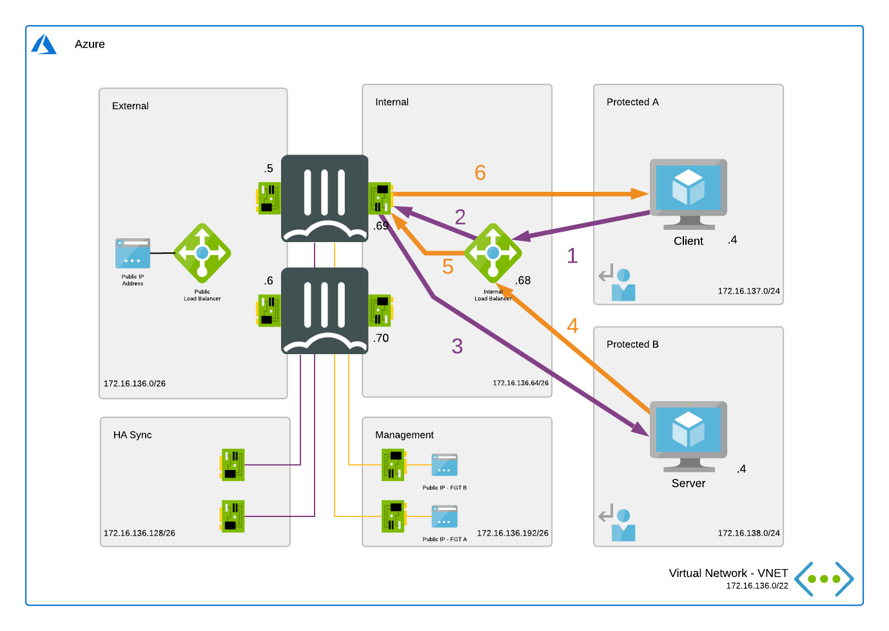

# East-West connections

## Introduction

East-West connections are considered the connections between internal subnets within the VNET or peered VNETs. The goal is to direct this traffic via the FortiGate.

To direct traffic to the FortiGate NGFW routing needs to be adapted on Microsoft Azure using User Defined Routing (UDR). With UDRs the routing in Azure can be adapted to send traffic destined for a specific network IP range to a specific destination such as Internet, VPN Gateway, Virtual Network (VNET), ... In order for the FortiGate to become the destination there is a specific destination called Virtual Appliance. Either the private IP of the FortiGate or the private IP of the internal Load Balancer is provided. More information about User Defined Routing can be found [here](https://docs.microsoft.com/en-us/azure/virtual-network/virtual-networks-udr-overview)

In this design an Azure Standard Load Balancer Internal is used with a specific feature called HA Ports. This feature allows fast failover between the different members of the FortiGate HA custer for all TCP, UDP and ICMP protocols. It is only available in the Standard Load Balancer and as such all load balancers connected to the FortiGate need to be of the Standard type. ALso the public IPs connected to the Fortigate need to be of the Standard type. These is no possibility to migrate between basic and standard public IP sku's. More information about HA Ports can be found [here](https://docs.microsoft.com/en-us/azure/load-balancer/load-balancer-ha-ports-overview)

## Flow

In the diagram the different steps to establish a session are layed out. This flow is based on the configuration as deployed in this template.

1. Connection from client to the private IP of server. Azure routes the traffic using UDR to the internal Load Balancer - s: 172.16.137.4 - d: 172.16.138.4
2. Azure Internal Load Balancer probes and send the packet to the active FGT - s: 172.16.137.4 - d: 172.16.138.4
3. FGT inspects the packet and when allowed sends the packet to the server - s: 172.16.137.4 - d: 172.16.138.4
4. The server responds to the request - s: 172.16.137.4 - d: 172.16.138.4
5. The Azure External Load Balancer sends the returns packet to the active FortiGate - s: 172.16.137.4 - d: 172.16.138.4
6. The active FGT accepts the return packet after inspection - s: 172.16.137.4 - d: 172.16.138.4

## Configuration

To configure the east-west connectivity to a service there are 2 resources that need to be verified/configured:

- FortiGate
- Azure user defined routing

The drawing in the [flow](#flow) section is used in the configuration screenshots.

### Azure User Defined Routing

  

  

  

### FortiGate

On the FortiGate VM, a firewall policy rule needs to be created to allow traffic from specific IP ranges going in and out of the same internal interface (port2).

## Limitations

- In case of failover the Azure Load Balancer will sends existing sessions to the failed VM as explained [here](https://docs.microsoft.com/en-us/azure/load-balancer/load-balancer-custom-probe-overview#probedown).