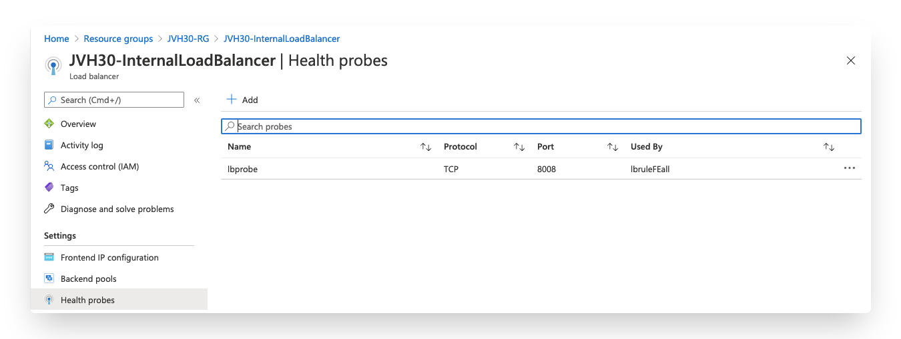
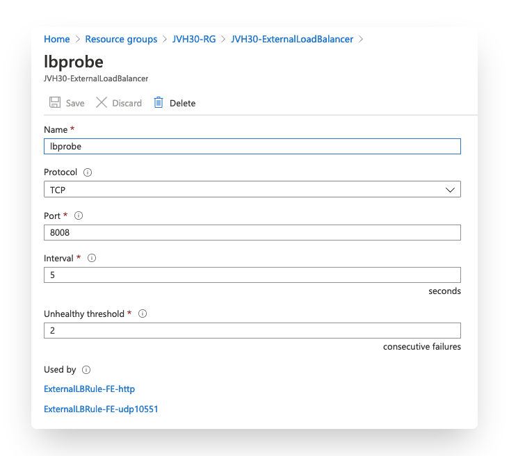

# High Availability Configuration

## Introduction

For this Active/Passive setup external and internal load balancers are used. These need to detect which the FortiGate VMs is online. This is done using a health probe on both Azure Load Balancers.

## Configuration

### Azure Load Balancer

On both the internal and the external Azure Load Balancer a probe needs to be configured and attached to Load Balancing rules for the FortiGate backend systems.

On the external Azure Load Balancer this probe is needed for each port you open. On the internal Azure Load Balancer a catch all 'HA Port' rules is used.




### FortiGate

The probe configured on the Azure Load Balancer need to be enabled on the FortiGate. There are 4 lines of config that will enable the active FortiGate to respond on TCP port 8008 based on the state of the FGCP Unicast HA protocol.

```
config system probe-response
  set http-probe-value OK
  set mode http-probe
end
```
The Microsoft Azure Load Balancer sends out probes from a specific IP, 168.63.129.16. This IP requires to have a response from the same interface as it packet arrived from. To ensure that the probes send for the external or internal load balancer is send via the correct interface, the configuration deployed by the template adds static routes for this Microsoft probe IP for both the external and internal interface of the firewall.

More information about this probe and the source IP can he found [here](https://docs.microsoft.com/en-us/azure/load-balancer/load-balancer-custom-probe-overview#probesource)

```
config router static
  edit 3
    set dst 168.63.129.16 255.255.255.255
    set device port2
    set gateway <b>172.16.136.65</b>
  next
  edit 4
    set dst 168.63.129.16 255.255.255.255
    set device port1
    set gateway <b>172.16.136.1</b>
  next
end
```
