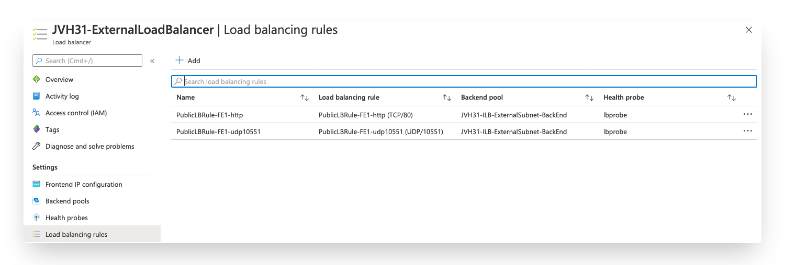
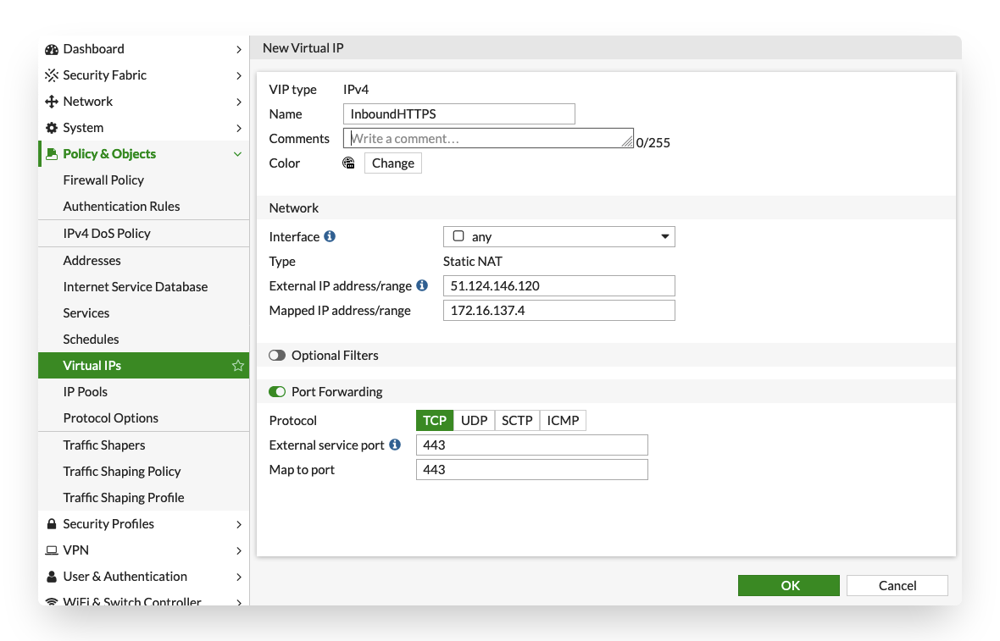
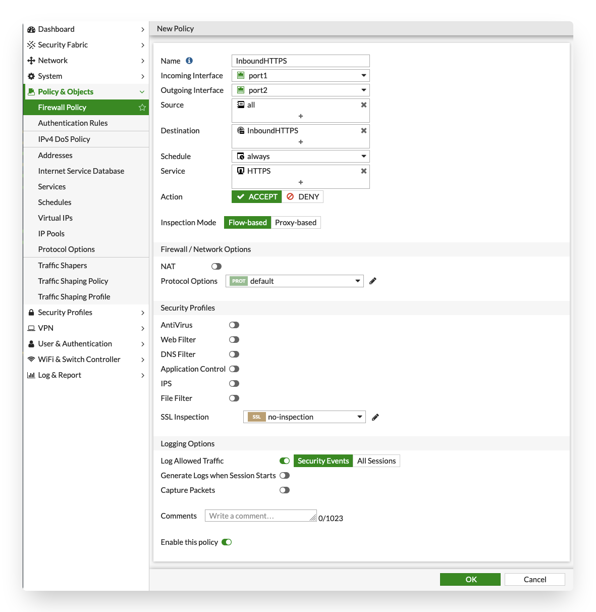
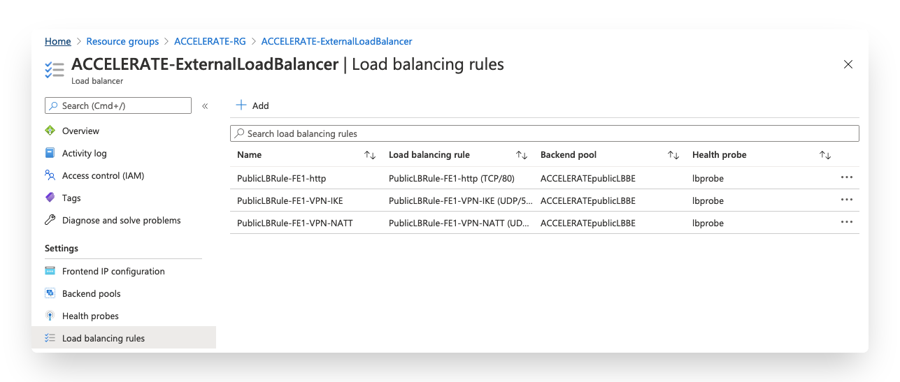
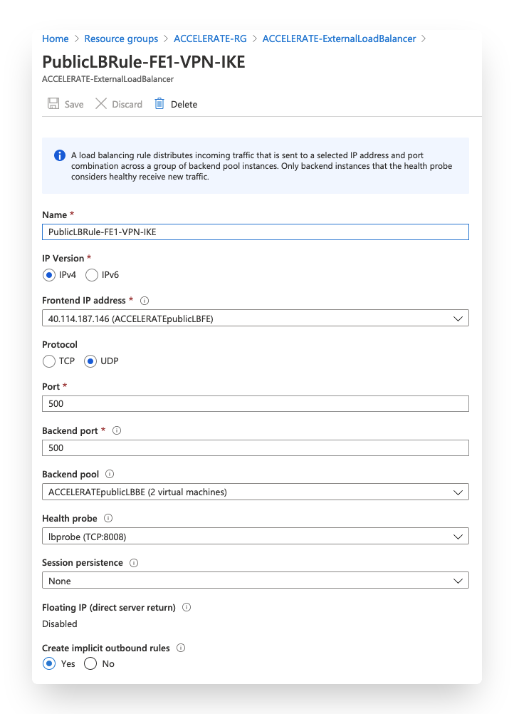
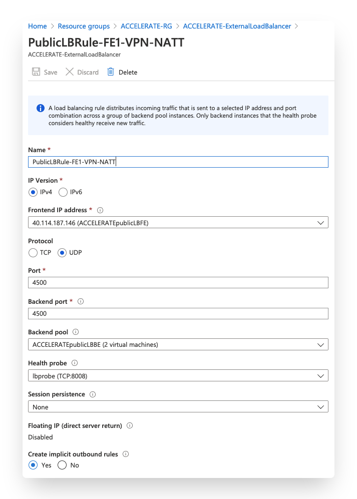
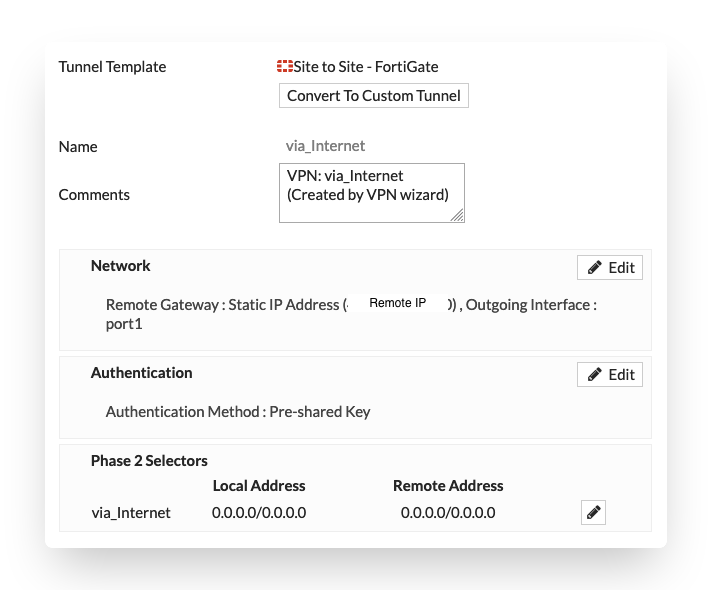
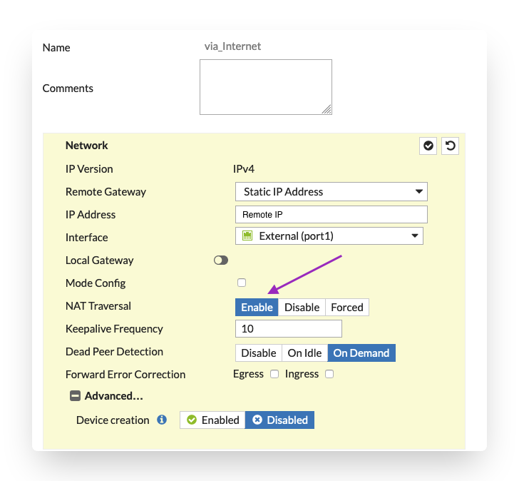

# Inbound connections

## Introduction

Inbound connections are considered the connections coming from the internet towards the Azure Load Balancer to publish services like a webserver or other hosted in the VNET or peered VNETs. The published services via the Azure Load Balancer are limited to the TCP and UDP protocols, as the Azure Load Balancer does not support any other protocols..

To go beyond the limitation of the Azure Load Balancer and use other protocols (e.g. ICMP,ESP,FTP,...), an instance level public IP on each of the VMs in the cluster is required. Load balancing would then be possible using Azure Traffic Manager, Azure FrontDoor or FortiGSLB services using DNS or Anycast mechanisms. Using an instance level public IP will change the behaviour of the outbound connections. The use of Azure Traffic Manager or FortiGSLB services is out of the scope of this article.

There are 2 public IP SKU's: Basic and Standard. This template will use the Standard SKU as we are using the Azure Standard Load Balancer. The standard public IP by default is a static allocation. More information can be found [in the Microsoft documentation](https://docs.microsoft.com/en-us/azure/virtual-network/public-ip-addresses).

## Flow

In the diagram the different steps to establish a session are layed out. This flow is based on the configuration as deployed in this template.

  

1. Connection from client to the public IP of the Azure Standard Load Balancer - s: w.x.y.z - d: a.b.c.d
2. Azure LB probes and send the packet to the active FGT using Floating IP. No NAT - s: w.x.y.z - d: a.b.c.d
3. FGT VIP picks up, translates (DNAT) and sends the packet to the server via routing in Azure - s: w.x.y.z - d: 172.16.137.4
4. Server responds to the request and send the packet to default gateway. Azure routes the traffic using User Defined Routing (UDR) to the Internal Load Balancer - s: 172.16.137.4 - d: w.x.y.z
5. Azure Internal Load Balancer send the traffic to the active FGT - s: 172.16.137.4 - d: w.x.y.z
6. Active FGT translates the source to the FGT VIP on the external interface - s: a.b.c.d - d: w.x.y.z
7. Packet is routed to the client using DSR (Direct Server Return) - s: a.b.c.d - d: w.x.y.z

### When to enable the floating IP in the Azure load balancing rule?

#### Traffic transiting the FortiGate VMs

Enabling the Floating IP option in a load balancing rule results in the Azure Load Balancer to pass the source and destination IP unchanged to the backend FortiGate VMs. In the FortiGate VM you can use the Virtual IP (VIP) construct to pick up this traffic and perform Destination Network Address Translation (DNAT).

If you disable the Floating IP option on the load balancing rule the destination IP of the inbound packet is translated (DNAT) to the IP address of the backend FortiGate VMs as configured in the backend configuration of the Azure Load Balancer. In our example, this would be 172.16.136.5 or 172.16.136.6 for the primary or secondary FortiGate respectively. To configure the FortiGate for a non floating IP load balancing rule it is required to create a VIP with the same name on each FortiGate VM and assign it in the rulebase on both units.

In case you have a requirement to host multiple public IPs for different services using the Floating IP method makes it easy for the FortiGate to distinguish the different inbound requests.

An example of the configuration of the FortiGate can be found [here](#fortigate).

#### Traffic connecting to a service on the FortiGate VMs

For trafic destined to terminate on the FortiGate VMs (e.g. IPSEC tunnels, SSL VPN, ...) the FortiGate is by default not aware of the public IP address attached to the Azure Load Balancer. In this case, where you have the service part of the FortiGate VMs it is best practice to disable the Floating IP option.

An example of the configuration of the FortiGate can be found [here](#configuration---ipsec).

## Configuration

To configure the inbound connectivity to a service there are 2 resources that need to be adapted:

- Azure Standard Load Balancer rules
- FortiGate

The drawing in the [flow](#flow) section is used in the configuration screenshots with a standard public IP in Azure of 51.124.146.120 and the backend VM having the internal IP 172.16.137.4.

### Azure Standard Load Balancer

After deployment of the template, the External Azure Load Balancer is available in the resource group. Once opened, the Load balancing rules will show you 2 default rules one for TCP/80 and one for UDP/10551. These rules are not required and are created as the Azure Load Balancer needs these to allow TCP/UDP traffic outbound.

  

To create a new rule you can follow the settings from the TCP/80 rule that was automatically created. The following variables need verification and/or completion:

- Name: Complete with a name for this specific rule
- Frontend IP address: Select the default frontend public IP or any additional frontend IP that was added to the Azure Load Balancer
- Protocol: What protocol is the inbound connection using TCP or UDP
- Port: The port used by the client to connect to the public IP on the Azure Load Balancer
- Backend port: If you want to configure port translation you can specific a different port. Otherwise the same port as in the port field is used
- Backend pool: This needs to be the backend pool created by the template which contains FortiGate instances
- Health probe: The Azure Load Balancer sends out a probe to a TCP/UDP port to verify if the VM is up and running. In the FortiGate a specific probe config is activate on TCP/8008
- Session persistance: By default the Azure Load Balancer uses a 5 tuple distribution mode. If only the client IP and optionally the protocol need to provide persistancy you change this here. More information on this topic can be found [here](https://docs.microsoft.com/en-us/azure/load-balancer/load-balancer-distribution-mode)
- Floating IP (direct server return): This setting needs to be enabled for any service located behind the FortiGate. This will allow the packet towards the FortiGate to contain the public IP as the destination IP. That allows for easy identification and policy enforcement of the inbound connection on the FortiGate. Services running on the FortiGate like IPSEC disable this option. It allows the IPSEC engine to pick up the traffic to the local process on the private IP of the VM.
- Create implicit outbound rules: Enabling this option will create an outbound SNAT rule for this protocol (TCP, UDP) and frontend IP address. This allows the Azure Load Balancer to use this frontend IP address for outbound connections.

  

### FortiGate

On the FortiGate a Virtual IP (VIP) needs to be created as well as a firewall policy to allow traffic to be translated and passed to the backend server.

The Virtual IP (VIP) is used to translate the inbound packets destination IP and optionally destination port towards the backend server.

- Name: A name for this VIP
- External IP address/range: The frontend IP configured on the Azure Load Balancer for this service
- Internal IP address/range: The internal IP of the service or internal Azure Load Balancer used to load balance multiple servers
- Port Forwarding: The port used for the service e.g. port 80.
***CAVEAT:***** If the Port Forwarding option is not enabled outbound connectivity might be impacted. The FortiGate will translate all outbound traffic from the internal IP address/range to the External IP address which causes Azure to drop these packet. NAT to a public IP is always managed by Microsoft Azure.**

  

Secondly, a firewall policy rule needs to be created to allow the packets to traverse the FortiGate and configure any security inspection for the communication.

- Name: A name for this VIP
- Incoming Interface: The interface where the packet is coming from. In this template it is port1
- Outgoing Interface: The interface where the packet is routed to, to connect to the internal server
- Source: Restrict which IP can connect to the service here or set this to all
- Destination:  The VIP created in step one
- Service: The destination port on the internal server
- NAT: Source NAT is not needed for an Active/Passive setup. For an Active/Active setup it is recommended so the packet is returning to the firewall that maintains the state of the session

  

## Configuration - IPSEC

Connectivity is one of the main use cases for the deployment of a FortiGate NGFW in Microsoft Azure. To connect branches and datacenters to the FortiGate VM, a few items need to be taken into account.

- Terminating an IPSEC tunnel via the Azure Load Balancer is limited to the TCP and UDP protocols. For IPSEC this means that both endpoints need to support NAT-T and run the data connection over UDP/4500 instead of the ESP protocol.
- In the Azure Load Balancer 2 load balancing rules need to be created:

  

  - IKE on port UDP/500

  

  - IPSEC NAT-T on port UDP/4500

  

- On the FortiGate configure an IPSEC tunnel either with the IPSEC wizard or a custom IPSEC tunnel. The FortiGate to FortiGate wizard enables NAT-T automatically. For a custom IPSEC tunnel make sure to enable this feature.

  - IPSEC Wizard

  

  - IPSEC Custom

  

