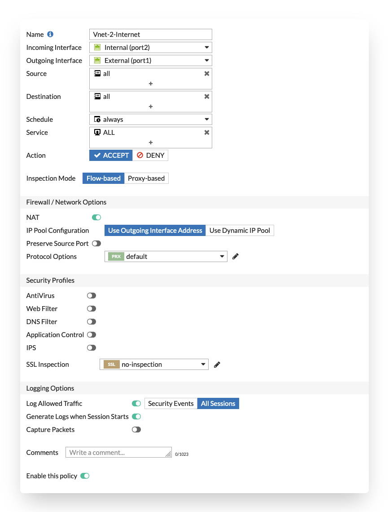

# Outbound connections

## Introduction

Outbound connections are considered the connections coming from the internal subnets within the VNET or peered VNETs via the FortiGate towards the internet.

To direct traffic to the FortiGate NGFW routing needs to be adapted on Microsoft Azure using User Defined Routing (UDR). With UDRs the routing in Azure can be adapted to send traffic destined for a specific network IP range to a specific destination such as Internet, VPN Gateway, Virtual Network (VNET), ... In order for the FortiGate to become the destination there is a specific destination called Virtual Appliance. Either the private IP of the FortiGate or the frontend IP of the internal Load Balancer is provided. More information about User Defined Routing can be found [here](https://docs.microsoft.com/en-us/azure/virtual-network/virtual-networks-udr-overview)

In this design an Azure Standard Load Balancer Internal is used with a specific feature called HA Ports. This feature allows fast failover between the different members of the FortiGate HA custer for all TCP, UDP and ICMP protocols. It is only available in the Standard Load Balancer and as such all load balancers connected to the FortiGate need to be of the Standard type. ALso the public IPs connected to the Fortigate need to be of the Standard type. These is no possibility to migrate between basic and standard public IP sku's. More information about HA Ports can be found [here](https://docs.microsoft.com/en-us/azure/load-balancer/load-balancer-ha-ports-overview)

## Flow

In the diagram the different steps to establish a session are layed out. This flow is based on the configuration as deployed in this template.

1. Connection from client to the public IP of server. Azure routes the traffic using UDR to the internal Load Balancer. - s: 172.16.137.4 - d: a.b.c.d
2. Azure Internal Load Balancer probes and send the packet to the active FGT. - s: 172.16.137.4 - d: a.b.c.d
3. FGT inspects the packet and when allowed sends the packet translated to it's external port private IP to the Azure External Load Balancer. - s: 172.16.136.5 - d: a.b.c.d
4. The Azure External Load Balancer picks one of the available public IP address attached and translates the source IP - s: w.x.y.z - d: a.b.c.d
5. The server responds to the request - s: a.b.c.d d: w.x.y.z
6. The Azure External Load Balancer sends the returns packet to the active FortiGate - s: a.b.c.d - d: 172.16.136.5
7. The active FGT accepts the return packet after inspection. It translates and routes the packet to the client - s: a.b.c.d - d: 172.16.137.4

## Configuration

Outbound connectivity in Azure has several properties that are specific to the platform. These need to be taken into account. This configuration is a basic configuration that will NAT all outbound connections behind 1 or more public IPs on the Azure Load Balancer. More specific cases are be explained [here](config-outbound-nat-considerations.md).

This template deploys 2 Azure Load Balancers with a standard SKU which requires standard SKU public IP connected to the VM or Load Balancer. A standard SKU public IP requires a network security group, is zone aware and always has a static assignment.

For more information on outbound connections in Azure the Microsoft documentation can be found [here](https://docs.microsoft.com/en-us/azure/load-balancer/load-balancer-outbound-connections)

To configure the outbound connectivity to a service there are 2 resources that need to be verified/configured:

- FortiGate
- Azure Standard Load Balancer rules

The drawing in the [flow](#flow) section is used in the configuration screenshots with a standard public IP in Azure of 40.114.187.146 on the Azure Load Balancer, the FortiGate private IP of 172.16.136.5 (primary) or 172.16.136.6 (secondary) and the backend VM having the internal IP 172.16.137.4.

### Azure Standard Load Balancer

After deployment of the template, the External Azure Load Balancer is available in the resource group. Once opened, the Load balancing rules will show you 2 default rules one for TCP/80 and one for UDP/10551. These rules are not required and are created as the Azure Load Balancer needs these to allow TCP/UDP traffic outbound.

If there is a public IP assigned to the port1 network interface of the FortiGate where also the Azure Load Balancer is connected this will take precedence outbound NAT.

The inbound rules have the option enabled to create outbound rules automatically. This enables outbound SNAT using the configured frontend ip for traffic coming from the FortiGate VM with it's private ip.

  

### FortiGate

On the FortiGate VM, a firewall policy rule needs to be created to allow traffic from the internal interface to the external interface with any or specific ip ranges and NAT enabled using the "Outgoing Interface Address".

  

The NAT behind the FortiGate outgoing interface allows for a very simple configuration. On failover the private IP of the FortiGate outgoing interface changes but there is no configuration change needed.

## Limitations

- Azure has certain limitations on outbound connections: https://docs.microsoft.com/en-us/azure/load-balancer/load-balancer-outbound-connections#limitations
- Azure has a limited number of outbound ports it can allocated per public ip. More information and optimisations can be found [here](https://docs.microsoft.com/en-us/azure/load-balancer/load-balancer-outbound-connections#preallocatedports)
- In case of failover the Azure Load Balancer will sends existing sessions to the failed VM as explained [here](https://docs.microsoft.com/en-us/azure/load-balancer/load-balancer-custom-probe-overview#probedown).