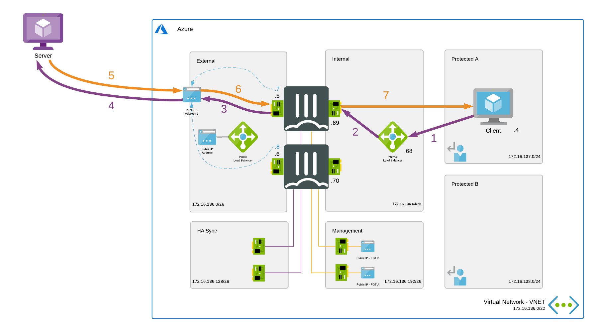
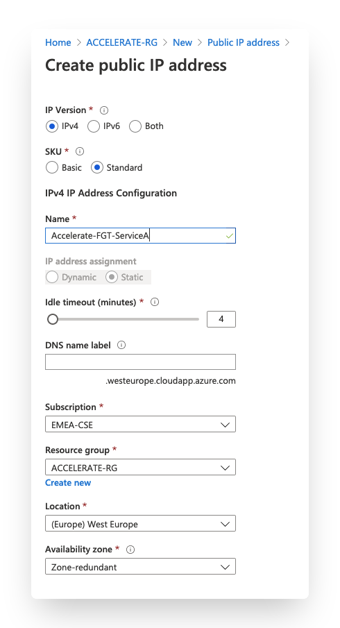
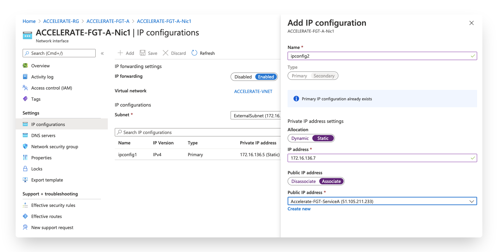
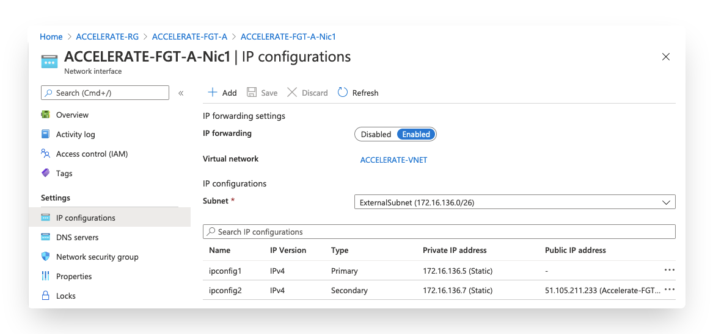
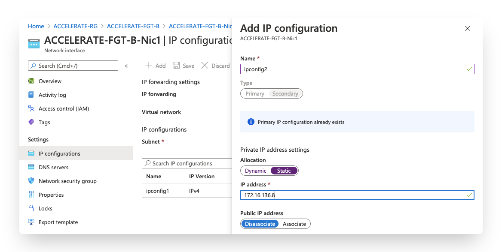
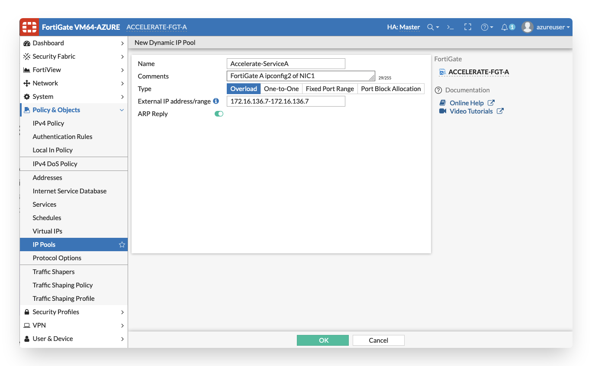
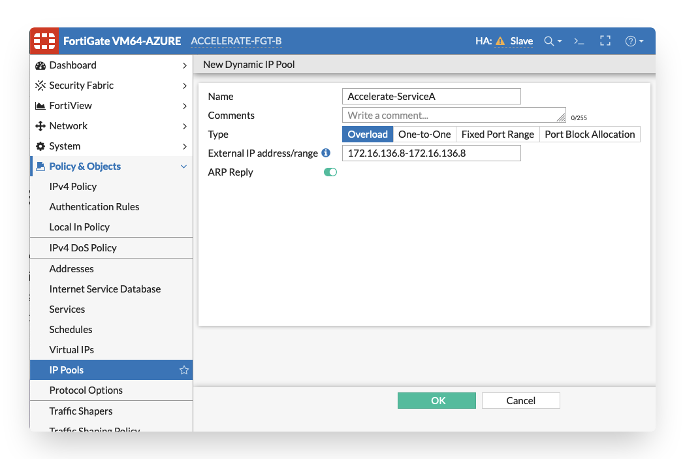
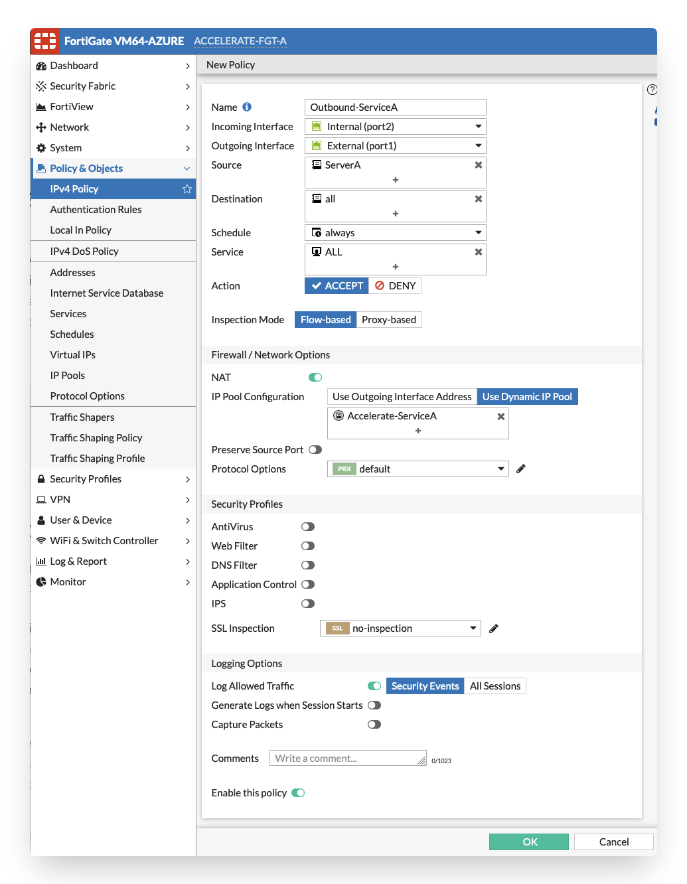

# Outbound connections - NAT considerations

## Introduction

The [general outbound connections page](config-outbound-connections.md) focussed on the default scenario with 1 or multiple public IPs that handle all outbound traffic. The Azure Load Balancer has a pool of IPs that can be used. In some deployments customers would like to have specific 1-to-1 NAT or NAT behind a separate public IPs for one service, server or user. These NAT scenario's are mostly requested for specific ACLs implemented at other side or validation of public IPs in case of sending email, ...

The Azure Load Balancer is limited in available outbound rules direct traffic as we would like for 1-to-1 NAT or NAT of specific services. The outbound rules only applies to the primary IP configuration of a NIC (limitations can be found [here](https://docs.microsoft.com/en-us/azure/load-balancer/load-balancer-outbound-connections#limitations)). This prevents us to differentiate the traffic based on different outbound IPs on the FortiGate.

To achieve this NAT one or more public IPs needs to be attached to the external NIC of the FortiGate. In this Active-Passive HA cluster is best to use the SDN connector to failover the public IP from the primary to the secondary in case of failure of the primary fortigate.

## Flow

In the diagram the different steps to establish a session are layed out. This flow is based on the configuration as deployed in this template.



1. Connection from client to the public IP of server. Azure routes the traffic using UDR to the internal Load Balancer - s: 172.16.137.4 - d: a.b.c.d
2. Azure Internal Load Balancer probes and send the packet to the active FGT - s: 172.16.137.4 - d: a.b.c.d
3. FGT inspects the packet and when allowed performs source NAT using IP pool settings to the secondary IP on the external interface - s: 172.16.136.7 (or 8) - d: a.b.c.d
4. The Azure router will NAT the source IP of the packet to the attached public IP - s: w.x.y.z - d: a.b.c.d
5. The server responds to the request - s: a.b.c.d d: w.x.y.z
6. The Azure router NAT the destination address to the private IP of the secondary IP configuration of the external NIC attached to the public IP - s: a.b.c.d - d: 172.16.136.7 (or 8)
7. The active FGT accepts the return packet after inspection. It translates and routes the packet to the client - s: a.b.c.d - d: 172.16.137.4

## Configuration

Outbound connectivity in Azure has several properties that are specific to the platform. These need to be taken into account.

For more information on outbound connections in Azure the Microsoft documentation can be found [here](https://docs.microsoft.com/en-us/azure/load-balancer/load-balancer-outbound-connections)

To configure the 1-to-1 outbound connectivity to a service there are 2 resources that need to be verified/configured:

- Azure portal: public IP and Network interfaces of both FortiGate VMs
- FortiGate

The drawing in the [flow](#flow) section is used in the configuration screenshots with a standard public IP in Azure of 40.114.187.146 on the Azure Load Balancer, the FortiGate private IP of 172.16.136.5 (primary) or 172.16.136.6 (secondary) and the backend VM having the internal IP 172.16.137.4.

### Azure portal

1. Create a new public IP in Azure. Make sure to match the other public IP SKUs used connected to the FortiGate cluster and Azure Load Balancer. The SKU needs to be 'Standard' when using the Azure Load Balancer in this setup.

<p align="center">
  
</p>

2. Add a secondary private IP address on the NIC1 (external NIC) of the primary FortiGate VM in Azure. Associate the public IP created in step 1.

<p align="center">
  
</p>

<p align="center">
  
</p>

3. Add a secondary private IP address on the NIC1 (external NIC) of the secondary FortiGate VM in Azure. Do not associate the public IP created in step 1.

<p align="center">
  
</p>

### FortiGate

On the FortiGate VM, a firewall policy rule needs to be created to allow traffic from the internal interface to the external interface with any or specific ip ranges and NAT enabled using the "Outgoing Interface Address".

1. Open the CLI of primary FortiGate and execute the below commands to make an vdom exception. This will case the IP Pool objects to not synchronized between cluster members. This feature is available in FortiOS 6.2.4, 6.4.0 or above. Each FortiGate VM needs to have unique IP Pool configured because they have unique secondary Private IP address which was configured in the Azure portal

```
config system vdom-exception
edit 0
  set object firewall.ippool
next
end
```

2. In the primary FortiGate GUI configure an IP Pool with the private IP address of ifconfig2 as the external IP address

<p align="center">
  
</p>

3. In the secondary FortiGate GUI configure an IP Pool with the private IP address of ifconfig2 as the external IP address. Make sure the name is exactly the same as on the primary unit to match the firewall policy

<p align="center">
  
</p>

3. Configure firewall policy using IP Pool object from step 4 & 5 for example for particular server which you would like to use Public IP configured in step 1 for outbound connections instead of public IP attached to Azure external load balancer.

<p align="center">
  
</p>

4. Configure the Azure Fabric Connector on the FortiGate CLI. Via an API call to Azure it will move the public IP from NIC1 of primary FortiGate to NIC1 of secondary FortiGate in case HA cluster failover. To authenticate to azure either managed identity or a service principal can be use. The authentication must be configured for the Azure Fabric Connector to work and information can be found on the [Fortinet documentation site](https://docs.fortinet.com/vm/azure/fortigate/7.0/azure-administration-guide/7.0.0/502895/configuring-a-fabric-connector-in-azure).

- Primary FortiGate
```
config system sdn-connector
    edit "AzureSDN"
        set type azure
        set ha-status enable
        config nic
            edit "ACCELERATE-FGT-A-Nic1"
                config ip
                    edit "ipconfig2"
                        set public-ip "Accelerate-FGT-ServiceA"
                    next
               end
           next
       end
end
```
- Secondary FortiGate
```
config system sdn-connector
    edit "AzureSDN"
        set type azure
        set ha-status enable
        config nic
            edit "ACCELERATE-FGT-B-Nic1"
                config ip
                    edit "ipconfig2"
                        set public-ip "Accelerate-FGT-ServiceA"
                    next
               end
           next
       end
end
```
## Limitations

- Azure has certain limitations on outbound connections: https://docs.microsoft.com/en-us/azure/load-balancer/load-balancer-outbound-connections#limitations
- Traffic not matching the firewall policy created here will use the standard NAT via the Azure Load Balancer
- Failover using the SDN connector is dependant on the execution time of the Azure API. If that timing is not acceptable it is possible to configure a public IP on both NICs and not use the SDN connector. The downside is that each firewall has a different public IP address
