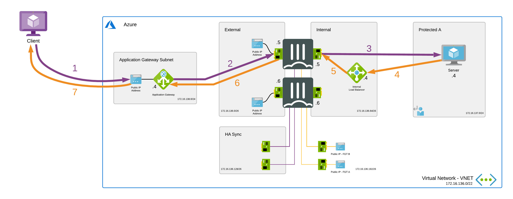
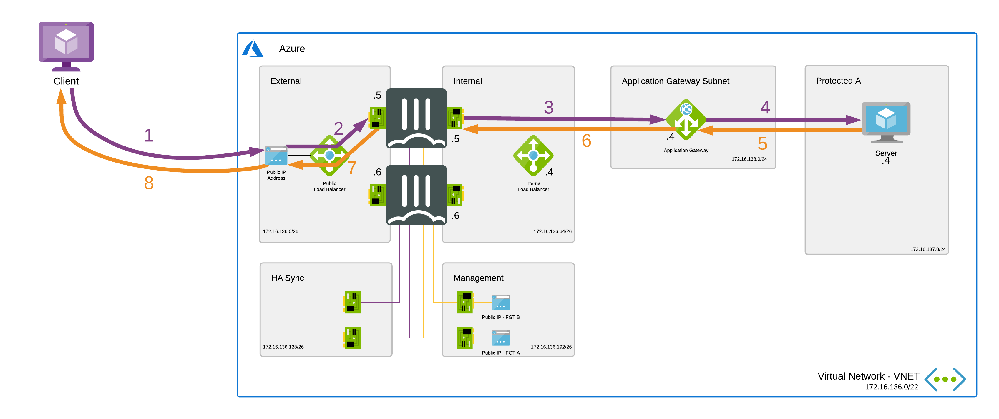
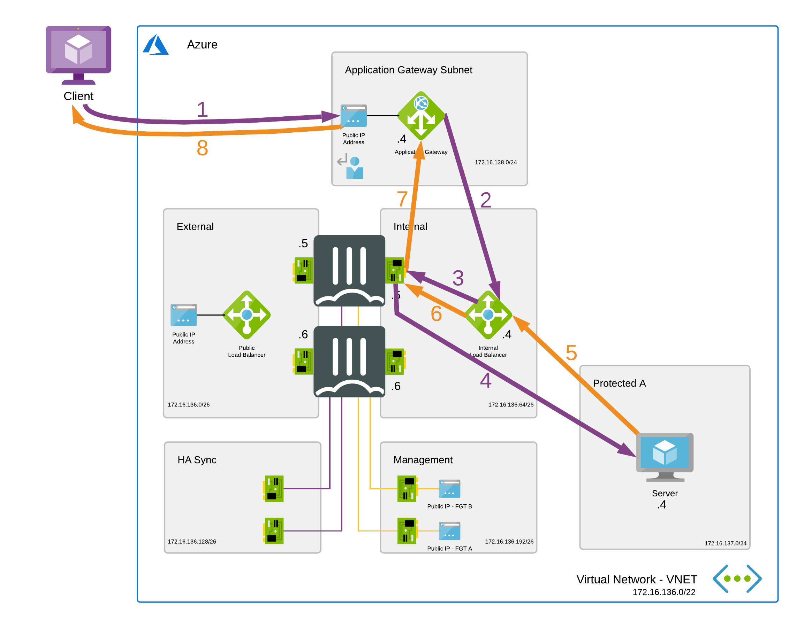

# Active/Passive High Available FortiGate pair with Azure Application Gateway and Azure Standard Load Balancer

# Introduction

The combination of Azure Application Gateway and FortiGate gives the ability to apply next-gen scanning (like IPS,AV,...) on incoming web traffic.

If you want to learn more about the Azure Application Gateway, check [here](https://docs.microsoft.com/en-us/azure/application-gateway/overview). 
If you want to learn more about the web application security solutions of Fortinet, check [here](https://www.fortinet.com/products/web-application-firewall/fortiweb).

# Design

The Azure Application Gateway can be deployed together with FortiGate in several ways. These different methods will be described as scenarios. The goal of this page is to document these scenarios and provide the necessary ARM templates.
These ARM templates deploy a high availability pair of FortiGate Next-Generation Firewalls accompanied by an Azure Application Gateway and the required infrastructure. It is based of the "Active/Passive High Available FortiGate pair with external and internal Azure Standard Load Balancer" template which can be found [here](https://github.com/fortinet/azure-templates/tree/main/FortiGate/Active-Passive-ELB-ILB). Please also review the documentation of that template for additional information and troubleshooting.

# Deployment

The FortiGate solution can be deployed using the "Deploy to Azure" button, Azure Portal or Azure CLI. There are 4 variables needed to complete kickstart the deployment. The deploy.sh script will ask them automatically. When you deploy the ARM template the Azure Portal will request the variables as a requirement.

  - PREFIX : This prefix will be added to each of the resources created by the templates for easy of use, manageability and visibility.
  - LOCATION : This is the Azure region where the deployment will be deployed
  - USERNAME : The username used to login to the FortiGate GUI and SSH management UI.
  - PASSWORD : The password used for the FortiGate GUI and SSH management UI.

## Scenario 1

In this scenario the Application Gateway will be placed in front of the FortiGates and act as an external load balancer. Offloading of SSL traffic on the Azure Application Gateway is recommended.
- This scenario is supported with Azure Application Gateway v1.
- This scenario is supported with Azure Application Gateway v2.

The traffic flow will look like this:

1. The client will do the request on the frontend IP of the Azure Application Gateway. This can be a public or private frontend.
2. The Azure Application Gateway will process the traffic and send it to it's configured backend, which are the private "WAN" IP's of both FortiGates. The Azure Application Gateway will determine which FortiGate is active and which one is passive using health probes. Only the active FortiGate will respond to the health probes and so the Azure Application Gateway will only send the request to the active FortiGate. The source IP of the traffic will be the IP of the Azure Application Gateway instance.
3. The FortiGate will have a VIP configured with the private "WAN" IP of the FortiGate as "External IP address" and with the private IP of the server as "Mapped IP address" in the VIP config. The private "WAN" IP is unique for each FortiGate, so the "External IP address" in the VIP config will be different between the active and passive FortiGate because of this, the template will disable the config sync for VIPs. This setting can be found in the FortiGate cli at "config system vdom-exception". It's a requirement to also configure a VIP with an identical name and settings, except for the "External IP address" setting, on the passive FortiGate.
4. On the subnet of the server there are User Defined Routes with a route that will send the reply of the server via the Azure standard internal load balancer.
5. The Azure standard internal load balancer will have an "HA ports" load balancing rule configured with the private "LAN" IP's of both FortiGates as backend. The Azure standard internal load balancer will determine which FortiGate is active and which one is passive using health probes. Only the active FortiGate will respond to the health probes and so the Azure standard internal load balancer will only send the reply to the active FortiGate.
6. The active FortiGate will send the reply to the Azure Application Gateway.
7. The Azure Application Gateway will process the reply and send it to the client.

### Azure Portal

### Azure CLI

`cd ~/clouddrive/ && wget -qO- https://github.com/fortinet/azure-templates/archive/main.zip | jar x && cd ~/clouddrive/azure-templates-main/FortiGate/AzureApplicationGateway/ && ./deploy.sh`

This Azure ARM template will automatically deploy an environment containing the following components.

  - 2 FortiGate firewalls in an active/passive deployment
  - 1 Azure Application Gateway v2 for incoming web traffic
  - 1 internal Azure Standard Load Balancer to receive all internal traffic
  - 1 VNET with 1 protected subnet, application gateway subnet and 4 subnets required for the FortiGate deployment (external, internal, ha mgmt and ha sync). When using an existing VNET, it must already have these 6 subnets.
  - 5 public IPs: 1 public IP as listener on the application gateway. 2 public IP as WAN IP and 2 public IP for management access.
  - User Defined Routes (UDR) for the protected subnet.

This ARM template can also be used to extend or customized based on your requirements. Additional subnets besides the one's mentioned above are not automatically generated. By adapting the ARM templates you can add additional subnets which preferably require their own routing tables.

## Scenario 2

In this scenario the Application Gateway will be placed behind the FortiGates. Enabling inbound SSL inspection on the FortiGate is recommended. More info on this topic can be found [here](https://docs.fortinet.com/document/fortigate/6.2.0/cookbook/55107/protecting-an-ssl-server)

Depending on the version of the Azure Application Gateway this scenario will differ:

- Azure Application Gateway v1 supports UDR being applied on the subnet it resides in. Because of this source NAT is not mandatory.
- Azure Application Gateway v2 doesn't support User Defined Routes with a default route via NVA on the subnet it resides in. Because of this applying source NAT on the FortiGate for the incoming traffic is mandatory. 
Please also review the Microsoft documentation on this topic [here](https://docs.microsoft.com/en-us/azure/application-gateway/configuration-infrastructure#supported-user-defined-routes).

The rest of the scenario and template only covers the Azure Application Gateway v2.
Microsoft Azure makes it mandatory to add a public frontend IP on the Application Gateway v2. The template will provision this public IP but it is not used by this scenario.

The traffic flow will look like this:

1. The client will do the request on the public frontend IP of the Azure standard public load balancer.
2. The Azure standard public load balancer will have a load balancing rule, with the floating IP option enabled, configured with the private "WAN" IP's of both FortiGates as backend. The Azure standard public load balancer will determine which FortiGate is active and which one is passive using health probes. Only the active FortiGate will respond to the health probes and so the Azure standard public load balancer will only send the request to the active FortiGate.
3. Because the floating IP option is enabled on the load balancing rule, the FortiGate will have a VIP with the public frontend IP of the Azure standard public load balancer configured as "External IP address" and with the private frontend of the Azure Application Gateway as "Mapped IP address". Applying source NAT on this traffic when using Application Gateway v2 is mandatory.
4. The Azure Application Gateway will process the traffic and send it to the configured backend server. The source IP of the traffic will be the IP of the Azure Application Gateway instance.
5. The server will directly reply to the Azure Application Gateway.
6. The Azure Application Gateway will respond directly to the active FortiGate because source NAT was applied on the request.
7. The active FortiGate will send the reply to it's default gateway.
8. Azure will source NAT the reply to the public frontend IP of the Azure standard public load balancer and send it to the client.

### Azure Portal

### Azure CLI

`cd ~/clouddrive/ && wget -qO- https://github.com/fortinet/azure-templates/archive/main.zip | jar x && cd ~/clouddrive/azure-templates-main/FortiGate/AzureApplicationGateway/ && ./deploy.sh`

This Azure ARM template will automatically deploy a full working environment containing the following components.

  - 2 FortiGate firewalls in an active/passive deployment
  - 1 Azure Application Gateway v2
  - 1 external Azure Standard Load Balancer for communication with the internet
  - 1 internal Azure Standard Load Balancer to receive all internal traffic
  - 1 VNET with 1 protected subnet, application gateway subnet and 4 subnets required for the FortiGate deployment (external, internal, ha mgmt and ha sync). If using an existing VNET, it must already have these 6 subnets.
  - 4 public IPs: 1 public IP as listener on the application gateway (unused but an Azure requirement). 1 public IP as WAN IP on the Azure standard Load Balancer and 2 public IP for management access.
  - User Defined Routes (UDR) for the protected subnet.

This ARM template can also be used to extend or customized based on your requirements. Additional subnets besides the one's mentioned above are not automatically generated. By adapting the ARM templates you can add additional subnets which preferably require their own routing tables.

## Scenario 3

In this scenario the FortiGates will be placed between the Azure Application Gateway and it's configured backend servers. Offloading of SSL traffic on the Azure Application Gateway is recommended.

- This scenario is supported with Azure Application Gateway v1.
- This scenario is supported with Azure Application Gateway v2.

The traffic flow will look like this:

1. The client will do the request on the frontend IP of the Azure Application Gateway. This can be a public or private frontend.
2. The Azure Application Gateway will process the request and send it to its configured backend, which is the webserver. On the subnet of the Azure Application Gateway there are User Defined Routes with a route that will route the request first via the Azure standard internal load balancer.
3. The Azure standard internal load balancer will have an "HA ports" load balancing rule configured with the private "LAN" IPs of both FortiGates as backend. The Azure standard internal load balancer will determine which FortiGate is active and which one is passive using health probes. Only the active FortiGate will respond to the health probes and so the Azure standard internal load balancer will only send the request to the active FortiGate.
4. The active FortiGate will send the request to the webserver.
5. On the subnet of the webserver there are User Defined Routes with a route that will send the reply of the webserver back via the Azure standard internal load balancer.
6. The Azure standard internal load balancer will have an "HA ports" load balancing rule configured with the private "LAN" IPs of both FortiGates as backend. The Azure standard internal load balancer will determine which FortiGate is active and which one is passive using health probes. Only the active FortiGate will process the health probes and so the Azure standard internal load balancer will send the reply to the active FortiGate.
7. The active FortiGate will send the reply to the Azure Application Gateway.
8. The Azure Application Gateway will process the reply and send it to the client.

### Azure Portal

### Azure CLI

`cd ~/clouddrive/ && wget -qO- https://github.com/fortinet/azure-templates/archive/main.zip | jar x && cd ~/clouddrive/azure-templates-main/FortiGate/AzureApplicationGateway/ && ./deploy.sh`

This Azure ARM template will automatically deploy a full working environment containing the following components.

  - 2 FortiGate firewalls in an active/passive deployment
  - 1 Azure Application Gateway v2 for incoming web traffic
  - 1 external Azure Standard Load Balancer for communication with the internet
  - 1 internal Azure Standard Load Balancer to receive all internal traffic
  - 1 VNET with 1 protected subnet, application gateway subnet and 4 subnets required for the FortiGate deployment (external, internal, ha mgmt and ha sync). If using an existing VNET, it must already have these 6 subnets.
  - 4 public IPs: 1 public IP as listener on the application gateway. 1 public IP as WAN IP on the Azure standard Load Balancer and 2 public IP for management access.
  - User Defined Routes (UDR) for the protected subnet.

This ARM template can also be used to extend or customized based on your requirements. Additional subnets besides the one's mentioned above are not automatically generated. By adapting the ARM templates you can add additional subnets which preferably require their own routing tables.

# Requirements and limitations

This template is based of the "Active/Passive High Available FortiGate pair with external and internal Azure Standard Load Balancer" template.
Please also check for other requirements and limitations [here](https://github.com/fortinet/azure-templates/tree/main/FortiGate/Active-Passive-ELB-ILB#requirements-and-limitations).

## Support
Fortinet-provided scripts in this and other GitHub projects do not fall under the regular Fortinet technical support scope and are not supported by FortiCare Support Services.
For direct issues, please refer to the [Issues](https://github.com/fortinet/azure-templates/issues) tab of this GitHub project.
For other questions related to this project, contact [github@fortinet.com](mailto:github@fortinet.com).

## License
[License](LICENSE) © Fortinet Technologies. All rights reserved.
