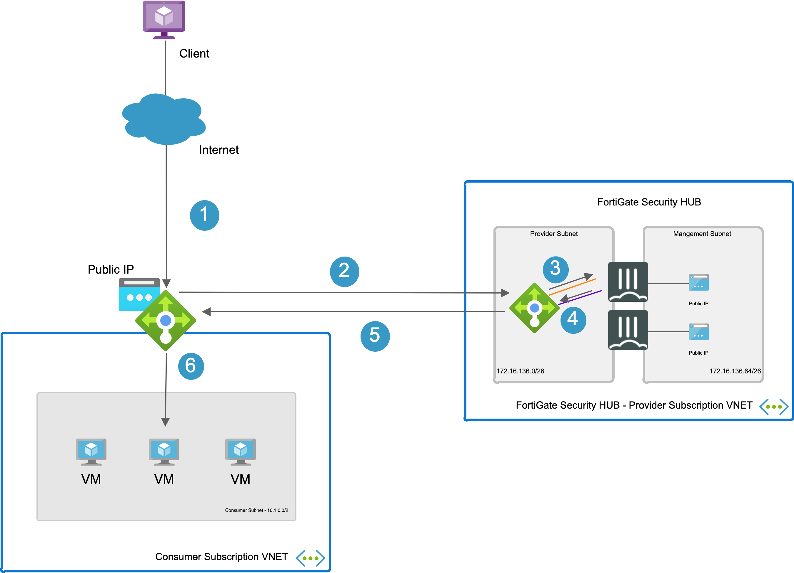
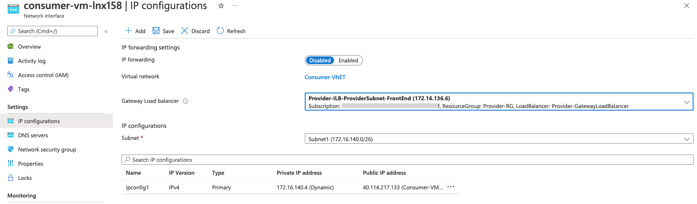
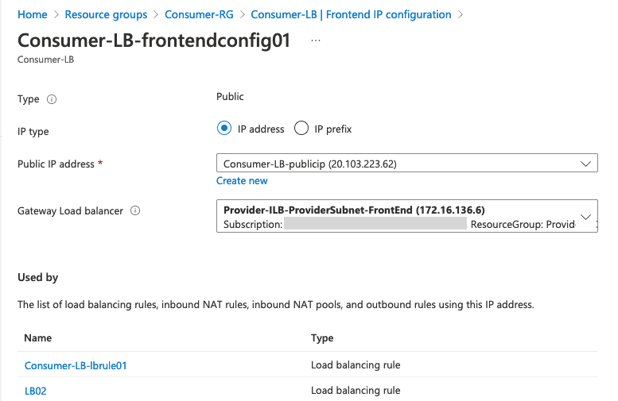
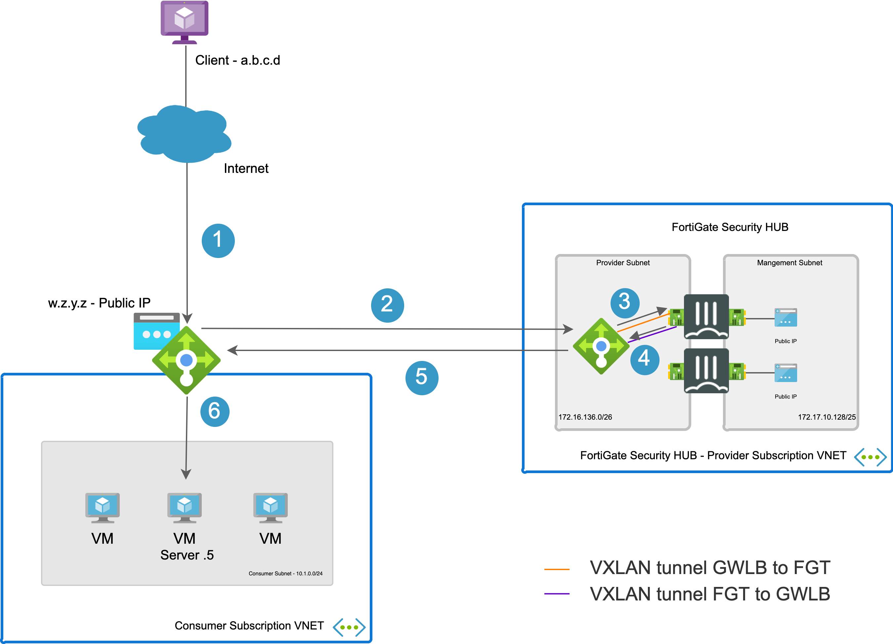

# FortiGate Next-Generation Firewall - Azure Gateway Load Balancer

## Introduction

More and more enterprises are turning to Microsoft Azure to extend or replace internal data centers and take advantage of the elasticity of the public cloud. While Azure secures the infrastructure, you are responsible for protecting the resources you put in it. As workloads are being moved from local data centers connectivity and security are key elements to take into account. FortiGate-VM offers a consistent security posture and protects connectivity across public and private clouds, while high-speed VPN connections protect data.

This ARM template deploys a pair of FortiGate Next-Generation Firewall accompanied by an Azure Gateway Load Balancer into a "provider" network. A Gateway Load Balancer can be referenced by a Standard Public Load Balancer with rules configured to forward to Azure backend hosts or with an instance-level Standard Public IP tied directly to a private IP on a virtual machine.  With the Azure Gateway Load Balancer referenced, all traffic will be forwarded first to one of the FortiGate VMs by way of the Gateway Load Balancer before being sent to the backend systems.

## Design

As you can see in the diagram, the Gateway Load Balancer and associated backend pool will sit as a shim in between the Standard Load Balancer Frontend and Backend or between the Standard Public IP and the private IP of the virtual machine.

All traffic in or out of the virtual machine via the Standard Load balancer or the Standard Public IP will be forwarded to the Gateway Load Balancer and inspected by a FortiGate VM. The primary template here deploys the right side (Provider Side) of this diagram. A sample consumer template is available here as well, but is not necessarily meant for production.

<p align="center">
  
</p>

## Deployment

For the deployment, you can use the Azure Portal, Azure CLI, Powershell or Azure Cloud Shell. The Azure ARM templates are exclusive to Microsoft Azure and can't be used in other cloud environments. The main template is the `azuredeploy.json` which you can use in the Azure Portal.

### Azure Portal

Azure Portal Wizard:
[](https://portal.azure.com/#create/Microsoft.Template/uri/https%3A%2F%2Fraw.githubusercontent.com%2Ffortinet%2Fazure-templates%2Fmain%2FFortiGate%2FAzureGatewayLoadBalancer%2Fazuredeploy.json/createUIDefinitionUri/https%3A%2F%2Fraw.githubusercontent.com%2Ffortinet%2Fazure-templates%2Fmain%2FFortiGate%2FAzureGatewayLoadBalancer%2FcreateUiDefinition.json)

Custom Deployment:
[](https://portal.azure.com/#create/Microsoft.Template/uri/https%3A%2F%2Fraw.githubusercontent.com%2Ffortinet%2Fazure-templates%2Fmain%2FFortiGate%2FAzureGatewayLoadBalancer%2Fazuredeploy.json)
[](http://armviz.io/#/?load=https%3A%2F%2Fraw.githubusercontent.com%2Ffortinet%2Fazure-templates%2Fmain%2FortiGate%2FAzureGatewayLoadBalancer%2Fazuredeploy.json)

## Requirements and limitations

This template only deploys the Gateway Load Balancer and FortiGates (i.e. the provider section of the above diagram).  It does not provide the consumer side of the deployment.  A typical use case may have a Managed Security Services Provider deploy the FortiGates in their subscription, and one of their customers deploy the consumer side of the solution in their subscription, using the subscription ID and Resource Group of the MSSP's deployment to link the two together.  A sample consumer template is also included.

The ARM template deploys different resources and it is required to have the access rights and quota in your Microsoft Azure subscription to deploy the resources.

- The template will deploy Standard F4s VMs for this architecture. Other VM instances are supported as well with a minimum of 2 NICs. A list can be found [here](https://docs.fortinet.com/document/fortigate/6.4.0/azure-cookbook/562841/instance-type-support)
- Licenses for Fortigate
  - BYOL: A demo license can be made available via your Fortinet partner or on our website. These can be injected during deployment or added after deployment. Purchased licenses need to be registered on the [Fortinet support site](http://support.fortinet.com). Download the .lic file after registration. Note, these files may not work until 60 minutes after it's initial creation.
  - PAYG or OnDemand: These licenses are automatically generated during the deployment of the FortiGate systems.
  - The password provided during deployment must need password complexity rules from Microsoft Azure:
  - It must be 12 characters or longer
  - It needs to contain characters from at least 3 of the following groups: uppercase characters, lowercase characters, numbers, and special characters excluding '\' or '-'
- The terms for the FortiGate PAYG or BYOL image in the Azure Marketplace needs to be accepted once before usage. This is done automatically during deployment via the Azure Portal. For the Azure CLI the commands below need to be run before the first deployment in a subscription.
  - BYOL
`az vm image accept-terms --publisher fortinet --offer fortinet_fortigate-vm_v5 --plan fortinet_fg-vm`
  - PAYG
`az vm image accept-terms --publisher fortinet --offer fortinet_fortigate-vm_v5 --plan fortinet_fg-vm_payg_2020`

## FortiGate configuration

The FortiGate VMs need a specific configuration to match the deployed environment. The basic configuration is already setup through the UserData portion of the ARM template.  This includes VXLAN tunnels from each FortiGate to the Gateway Load Balancer.  These provide the external and internal interfaces which are configured as a virtual wire pair. All communication between the Gateway Load Balancer and FortiGate occur at layer 2 within these tunnels.  The following shows the basic configuration which is already included in the template. Notice that the policy allows all traffic, but does enable IPS and logging. This can be modified and restricted as necessary. The policy here is only an initial example which does allow all traffic to flow.

```console
config system vxlan
    edit "extvxlan"
        set interface "port1"
        set vni 801
        set dstport 2001
        set remote-ip "172.16.136.6"
    next
    edit "intvxlan"
        set interface "port1"
        set vni 800
        set dstport 2000
        set remote-ip "172.16.136.6"
    next
end
config system interface
    edit "port1"
        set vdom "root"
        set mode dhcp
        set allowaccess probe-response
        set description "Provider"
        set defaultgw disable
        set mtu-override enable
        set mtu 1570
    next
    ...
    edit "extvxlan"
        set vdom "root"
        set type vxlan
        set snmp-index 7
        set interface "port1"
    next
    edit "intvxlan"
        set vdom "root"
        set type vxlan
        set snmp-index 8
        set interface "port1"
    next
end
config system virtual-wire-pair
    edit "vxlanvwpair"
        set member "extvxlan" "intvxlan"
    next
end
config firewall policy
    edit 1
        set name "int-ext_vxlan"
        set srcintf "extvxlan" "intvxlan"
        set dstintf "extvxlan" "intvxlan"
        set action accept
        set srcaddr "all"
        set dstaddr "all"
        set schedule "always"
        set service "ALL"
        set utm-status enable
        set ssl-ssh-profile "certificate-inspection"
        set ips-sensor "default"
        set logtraffic all
    next
end
```

## Azure configuration

The Azure Gateway Load Balancer can be attached to a instance-level Standard Public IP or a Standard External Load Balancer. Once you have your VMs configured with either the Public IP or the Load Balancer the Gateway Load Balancer can be configured. The FortiGate VMs don't intervene in the routing, address translation and NSGs. They need to be configured correctly for this setup to work. For outbound connections it is important to take into account the potential SNAT port exhaustion. More information is available in the links provider at the bottom of this document. 

### Standard Public IP
Open the network interface that has the public IP attached and in IP configuration menu you can select the Gateway Load Balancer to use.
<p align="center">
  
</p>

### Standard External Load Balancer
Open the Load Balancer Front End IP configuration and select the Gateway Load Balancer to use.
<p align="center">
  
</p>

## Traffic flow

### Inbound connection

Inbound connections are considered the connections coming from the internet towards the Standard Public IP attached to the VM or Azure Load Balancer to publish services like a webserver or other. In the diagram the different steps to establish a session are layed out.

The producer environment only sees public IPs and doesn't require specific routing as the FortiGate uses a  to pick up, inspect the traffic and send it back to the producer environment.

<p align="center">
  
</p>

1. Connection from client to the Standard Public IP - s: a.b.c.d - d: w.x.y.z
2. The packet is picked up and transfered from the consumer environment towards the producer Azure Gateway Load Balancer. No NAT - s: a.b.c.d - d: w.x.y.z
3. Traffic is send to one of the FortiGate VM across the inbound VXLAN tunnel. - s: a.b.c.d - d: w.x.y.z
4. Traffic when allowed on the virtual wire pair firewall policy is send back to the Azure Gateway Load Balancer across the outbound VXLAN tunnel. - s: a.b.c.d - d: w.x.y.z
5. The Azure Gateway Load Balancer sends the inspected packet back to the consumer VNET - s: a.b.c.d - d: w.x.y.z
6. The inspected packet is translated (DNAT) to the receiving VM - s: a.b.c.d - d: 10.1.0.5

### Outbound connection

Outbound connections are considered the connections coming from the internal subnets within the VNET or peered VNETs via the FortiGate towards the internet. Once the address translation (SNAT) needs to be done by Azure with the Standard Public IP or the Azure Standard Load Balancer the packet is send to the producer environment for inspection. In the diagram the different steps to establish a session are layed out.

The producer environment only sees public IPs and doesn't require specific routing as the FortiGate uses a [virtual wire pair](https://docs.fortinet.com/document/fortigate/7.2.1/administration-guide/166804/virtual-wire-pair) to pick up, inspect the traffic and send it back to the producer environment.

<p align="center">
  
</p>

1. Outbound connection from the VM to the internet - s: 10.1.0.5 - d: a.b.c.d
2. The packet is translated (SNAT) and send to the Azure Gateway Load Balancer for inspection. The SNAT happens becuase this is outbound traffic to the internet. - s: w.x.y.z - d: a.b.c.d
3. Traffic is send to one of the FortiGate VM across the inbound VXLAN tunnel. - s: w.x.y.z - d: a.b.c.d
4. Traffic when allowed on the virtual wire pair firewall policy is send back to the Azure Gateway Load Balancer across the outbound VXLAN tunnel. - s: a.b.c.d - d: w.x.y.z
5. The Azure Gateway Load Balancer sends the inspected packet back to the consumer VNET - s: w.x.y.z - d: a.b.c.d
6. The inspected and allowed packet is send to the client on the internet - s: w.x.y.z - d: a.b.c.d

## Links and documentation

- [Azure Gateway Load Balancer](https://docs.microsoft.com/en-us/azure/load-balancer/gateway-overview)
- [Azure Load Balancer SKUs](https://docs.microsoft.com/en-gb/azure/load-balancer/skus)
- [Azure Load Balancer outbound connectivity](https://docs.microsoft.com/en-gb/azure/load-balancer/load-balancer-outbound-connections)
- [Azure Load Balancer outbound rules](https://docs.microsoft.com/en-gb/azure/load-balancer/outbound-rules)

## Support

Fortinet-provided scripts in this and other GitHub projects do not fall under the regular Fortinet technical support scope and are not supported by FortiCare Support Services.
For direct issues, please refer to the [Issues](https://github.com/fortinet/azure-templates/issues) tab of this GitHub project.

## License

[License](LICENSE) © Fortinet Technologies. All rights reserved.
