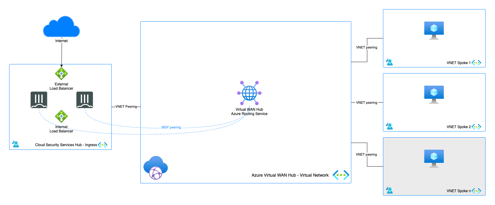
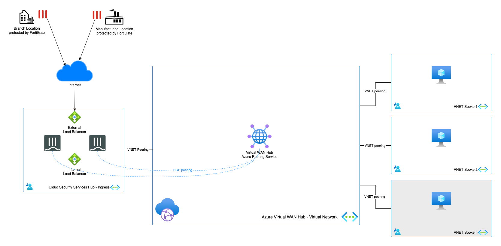
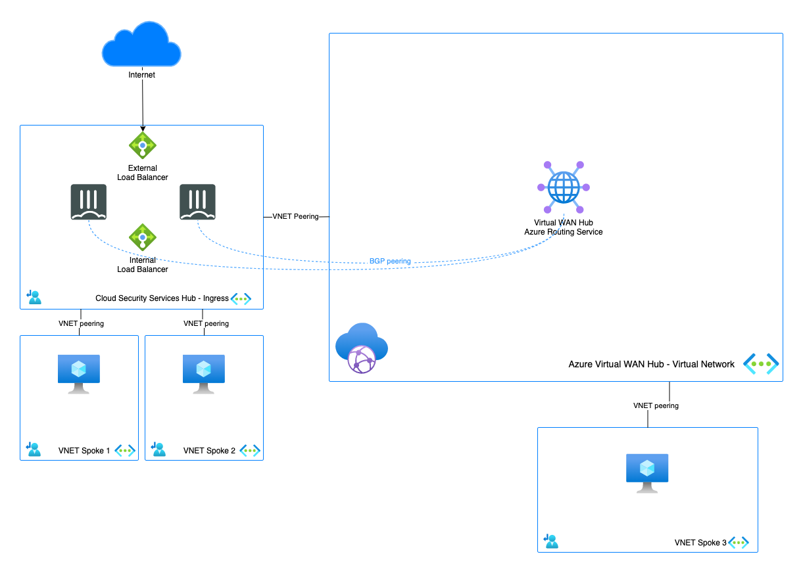
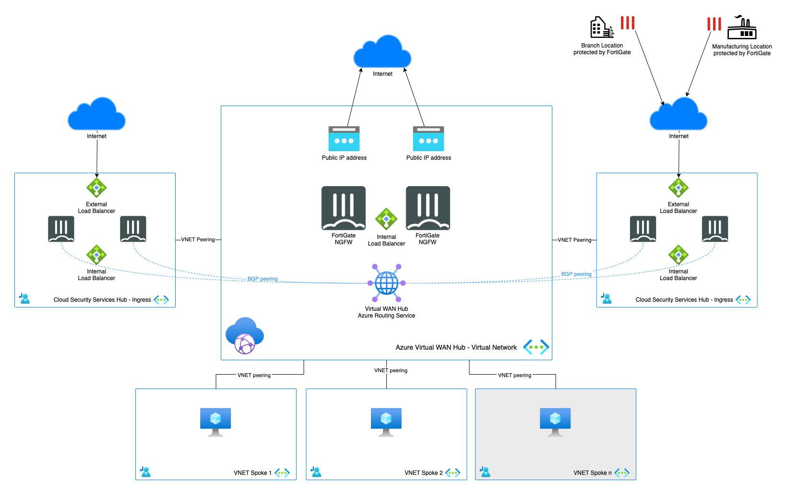
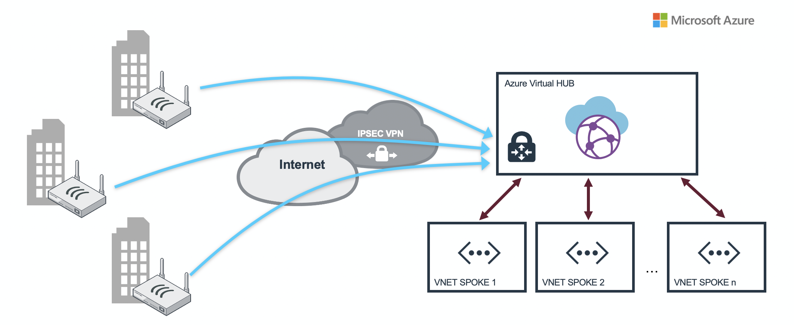

# FortiGate NGFW for Microsoft Azure Virtual WAN

## Introduction

Microsoft Azure Virtual WAN provides easy, unified and global connectivity. It supports large-scale branch connectivity and optimal routing using the Microsoft global network. 

Fortinet offers integration with Azure Virtual WAN in different ways to provide different security and connectivity solutions both inside Azure as well as on-premise locations into Azure. There are different architectures available that each provide specific functionality. Some functionality can be overlapping between the different architectures. In this overview, we are going to give all the information needed to select the architecture or combination of architectures for your environment.

Azure Virtual WAN offers options to interact with FortiGate Next-Generation Firewall in different locations. Different scenario's can be combined to provide more performance, separation of functions, management.

* Inside Virtual WAN Hub. The FortiGate is deployed through a solution that is jointly managed by Microsoft Azure and FortiManager
* Outside Virtual WAN Hub in a peered spoke acting as a Cloud Security Services Hub
* On-premises FortiGate in branch or datacenter connecting via SD-WAN using both IPSec tunnels and/or ExpressRoute

### FortiGate inside Virtual WAN Hub

* [FortiGate Secure SD-WAN](#fortigate-secure-sd-wan-inside-virtual-wan-hub): 
Connecting your branches and datacenters into the FortiGate Next-Generation Firewall running in Virtual WAN Hub and managed by FortiManager 

### FortiGate outside Virtual WAN Hub

In case the integrated model doesn't fit your organisation or you already have a FortiGate cluster running in a hub spoke model you can connect this environment with Azure Virtual WAN.

* [North-South](#north-south): Handling the inbound connectivity from internet to your workloads connected to Azure Virtual WAN
* [Branch to spoke inspection](#fortigate-secure-sd-wan-inside-virtual-wan-hub): Connecting your branches and datacenters into the FortiGate Next-Generation Firewall in Microsoft Azure
* [East-West](#east-west): Handling inspection of traffic between different spokes and connectivity towards Azure Virtual WAN Hub
* [Large Deployments](#large-deployments): Combing different scenario's to cover more requirements and performance

### FortiGate connectivity to Virtual WAN Hub
* [FortiGate connectivity to the VPN Gateway inside of Virtual WAN Hub](#fortigate-connectivity-to-the-vpn-gateway-inside-of-virtual-wan-hub)

## Deployment

Deployment of the different scenario's is either via the Azure Portal, ARM template or Azure CLI depending on the supported functionality in the deployment method. Depending on the availability a link to the Azure Portal, a guide or CLI command will be shown to get your started with the deployment. The links will be provided in each of the scenario subsections.

## Scenarios

### FortiGate Secure SD-WAN (inside Virtual WAN Hub)
*Connecting your branches and datacenters into the FortiGate Next-Generation Firewall running in Virtual WAN Hub and managed by FortiManager*

  

In this scenario, a FortiGate-VMs Active/Active cluster is deployed and runs natively inside Virtual WAN Hub. With this integration, the FortiGate-VMs are deployed using a Managed Application on Azure Marketplace, into the Virtual WAN Hub. During deployment the FortiGate-VMs are configured  to peer via BGP with the Virtual WAN hub router as well as link it with the FortiManager for further management. 

The solution is load balanced and configured for active-active highly resilient deployments.

FortiGate-VM and Fortinet Secure SD-WAN Native Integration with Azure Virtual WAN provides multiple benefits like :
- Elasticity as this solution is scalable, load balanced and configured for active-active highly resilient deployments
- Managed Application: FortiGate-VM is being deployed as Azure Managed Application. This eases administration overhead aspects of IaaS solutions providing automated deployment and configuration, automated updates and upgrades, as well as constant monitoring of the solution.
- Best-in-class SD-WAN and [NGFW](https://www.fortinet.com/products/next-generation-firewall.html?utm_source=blog&utm_campaign=fortigate) solution. FortiGate-VM is the only solution in the market that can provide those two functionalities in one offering for Azure vWAN HUB,

This setup can be combined with different FortiGate deployment outside of the Virtual WAN Hub like the [North-South](#north-south) setup for ingress publishing of services.

### Flows, diagrams, Azure internet edge inbound/DNAT
More information about those topics can be found [here](doc/insidevwan-sdwan.md)

### North-South
*Inbound connectivity from internet to your workloads connected to Azure Virtual WAN*

  

In this scenario, the ingress traffic flows are handled by a FortiGate-VM cluster outside of the Virtual WAN Hub. The Public IPs assigned to the FortiGate instances inside the Virtual WAN Hub only provide access for management using FortiManager and IPSEC VPN tunnels. To provide any additional access to your workload a separate FortiGate cluster can be installed in a spoke VNET, dubbed "Cloud Security Services Hub", handling all the inbound traffic using an External Azure Load Balancer. 

To exchange routes dynamically, you can configure an Virtual WAN Hub to connect with FortiGate-VMs in your Cloud Security Services Hub using BGP Peering.

* [Microsoft: Azure Virtual WAN BGP peering](https://learn.microsoft.com/en-us/azure/virtual-wan/create-bgp-peering-hub-portal)
* [Microsoft: Virtual WAN Hub routing](https://learn.microsoft.com/en-us/azure/virtual-wan/about-virtual-hub-routing).

More information can be found [here](doc/outsidevwan-north-south.md)

### FortiGate Secure SD-WAN (outside Virtual WAN Hub)
*Connecting your branches and datacenters into the FortiGate Next-Generation Firewall running outside Virtual WAN Hub*

  

In this scenario, the VPN connections from the on-premises location are terminated on the FortiGate-VM cluster outside of the Virtual WAN Hub. This scenario is for customers that don't want to change the currently deployed Hub, have another firewall solution but want to add Fortinet SD-WAN or are migrating. 

To exchange routes dynamically, you can configure an Virtual WAN Hub  to connect with FortiGate-VMs in your Cloud Security Services Hub using BGP Peering.

* [Microsoft: Azure Virtual WAN BGP peering](https://learn.microsoft.com/en-us/azure/virtual-wan/create-bgp-peering-hub-portal)
* [Microsoft: Virtual WAN Hub routing](https://learn.microsoft.com/en-us/azure/virtual-wan/about-virtual-hub-routing).

More information can be found [here](doc/outsidevwan-sdwan.md)

### East-West
*Spoke to spoke inspection and connectivity via the FortiGate Next-Generation Firewall running outside Virtual WAN Hub*

  

In this scenario, the traffic between different spokes is being inspected. Spokes connected directly to Azure Virtual WAN can't be inspected with a FortiGat-VM running in a spoke. To inspect spoke to spoke traffic via the Virtual WAN Hub the FortiGate needs to be installed [inside of the Virtual WAN Hub](#fortigate-secure-sd-wan-inside-virtual-wan-hub). 

It is possible, to inspect the traffic between 2 spokes that are peered directly with the spoke where you have the FortiGate installed. That way you have a basic VNET peering, Hub-Spoke topology. The hub can be then be connected to the Virtual WAN Hub to route to other hubs in different regions, spokes that do not require extra inspection or to on-premises locations connected via VPN or ExpressRoute.

More information can be found [here](doc/outsidevwan-east-west.md)

### Large deployments

For Enterprise customers that have different requirements that can't be met with one cluster, it is possible to combine different scenario's so different traffic flows are handled by different FortiGate-VM clusters.

This scenario consist of a combination of different scenario's:
- East-West: Azure Virtual WAN Hub with integrated FortiGate-VM which is used for egress VNET to Internet and East-West VNET to VNET filtering
- Ingress: Cloud Security Services Hub (AP HA ELB/ILB FortiGate-VM cluster) which is used for secure publishing of services like HTTP, HTTPS, RDP etc. to the Internet
- SDWAN/VPN Services Hub: VPN/SDWAN connectivity between on-premise branch officies and Microsoft Azure

As a result this is very scalable architecture which fits the needs of large Enterprise customers requiring high performance.

In this architecture you can configure an Virtual WAN Hub router to peer with FortiGates in your Cloud Security Services Hub & SDWAN/VPN Services Hub  using BGP Peering described [here](https://learn.microsoft.com/en-us/azure/virtual-wan/create-bgp-peering-hub-portal)

### FortiGate connectivity to the VPN Gateway inside of Virtual WAN Hub

In this scenario, the FortiGate in a branch location will connect to the Virtual HUB VPN Gateway. 

To configure the VPN tunnels you need to configure both Azure and the FortiGate on-premises.

- [Fortinet: local FortiGate to Azure VPN Gateway](https://docs.fortinet.com/document/fortigate-public-cloud/7.2.0/azure-administration-guide/989216/connecting-a-local-fortigate-to-an-azure-vnet-vpn)
- [Microsoft: Create a site-to-site connection to Azure Virtual WAN](https://learn.microsoft.com/en-us/azure/virtual-wan/virtual-wan-site-to-site-portal)
- [Microsoft: Supported encrption and authentication methods](https://learn.microsoft.com/en-us/azure/virtual-wan/virtual-wan-ipsec)

For smaller setups or demo a convertor is linked that will convert your Azure VirtualWAN VPN config into a FortiGate configuration.
- [FortiGate Azure Virtual WAN config convertor](https://40net-cloud.github.io/fortinet-azure-solutions/FortiGate/AzureVirtualWAN/)

More information can be found [here](doc/to-vpn-gateway.md)

## Links

* [Fortinet: Azure Virtual WAN deployment guide](https://docs.fortinet.com/document/fortigate-public-cloud/7.4.0/azure-vwan-sd-wan-ngfw-deployment-guide/12818/deployment-overview)
* [Microsoft: Azure Virtual WAN NVA in Virtual WAN Hub](https://learn.microsoft.com/en-us/azure/virtual-wan/about-nva-hub)
* [Microsoft: Azure Virtual WAN FAQ](https://learn.microsoft.com/en-us/azure/virtual-wan/virtual-wan-faq)
* [Microsoft: Azure Virtual WAN BGP peering](https://learn.microsoft.com/en-us/azure/virtual-wan/create-bgp-peering-hub-portal)
* [Microsoft: Virtual WAN Hub routing](https://learn.microsoft.com/en-us/azure/virtual-wan/about-virtual-hub-routing)

## Support
Fortinet-provided scripts in this and other GitHub projects do not fall under the regular Fortinet technical support scope and are not supported by FortiCare Support Services.
For direct issues, please refer to the [Issues](https://github.com/fortinet/azure-templates/issues) tab of this GitHub project.
For other questions related to this project, contact [github@fortinet.com](mailto:github@fortinet.com).

## License
[License](/../../blob/main/LICENSE) © Fortinet Technologies. All rights reserved.
