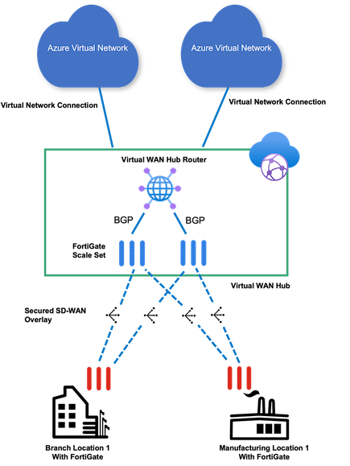
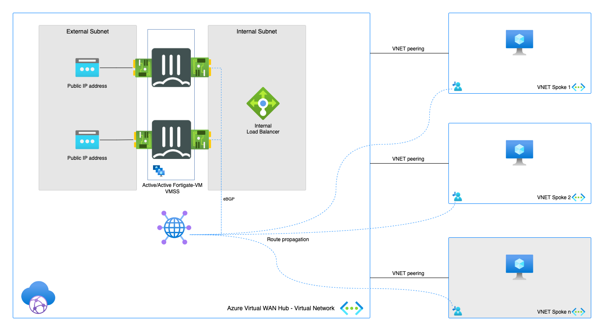
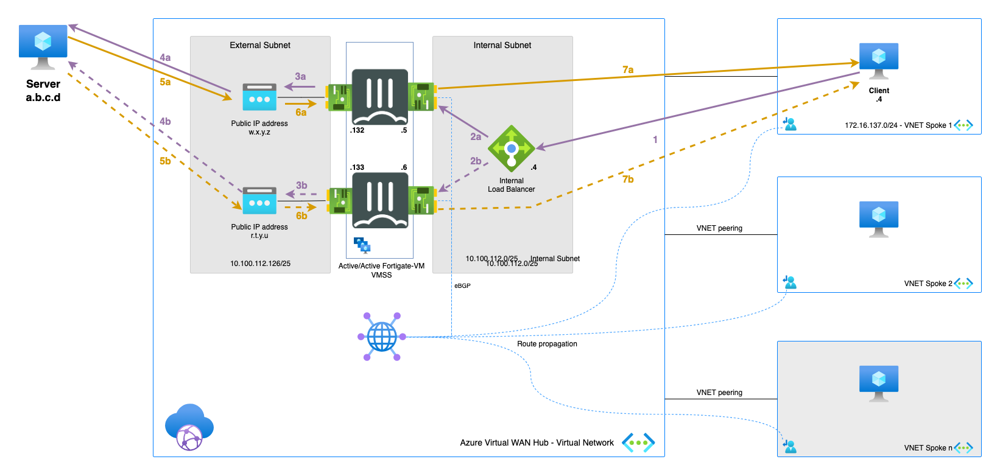
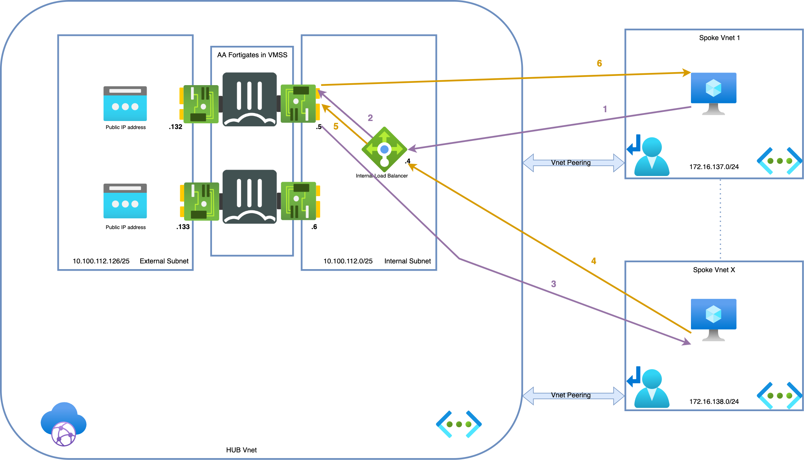
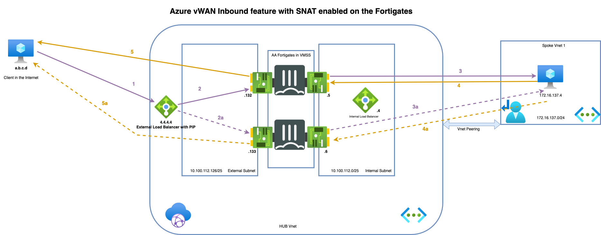

# FortiGate Secure SD-WAN (INSIDE Virtual WAN Hub)
*Connecting your branches and datacenters into the FortiGate Next-Generation Firewall running in Virtual WAN Hub and managed by FortiManager*

  

## Design

  

Setup consist of:
* 2 FortiGate-VMs in a active-active setup using FGSP and UTM Sync
* 2 Public IPs associated with external NICs of the FortiGate-VMs
* Inside of the Virtual WAN Hub an Azure Internal Load Balancer and Azure Routing Service

## Deployment

The integration of the FortiGate inside of the Virtual WAN Hub requires FortiManager to manage the FortiGate instances and the SD-WAN configuration. The deployment process is detailed in the documentation [here](https://docs.fortinet.com/document/fortigate-public-cloud/7.4.0/azure-vwan-sd-wan-ngfw-deployment-guide/311594/deployment-procedures).

## Requirements and limitations

* FortiManager and FortiGate 7.2.2 and above is required for the deployment integration into Virtual WAN Hub
* Observe a waiting time of around 15 minutes between the deployment of the Virtual WAN Hub and the deployment of FortiGate VMs inside the Hub. This allows the deployment of the Virtual WAN Hub to complete all configuration
* Routing: During the deployment the FortiGate-VMs are coupled to the Azure Routing Service inside the Virtual WAN Hub using BGP. This allows the FortiGate-VMs to inject routes to them for all the remote sites. The gateway the networks is always the ForitGate-VM ip address on the port2.
* The FortiManager needs to be routable and accessible from the FortiGate instances. During the deployment the IP address or dns name of the FortiManager is provided and the FortiGate will try to connect to the FortiManager. Either the FortiManager is accessible via a public IP address and the default route is used. Alternatively, the FortiManager can be reach internal either in a spoke, another hub or on-premises if an IPSEC tunnel or ExpressRoute is terminated on the the Virtual WAN Hub.
* Licenses for FortiGate
  - BYOL: VM, VM Subscription or FortiFlex licenses can be used on these units. A demo license can be made available via your Fortinet partner or on our website. Licenses need to be registered on the [Fortinet support site](http://support.fortinet.com). Download the .lic file after registration. Note, these files may not work until 60 minutes after it's initial creation.
  - PAYG or OnDemand is supported for the integrated FortiGate-VMs installed inside the Virtual WAN Hub.

## Flows

### Outbound

1. Connection from client to the public IP of server. Azure routes the traffic using Intent Routing to the internal Load Balancer (which is running in managed subscription together with FGTs). - s: 172.16.137.4 - d: a.b.c.d
2. (a/b)Azure Internal Load Balancer probes and send the packet to one of the active FGTs. - s: 172.16.137.4 - d: a.b.c.d
3. (a/b)FGT inspects the packet and when allowed sends the packet translated to it's external port private IP to Public IP associated with the private IP . - s: 10.100.112.132/133 - d: a.b.c.d
4. (a/b)Packet is leaving Azure using public IP address attached and translates the source IP - s: w.x.y.z/r.t.y.u - d: a.b.c.d
5. (a/b)The server responds to the request - s: a.b.c.d d: w.x.y.z/r.t.y.u
6. (a/b)Public IP address associated with corresponding NIC is doing DNAT and forwards the packet to the active FortiGate - s: a.b.c.d - d: 10.100.112.132/133
7. (a/b)The active FGT accepts the return packet after inspection. It translates and routes the packet to the client - s: a.b.c.d - d: 172.16.137.4

### East-West

1. Connection from client to the private IP of server. Azure routes the traffic using Intent Routing to the internal Load Balancer - s: 172.16.137.4 - d: 172.16.138.4
2. zure Internal Load Balancer can send the packet to any of the FGTs in AA cluster. In our diagram we assume that FGT-A received the packet for ease of understanding - s: 172.16.137.4 - d: 172.16.138.4
3. FGT inspects the packet and when allowed sends the packet to the server - s: 172.16.137.4 - d: 172.16.138.4
4. Server responds to the request - s: 172.16.138.4 - d: 172.16.137.4
5. Azure External Load Balancer sends the return packets to the same FGT-A thanks to session persistance - s: 172.16.138.4 - d: 172.16.137.4
6. Active FGT accepts the return packet after inspection - s: 172.16.138.4 - d: 172.16.137.4

### Azure internet edge inbound/DNAT

The internet inbound use case will have an External Load Balancer (ELB) deployed as part of the managed application. Load balancing rules will be configured from the FortiGate CLI, and once configured, they will be automatically pushed with an API call to the ELB.

### Inbound with SNAT applied on the FGTs

1.	Connection from client to one of the  public IPs associated with External Load Balancer s: a.b.c.d - d: 4.4.4.4
2.	(a/b)Azure load balances the connection request to one of the Firewall NVA instances. Traffic is sent to the external/untrusted interface of the NVA. External Load Balancer is configured with Floating IP enabled thus destination IP is not changed  - s: a.b.c.d - d: 4.4.4.4
3.	(a/b)FGT VIP(4.4.4.4) picks up the packet, translates (DNAT) the packet and sends the packet to the server. SNAT behind the firewall to make sure return traffic arrives on the FGT that has the session -                    s: 10.100.112.5 - d: 172.16.137.4
4.	(a/b)Server responds to the request to the FGT-A - s: 172.16.137.4 - d: 10.100.112.5
5.	(a/b)FGT A translates the source to the FGT VIP on the external interface and sends out packet to the client via untrusted interface   - s: 4.4.4.4 - d: a.b.c.d

Connection would look the same for FTG-B (see 2a-5a steps) but packet would be SNATed (step 3a) behind private IP of the FGT-B 10.100.112.6 to ensure traffic symmetry and that return traffic (step 4a) will go to FGTB.

### Inbound without SNAT applied on the FGTs

1.	Connection from client to one of the  public IPs associated with External Load Balancer s: a.b.c.d - d: 4.4.4.4
2.	Azure load balances the connection request to one of the Firewall NVA instances. Traffic is sent to the external/untrusted interface of the NVA. External Load Balancer is configured with Floating IP enabled thus destination IP is not changed  - s: a.b.c.d - d: 4.4.4.4
3.	(a/b)FGT VIP(4.4.4.4) picks up the packet, translates (DNAT) the packet and sends the packet to the server.There is no SNAT applied on port2 of FGT - s: a.b.c.d - d: 172.16.137.4
4.	Server responds to the request to the ILB. As this load balancer does not yet have a session state for traffic initiated from public addresses, it may send the traffic to any of the backend pool, which will likely not be the FortiGate where the session was originated. In order to resolve this issue with assymetrical flow FGSP needs to be configured and intent routing 0/0 route via the FGTs has to be enabled - s: 172.16.137.4 - d: a.b.c.d
5.	(a/b)ILB is sending the traffic to any of the backendpool FGTs - s: 172.16.137.4 - d: a.b.c.d
6.	(a/b)Packet is being SNAT to the Public IP of the External Load Balancer and is sent out to Internet - s: 4.4.4.4 - d: a.b.c.d
   
As packet is reaching External Load Balancer it can be balanced to any of the FGTs in the backend pool, taking 2/3 or 2a/3a path.

More documentation about Azure internet edge inbound can be fund [here](https://learn.microsoft.com/en-us/azure/virtual-wan/how-to-network-virtual-appliance-inbound)

Configuration and troubleshooting guide is located [here](https://docs.fortinet.com/document/fortigate-public-cloud/7.4.0/azure-vwan-sd-wan-ngfw-deployment-guide/323600/configuring-internet-inbound-dnat-policies)

