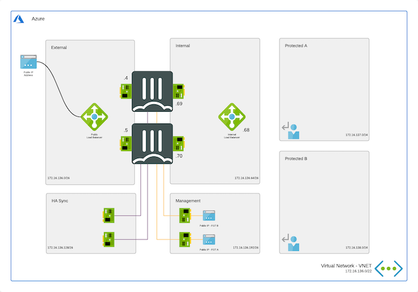
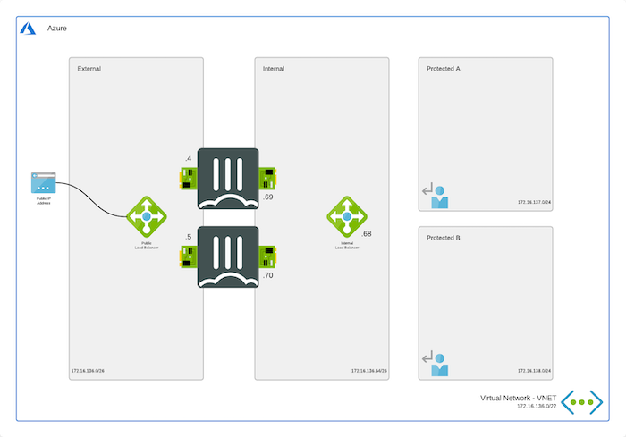
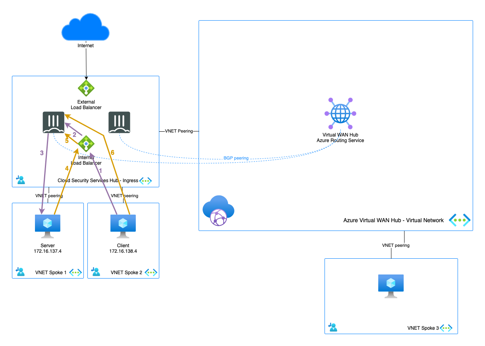

# East-West (FortiGate-VMs deployed in a peered VNET)
*Spoke to spoke inspection and connectivity via the FortiGate Next-Generation Firewall running outside Virtual WAN Hub*

  

## Design

This scenario can use an [active/active](https://github.com/fortinet/azure-templates/tree/main/FortiGate/Active-Active-ELB-ILB) or [active/passive](https://github.com/fortinet/azure-templates/tree/main/FortiGate/Active-Passive-ELB-ILB) deployment or even an [autoscale deployment](https://github.com/40net-cloud/fortinet-azure-solutions/tree/main/FortiGate/Autoscale). The selection is based on your requirements and explained in our documentation [here](https://docs.fortinet.com/document/fortigate-public-cloud/7.2.0/azure-administration-guide/983245). Deployment of these setup can be done either via the Azure Marketplace or via the above GitHub links.

  
  
  

In this scenario, the traffic between different spokes is being inspected only when they are directly connected to the VNET where the FortiGate-VM is connected. Spokes connected directly to Azure Virtual WAN can't be inspected with a FortiGat-VM running in a spoke. It is not possible to connect an Azure Route Server with Virtual WAN Hub to provide route updates, more information can be found [here](https://learn.microsoft.com/en-us/azure/virtual-wan/scenario-bgp-peering-hub#benefits-and-considerations).

## Deployment

Deployment of the FortiGate-VM(s) is documented [here](https://docs.fortinet.com/document/fortigate-public-cloud/7.2.0/azure-administration-guide/983245) and can be done via the [Azure Marketplace](https://azuremarketplace.microsoft.com/en/marketplace/apps/fortinet.fortinet-fortigate?tab=Overview) or using the [ARM](https://github.com/fortinet/azure-templates/tree/main/FortiGate) or [Terraform](https://github.com/fortinet/azure-templates/tree/main/FortiGate/Terraform) templates.

## Requirements and limitations

* Routing: to route the traffic for the different spokes to the FortiGate-VM internal load balancer, UDR routes are required. 
* Licenses for FortiGate
  - BYOL: VM, VM Subscription or FortiFlex licenses can be used on these units. A demo license can be made available via your Fortinet partner or on our website. Licenses need to be registered on the [Fortinet support site](http://support.fortinet.com). Download the .lic file after registration. Note, these files may not work until 60 minutes after it's initial creation.
  - PAYG or OnDemand: These licenses are automatically generated during the deployment of the FortiGate systems.

## Flows

1. Connection from client to the private IP of server. Azure routes the traffic using UDR to the internal Load Balancer - s: 172.16.137.4 - d: 172.16.138.4
2. Azure Internal Load Balancer probes and send the packet to the active FGT - s: 172.16.137.4 - d: 172.16.138.4
3. FGT inspects the packet and when allowed sends the packet to the server - s: 172.16.137.4 - d: 172.16.138.4
4. The server responds to the request - s: 172.16.137.4 - d: 172.16.138.4
5. The Azure External Load Balancer sends the returns packet to the active FortiGate - s: 172.16.137.4 - d: 172.16.138.4
6. The active FGT accepts the return packet after inspection - s: 172.16.137.4 - d: 172.16.138.4
