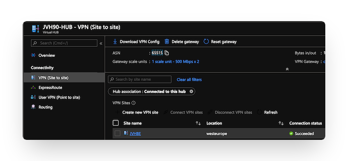
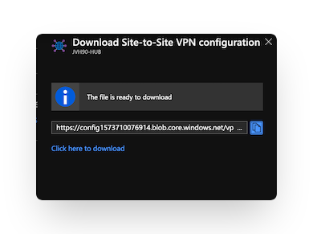

# FortiGate connectivity to the VPN Gateway inside of Virtual WAN Hub


In this scenario, the FortiGate in a branch location will connect to the Virtual HUB VPN Gateway. 

To configure the VPN tunnels you need to configure both Azure and the FortiGate on-premises.

- [Fortinet: local FortiGate to Azure VPN Gateway](https://docs.fortinet.com/document/fortigate-public-cloud/7.2.0/azure-administration-guide/989216/connecting-a-local-fortigate-to-an-azure-vnet-vpn)
- [Microsoft: Create a site-to-site connection to Azure Virtual WAN](https://learn.microsoft.com/en-us/azure/virtual-wan/virtual-wan-site-to-site-portal)
- [Microsoft: Supported encrption and authentication methods](https://learn.microsoft.com/en-us/azure/virtual-wan/virtual-wan-ipsec)

For smaller setups or demo a convertor is linked that will convert your Azure VirtualWAN VPN config into a FortiGate configuration.
- [FortiGate Azure Virtual WAN config convertor](https://40net-cloud.github.io/fortinet-azure-solutions/FortiGate/AzureVirtualWAN/)

## Deployment

An ARM Template is provide to deploy a Azure Virtual WAN setup and a Virtual WAN configuration for a first VPN branch site. A prefix and public IP address of the branch FortiGate are required during deployment:

- VPNSITE PREFIX : This prefix will be prepended to each of the resources regarding the VPN Branch connecting into Virtual WAN.
- VPNSITE PUBLIC IP ADDRESS : This is the public IP address of the FortiGate device connecting into Virtual WAN.

### Azure Portal

[](https://portal.azure.com/#create/Microsoft.Template/uri/https%3A%2F%2Fraw.githubusercontent.com%2F40net-cloud%2Ffortinet-azure-solutions%2Fmain%2FFortiGate%2FAzureVirtualWAN%2Fscenario1%2Fazuredeploy.json)
[](http://armviz.io/#/?load=https%3A%2F%2Fraw.githubusercontent.com%2F40net-cloud%2Ffortinet-azure-solutions$2Fmain%2FFortiGate%2FAzureVirtualWAN%2Fscenario1%2Fazuredeploy.json)

### Azure CLI

cd ~/clouddrive/ && wget -qO- https://github.com/40net-cloud/fortinet-azure-solutions/archive/main.tar.gz | tar zxf - && cd ~/clouddrive/fortinet-azure-solutions-main/FortiGate/AzureVirtualWAN/scenario1/ && ./deploy.sh

## Configuration

The deployment of the VPN Gateway inside the Azure Virtual HUB can take some time (>30min). Once everything is in the 'Succeeded' state. The VPN Site configuration can be downloaded from the Azure Portal.





[FortiGate Azure Virtual WAN convertor](https://40net-cloud.github.io/fortinet-azure-solutions/FortiGate/AzureVirtualWAN/)

Using [this webpage](https://40net-cloud.github.io/fortinet-azure-solutions/FortiGate/AzureVirtualWAN/) you can convert the Microsoft JSON configuration file of a vpn site into a FortiGate configuration that can be added into the FortiGate branch configuration. This webpage can also be downloaded but only processes data locally in your browser using Javascript. No data is send to a server for processing.

The external and internal interface of the FortiGate needs to be added into the resulting configuration. Search for "## EXTERNAL INTERFACE ##" and "## INTERNAL INTERFACE ##".

```
config system interface
  edit "VPNSITE1-1"
    set vdom "root"
    set ip 169.127.32.1 255.255.255.255
    set type tunnel
    set remote-ip 172.16.110.13 255.255.255.255
    set interface "## EXTERNAL INTERFACE ##"
  next
  edit "VPNSITE1-2"
    set vdom "root"
    set ip 169.127.32.1 255.255.255.255
    set type tunnel
    set remote-ip 172.16.110.12 255.255.255.255
    set interface "## EXTERNAL INTERFACE ##"
  next
end
```

```
config firewall policy
  edit 0
    set srcintf "VPNSITE1-1" "VPNSITE2-2"
    set dstintf "## INTERNAL INTERFACE ##"
    set srcaddr all
    set dstaddr all
    set action accept
    set schedule always
    set service ANY
  next
end
config firewall policy
  edit 0
    set srcintf "## INTERNAL INTERFACE ##"
    set srcintf "VPNSITE1-1" "VPNSITE2-2"
    set srcaddr all
    set dstaddr all
    set action accept
    set schedule always
    set service ANY
  next
end
```
