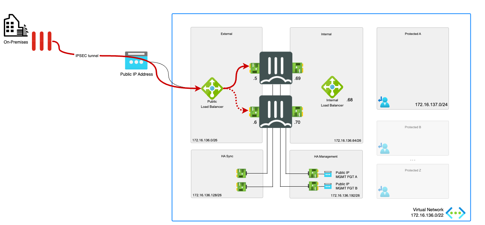
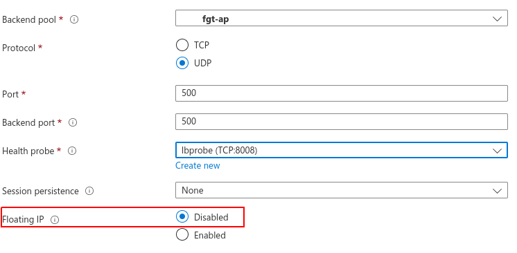
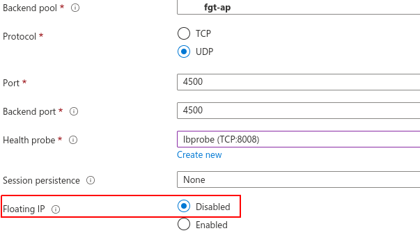
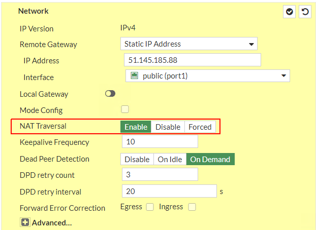
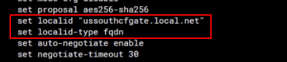
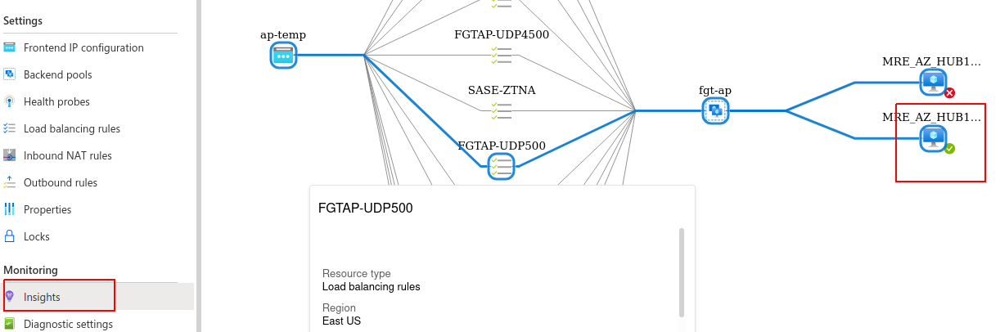
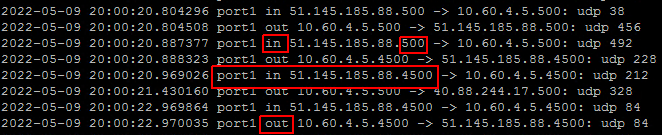
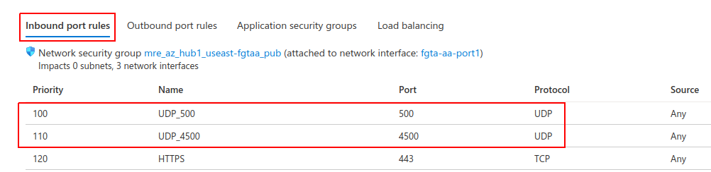
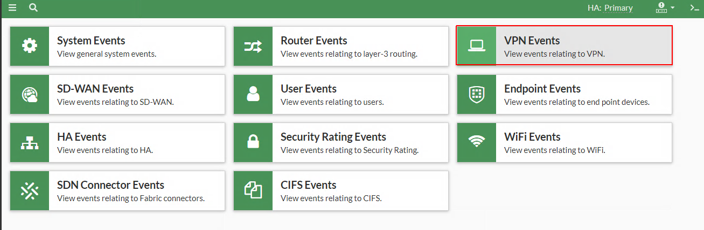

# FAQ - IPSEC VPN connectivity and troubleshooting for FortiGate running in Microsoft Azure

## Introduction

IPSEC is a group of protocols that can be challenging to get right. There are multiple parameters to take into account. Microsoft Azure networking and the FortiGate NGFW deployment in it, has some specific design and limitations to take into account. 

In this FAQ there are 2 sections: configuration and troubleshooting. The configuration will cover the different Azure and FortiGate components to establish a tunnel from an on-premises device.

## Configuration

### Active/Passive High Available FortiGate pair with external and internal Azure Standard Load Balancer
More information about this deployment type can be found [here](https://github.com/fortinet/azure-templates/tree/main/FortiGate/Active-Passive-ELB-ILB).



#### Microsoft Azure

* The external Azure Load Balancer requires 2 load balancer rules to pass IPSEC traffic to the active FortiGate. The rules need to configured to pass ports UDP/500 and UDP/4500 as explained in this [link](https://github.com/fortinet/azure-templates/blob/main/FortiGate/Active-Passive-ELB-ILB/doc/config-inbound-connections.md#configuration---ipsec)

* The **Floating IP** options should not be enabled on the IPSEC VPN LB rules (UDP 500 and UDP 4500). When **Floating IP** is enabled, Azure Load Balancer doesn't DNAT the packets to the private IP configured on the FortiGate. The FortiGate VM in Azure doesn't have the public IPs configured and as such local processes like IPSEC do not listen on this public IP address. 

More information on when to enable floating IP or not on a load balancing rule towards the FortiGate can be found [here](https://github.com/40net-cloud/fortinet-azure-solutions/blob/main/FortiGate/Active-Passive-ELB-ILB/doc/config-inbound-connections.md#when-to-enable-the-floating-ip-in-the-azure-load-balancing-rule). More information on the floating ip options can be found [here](https://docs.microsoft.com/en-us/azure/load-balancer/load-balancer-floating-ip).




#### FortiGate

* Firewall policy referencing the VPN is required for the IPSEC tunnel to be enabled

* Microsoft Azure requires NAT between public IP and the FortiGate VM with or without the Azure Load Balancer. To establish an IPSEC tunnel across NAT the NAT Traversal options needs to be set to **Enable** or **Forced** on both the FortiGate in Azure and on the remote peer

    

* If the tunnel is failing with the error message "**received notify type AUTHENTICATION_FAILED**" or "**RETRANSMIT_AUTH**" it is likely that the local-id set by the FortiGate does not match the local id expected by the peer. To resolve this issue you can configure the FortiGate to set a specific localid-type and value. Ensure that the vpn peer is configured to match this value in the peer-id field.

The example below shows local-id type and value set to fqdn. The localid-type and value can be set to fqdn, a string or auto, for more information please consult the CLI guide [here](https://docs.fortinet.com/document/fortigate/7.2.0/cli-reference/370620/config-vpn-ipsec-phase1-interface)



    > Do not set the localid value to the private ip address of the FortiGate nic, since upon failover the ip address of the new primay FortiGate will be a different one.

## Troubleshooting

### <ins>Azure</ins>
* For FortiGate A/P LB sandwich, ensure that UDP500 and UDP4500 Load balancing rules are functionnal
  1. In Azure, go to the Azure external load balancer, click on Insights and verify that the primary FortiGate is marked as healthy (answering health probes). The other FortiGate is secondary so should be marked as unhealthy

      

  2. Check on the FortiGate if udp 500 and udp 4500 are reaching the FortiGate from the on-premise device. Use the command ```diagnose sniffer packet any 'port 500 or port 4500' 4 0 a ```  or the following command if you want to only capture traffic coming from your peer. Replace x.x.x.x with the actual peer ip ```diagnose sniffer packet any '(port 500 or port 4500) and host x.x.x.x' 4 0 a ```

      

  3. If the tcpdump does not show any packet. Please check your NSG rules.
        

### <ins>FortiGate</ins>
* To check log relating to vpn events on the FortiGate go to Log & Report, Events and then clickk on VPN events
      

* Click on the error message to view further details
      

* For advanced troubleshooting, use the commands below

```
diagnose vpn ike filter name <phase1 name>
diagnose debug application ike -1
diagnose debug enabled
```

* For further IPSEC vpn troubleshooting tips, please check this [kb article](https://community.fortinet.com/t5/FortiGate/Technical-Tip-Troubleshooting-IPsec-VPNs/ta-p/195955) and [this one](https://community.fortinet.com/t5/FortiGate/Troubleshooting-Tip-IPSEC-Tunnel-debugging-IKE/ta-p/190052)
