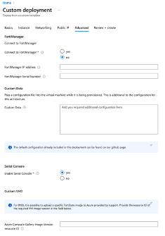
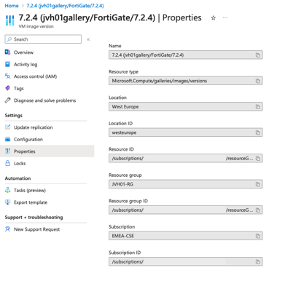

# FAQ - Deployment of FortiGate-VM using a VHD image file

In case a specific release provided by Fortinet is required or the use of the Azure Marketplace is not possible the FortiGate-VM can be deploy using an Azure Compute Gallery. The regular VHD images are available via support.fortinet.com.

FortiGate-VM ARM64 images suitable for ARM based processors like the Ampere ARM CPUs available in Microsoft, currently can only be deployed via an [Azure Compute Gallery](https://learn.microsoft.com/en-us/azure/virtual-machines/azure-compute-gallery).

## Downloading the FortiGate Image

FortiGate-VM VHD image files are available from [Fortinet Customer Service & Support](https://support.fortinet.com/). 

* Go to Download > VM Image, then select FortiGate as the Product and Azure for the Platform. 
* The file name for ARM64 CPUs is FGT_ARM64_AZURE-v7-build XXXX-FORTINET.out.hyperv.zip, where XXXX is the build number.
* The file name for the x86 CPUs is FGT_VM64_AZURE-v7-buildXXXX-FORTINET.out.hyperv.zip, where XXXX is the build number.
Once the download is complete, unzip the file and locate the fortios.vhd file. To upload the fortios.vhd you need to have access to Azure CLI logged on to your Azure Subscription from the system that has the fortios.vhd downloaded. 

## Preparing the FortiGate image on Microsoft Azure

Create the bash script (below or on [GitHub](https://github.com/40net-cloud/fortinet-azure-solutions/blob/main/FortiGate/A-Single-VM/customvhd.sh)) onto this system located in the same directory as the fortios.vhd. Adapt the variables according to your needs and the script will perform the following:

* Create a resource group
* Create an Azure Storage Account
* Upload the fortios.vhd file onto the Azure Storage Account into the vhd container
* Create an Azure Compute Gallery
* Create an Image Definition for either x86 or ARM64
* Create an Image Version based on the uploaded forties.vhd file in the Azure Storage Account

_The image needs to be deployed in the all the Azure regions you would be deploying the FortiGate-VM._

```sh
#!/bin/bash
echo "
##############################################################################################################
#
# Customer VHD
# Download the FortiGate VHD from support.fortinet.com
# Upload VHD to a storage account
# Create an Azure Compute Gallery with an Image and specific Image Version
#
# This can be used for both x86 and ARM version of FortiGate
#
##############################################################################################################

"
# Stop on error
set +e

##############################################################################################################
# Update the below variable to your environment
##############################################################################################################
PREFIX="test"
LOCATION="westeurope"
# ARCHITECTURE: arm64 or x86
ARCHITECTURE="arm64"
# HYPER_V_GENERATION: FortiGate x86 uses V1, arm64 uses V2
HYPER_V_GENERATION="V2"
# VHD image with path
FORTIGATE_IMAGE_DIRECTORY="$PWD"
FORTIGATE_IMAGE_FILENAME="fortios.vhd"
FORTIGATE_IMAGE_LOCATION="${FORTIGATE_IMAGE_DIRECTORY}/${FORTIGATE_IMAGE_FILENAME}"
FORTIGATE_VERSION="7.2.4"

##############################################################################################################
# Static variables
##############################################################################################################
resource_group="${PREFIX}-rg"
storage_account_name="${PREFIX}imagestorage"
storage_container_name="vhds"
gallery_name="${PREFIX}gallery"
image_definition_name="FortiGate"
offer="fortinet-fortigate-vm_v5"
publisher="fortinet"
sku="fortinet_fg-vm_${ARCHITECTURE}"

# Create resource group
echo ""
echo "--> Creating ${resource_group} resource group ..."
az group create --location "${LOCATION}" --name "${resource_group}"

echo ""
echo "--> Creating ${storage_account_name} storage account ..."
# Create Azure Storage Account to upload the VHD image
az storage account create --resource-group "${resource_group}" --name "${storage_account_name}" --location "${LOCATION}" --sku Standard_LRS

echo ""
echo "--> Creating container and uploading file ${FORTIGATE_IMAGE_LOCATION} to storage account ..."
# Retrieve access key and upload fortios vhd
storage_account_key=$(az storage account keys list --resource-group "${resource_group}" --account-name "${storage_account_name}" --query '[0].value' -o tsv)
az storage container create --name "${storage_container_name}" --account-name "${storage_account_name}" --account-key "${storage_account_key}" --public-access blob
result=$?
if [ $result != 0 ];
then
    echo "--> Deployment failed: unable to create container '${storage_account_name}' in Azure Storage Account [$storage_account_name] ..."
    exit $result
fi
az storage blob upload --account-name "${storage_account_name}" --account-key "${storage_account_key}" --file "${FORTIGATE_IMAGE_LOCATION}" --container-name "${storage_container_name}"
result=$?
if [ $result != 0 ];
then
    echo "--> Deployment failed: unable to upload vhd image to the Azure Storage Account [$storage_account_name] ..."
    exit $result
fi
storage_account_url=$(az storage account show --name "${storage_account_name}" --resource-group "${resource_group}" --query "primaryEndpoints.blob" -o tsv)
vhd_url="${storage_account_url}${storage_container_name}/${FORTIGATE_IMAGE_FILENAME}"

echo ""
echo "--> Creating ${gallery_name} Azure Compute Gallery ..."
# Create Azure Compute Gallery
az sig create --resource-group "${resource_group}" \
	      --gallery-name "${gallery_name}"

echo ""
echo "--> Creating Image Definition ..."
# Create Image definition - publisher, sku and offer can be customized
az sig image-definition create --resource-group "${resource_group}" \
			       --gallery-name "${gallery_name}" \
                   --location "${LOCATION}" \
                   --gallery-image-definition "${image_definition_name}" \
			       --offer "${offer}" \
			       --publisher "${publisher}" \
			       --sku "${sku}" \
			       --os-type linux \
			       --architecture "${ARCHITECTURE}" \
		 	       --hyper-v-generation "${HYPER_V_GENERATION}" \
			       --os-state generalized

echo ""
echo "--> Creating Image Version ..."
# Create an image version. This needs to be available in the region where you want to deploy the FortiGate
az sig image-version create --resource-group "${resource_group}" \
                            --gallery-name "${gallery_name}" \
                            --gallery-image-definition "${image_definition_name}" \
                            --gallery-image-version "${FORTIGATE_VERSION}" \
                            --target-regions "${LOCATION}=1=standard_zrs" \
                            --replica-count 1 \
                            --os-vhd-uri "${vhd_url}" \
                            --os-vhd-storage-account "${storage_account_name}"

echo ""
echo "--> Use the below resource ID to deploy a FortiGate with a custom VHD ..."
az sig image-version show --gallery-image-definition "${image_definition_name}" \
                          --gallery-image-version "${FORTIGATE_VERSION}" \
                          --gallery-name "${gallery_name}" \
                          --resource-group "${resource_group}" \
                          --query "id" -o tsv

exit 0
```
More information about the Azure Compute Gallery can be found in the [Microsoft documentation](https://learn.microsoft.com/en-us/azure/virtual-machines/create-gallery).

## Deployment of the FortiGate-VM

Once the Azure Compute Gallery is fully deployed in the required region, the deployment can be started from the Azure Marketplace. Only the BYOL licensed version can be used when uploading a VHD file. 
In the Azure Marketplace deployment of the different architectures in the Advanced tab you can find the ‘Azure Compute Gallery Image Version resource ID’ field.



This field requires the full resource id the has the following format. This resource ID can be found in the Configuration page in the Image Version of the Azure Compute Gallery that you would like to install.

```
/subscriptions/xxxxxxxx-xxxx-xxxx-xxxx-xxxxxxxxxxxx/resourceGroups/xxxxx/providers/Microsoft.Compute/galleries/xxxgallery/images/xxxxx/versions/x.x.x
```

_Beware: when an ARM64 based instance type is selected, the Azure Compute Gallery Image Version resource ID’ field becomes a requirement as well as the BYOL license type for deployment._

