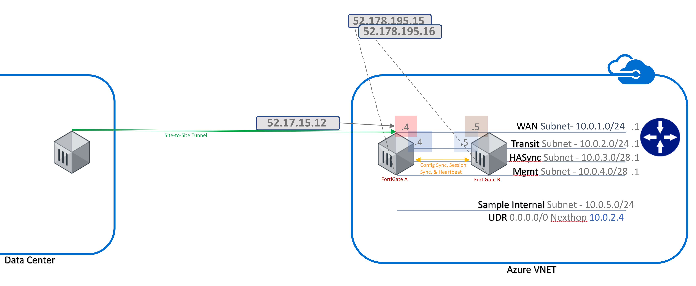
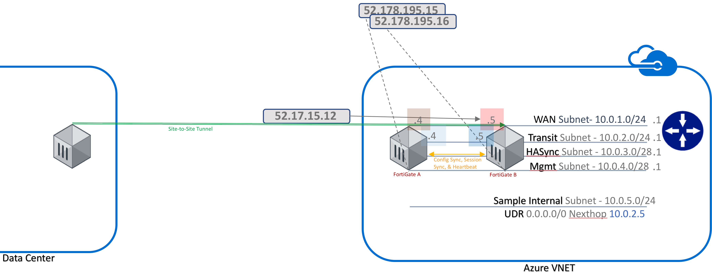

## This template set is designed for A/P HA in Azure.  The following are created:
    - vnet with five subnets
                or uses an existing vnet of your selection.  If using an existing vnet, it must already have 5 subnets.
    - three public IPs.  The first public IP is for cluster access to/through the active FortiGate.  The other two PIPs are for Management access
    - Two FortiGate virtual appliances

A typical use case will be for Site-to-Site VPN termination as in the following diagram:
---

---

This second diagram shows what will happen in the event FortiGate A is shut down:
---

---

### In order to configure FortiGates:

FortiGate-A:
    Connect via ssh to the cluster IP of port1 or private IP if already connected to the vnet via ExpressRoute or Azure VPN (both of these IPs can be obtained from the portal)
    Configure FortiGate A so that all four interfaces have static IPs (which match those assigned in the Azure portal).  Be sure to setup a manual gateway first.  This should point to the first IP address of subnet 1.
    Next configure the HA settings.

The following is a sample config, based on the defaults in this template set.  If copying and pasting, be sure that there are no tabs or other characters that will confuse the FGT CLI.

    config router static
      edit 1
        set gateway 10.0.1.1
        set device port1
      next
      edit 2
        set dst 10.0.5.0 255.255.255.0
        set gateway 10.0.2.1
        set device "port2"
      next
    end
    config system interface
      edit "port1"
        set mode static
        set ip 10.0.1.4 255.255.255.0
        set alias "external"
      next
      edit "port2"
        set mode static
        set ip 10.0.2.4 255.255.255.0
        set allowaccess ping ssh
        set alias "internal"
      next
      edit "port3"
        set mode static
        set ip 10.0.3.4 255.255.255.240
        set allowaccess ping probe-response
        set alias "hasyncport"
      next
      edit "port4"
        set mode static
        set ip 10.0.4.4 255.255.255.240
        set allowaccess ping https ssh snmp fgfm radius-acct capwap ftm
        set alias "management"
      next
    end

    config system ha
      set group-name "AzureHA"
      set mode a-p
      set hbdev "port3" 100
      set session-pickup enable
      set session-pickup-connectionless enable
      set ha-mgmt-status enable
      config ha-mgmt-interfaces
        edit 1
          set interface "port4"
          set gateway 10.0.4.1
        next
      end
      set override disable
      set priority 255
      set unicast-hb enable
      set unicast-hb-peerip 10.0.3.5
    end

Once complete with this config on FGT A, you may need to restablish the SSH session.  You can do so to the cluster IP again, or connect the the public IP for management set to port4.  From that SSH session connect to FortiGate B port1 via ssh:

execute ssh 10.0.1.5

Complete a similar configuration on FortiGate B with different IPs and priority:

    config router static
      edit 1
        set gateway 10.0.1.1
        set device port1
      next
      edit 2
        set dst 10.0.5.0 255.255.255.0
        set gateway 10.0.2.1
      set device "port2"
      next
    end
    config system interface
      edit "port1"
        set vdom "root"
        set mode static
        set ip 10.0.1.5 255.255.255.0
        set alias "external"
      next
      edit "port2"
        set vdom "root"
        set mode static
        set ip 10.0.2.5 255.255.255.0
        set allowaccess ping ssh
        set alias "internal"
      next
      edit "port3"
        set mode static
        set ip 10.0.3.5 255.255.255.240
        set allowaccess ping probe-response
        set alias "hasyncport"
      next
      edit "port4"
        set mode static
        set ip 10.0.4.5 255.255.255.240
        set allowaccess ping https ssh snmp fgfm radius-acct capwap ftm
        set alias "management"
      next
    end
    config system ha
      set group-name "AzureHA"
      set mode a-p
      set hbdev "port3" 100
      set session-pickup enable
      set session-pickup-connectionless enable
      set ha-mgmt-status enable
      config ha-mgmt-interfaces
        edit 1
          set interface "port4"
          set gateway 10.0.4.1
        next
      end
      set override disable
      set priority 1
      set unicast-hb enable
      set unicast-hb-peerip 10.0.3.4
    end

Now you will need to apply the license unless you are using PAYG licensing.  To apply BYOL licenses, first register the licenses with http://support.fortinet.com and download the .lic files.  Note, these files may not work until 30 minutes after they're initially created.

Next, connect via HTTPS to both FortiGates via their management addresses and upload a unique license file to each.

Once, licensed and rebooted, you can proceed to configure the Azure settings to enable the cluster IP and route table failover:

For FortiGate A (Most of this config will be specific to your environment and so must be modified):

    config system sdn-connector
      edit "AZConnector"
      set type azure
      set tenant-id "942e801f-1c18-237a-8fa1-4e2bde2161ba"
      set subscription-id "2g95c73c-dg16-47a1-1536-65124d1a5e11"
      set resource-group "fortigateapha"
      set client-id "7d1234a4-a123-1234-abc4-d80e7af9123a"
      set client-secret i7I21/mabcgbYW/K1l0zABC/6M86lAdTc312345Tps1=
      config nic
        edit "FortiGate-A-NIC1"
          config ip
            edit "ipconfig1"
            set public-ip "FGTAPClusterPublicIP"
          next
        end
        next
      end
      config route-table
        edit "FortiGateDefaultAPRouteTable"
        config route
        edit "toDefault"
          set next-hop "10.0.2.4"
        next
      end
      next
     end
    end

For FortiGate B:

    config system sdn-connector
      edit "AZConnector"
      set type azure
      set tenant-id "942e801f-1c18-237a-8fa1-4e2bde2161ba"
      set subscription-id "2g95c73c-dg16-47a1-1536-65124d1a5e11"
      set resource-group "fortigateapha"
      set client-id "7d1234a4-a123-1234-abc4-d80e7af9123a"
      set client-secret i7I21/mabcgbYW/K1l0zABC/6M86lAdTc312345Tps1=
      config nic
        edit "FortiGate-B-NIC1"
        config ip
          edit "ipconfig1"
          set public-ip "FGTAPClusterPublicIP"
        next
      end
      next
      end
      config route-table
        edit "FortiGateDefaultAPRouteTable"
          config route
          edit "toDefault"
             set next-hop "10.0.2.5"
          next
        end
        next
      end
    end

