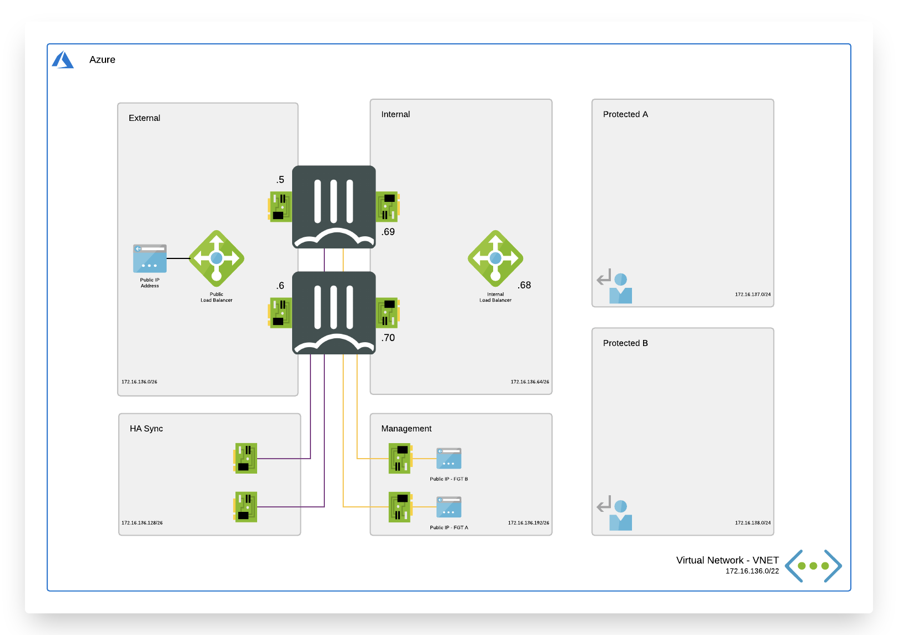
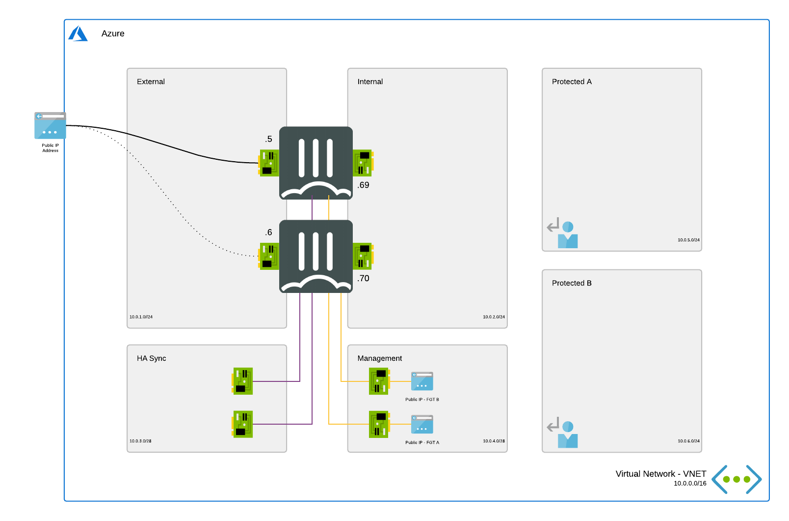

# Deployment templates for FortiGate Next-Generation Firewall in Microsoft Azure

## Use cases

The FortiGate can be used in different scenario's to protect assets deployed in Microsoft Azure Virtual Networks.

- Secure hybrid cloud
- Cloud security services hub
- Logical (intent-based) segmentation
- Secure remote access

Click [here](https://www.fortinet.com/products/public-cloud-security/azure#usecases) for a general overview of the different public cloud use cases.

## Resiliency and High Availability

When designing a reliable architecture in Microsoft Azure it is important to take resiliency and High Availability into account. Microsoft has the [Microsoft Azure Well-Architected Framework](https://docs.microsoft.com/en-us/azure/architecture/framework/resiliency/overview) available.

Running the FortiGate Next-Generation Firewall inside of Microsoft Azure can offer different levels of reliability based on these building blocks

### SLA

Microsoft offers different [SLAs](https://azure.microsoft.com/en-au/support/legal/sla/virtual-machines/) on Microsoft Azure based on the deployment used.
- [Availability Zone](AvailabilityZones/) (different datacenter in the same region): 99,99%
- Availability Set (different rack and power): 99,95%
- Single VM with Premium SSD: 99.9%

A cluster of FortiGate VMs will have a cross region/parallel SLA of 99,999975% when using Availability Sets. A cluster of FortiGate VMs will have a cross region/parallel SLA of 99,999999% when using Availability Zones. More information about the uptime of the Azure datacenter can be found on [this blog post](https://kvaes.wordpress.com/2020/02/16/is-azure-a-tier-3-datacenter-and-what-about-service-levels-in-a-broader-sense/).

### Building blocks

- [__**A Single VM**__](A-Single-VM/): This single FortiGate VM will process all the traffic and as such become a single point of failure during operations as well as upgrades. This block can also be used in an architecture with multiple regions where a FortiGate is deployed in each region. This setup provides an SLA of 99.9% when using a Premium SSD disk.

More information can be found [here](A-Single-VM/)

  

  

  

  
</p

*By default these building blocks are using Availability Sets. The Availability Zone templates are also available [here](AvailabilityZones/) for a higher SLA.*

## Selecting your architecture in Microsoft Azure

The FortiGate Next-Generation Firewall can be deployed in Microsoft Azure in different architectures each with their specific properties that can be an advantage or disadvantage in your environment.

- __**Single VNET**__: All the building block above are ready to deploy in a new or existing VNET. Select your block above to get started.
- [__**Cloud Security Services Hub (VNET peering)**__](VNET-peering/): With VNET peering it is possible to have different islands deploying different services managed by diferent internal and/or external teams but to maintain a single point of control going to on-premise, other clouds or public internet. By connecting the different VNETs in a Hub-Spoke setup the Hub can control all traffic. Get started [here](VNET-Peering/)
- [__**Autoscaling**__](Autoscale/): For application that are fluid in the amount of resources the FortiGate can also be deployed with a autoscaling architecture. This architecture is documented [here](https://docs.fortinet.com/vm/azure/fortigate/6.4/azure-cookbook/6.4.0/161167/deploying-auto-scaling-on-azure) or a quickstart script is available [here](Autoscale/)

## Support
Fortinet-provided scripts in this and other GitHub projects do not fall under the regular Fortinet technical support scope and are not supported by FortiCare Support Services.
For direct issues, please refer to the [Issues](https://github.com/fortinet/azure-templates/issues) tab of this GitHub project.
For other questions related to this project, contact [github@fortinet.com](mailto:github@fortinet.com).

## License
[License](LICENSE) © Fortinet Technologies. All rights reserved.
