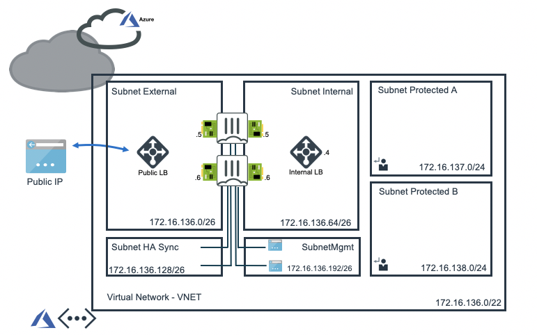

# FortiGate Active/Passive High Availability with Azure Standard Load Balancer - External and Internal
*Terraform deployment template for Microsoft Azure*

## Introduction

More and more enterprises are turning to Microsoft Azure to extend or replace internal data centers and take advantage of the elasticity of the public cloud. While Azure secures the infrastructure, you are responsible for protecting the resources you put in it. As workloads are being moved from local data centers connectivity and security are key elements to take into account. FortiGate-VM offers a consistent security posture and protects connectivity across public and private clouds, while high-speed VPN connections protect data.

This Terraform template deploys an Active Passive High Availability pair combined with the Microsoft Azure Standard Load Balancer both on the external and the internal side. Additionally, Fortinet Fabric Connectors deliver the ability to create dynamic security policies.

## Design

In Microsoft Azure, this central security service hub is commonly implemented using local VNET peering. The central security services hub component will receive, using user-defined routing (UDR), all or specific traffic that needs inspection going to/coming from on-prem networks or the public internet.

This Terraform template will automatically deploy a full working environment containing the the following components.

  - 2 FortiGate firewalls in an active/passive deployment
  - 1 external Azure Standard Load Balancer for communication with internet
  - 1 internal Azure Standard Load Balancer to receive all internal traffic and forwarding towards Azure Gateways connecting ExpressRoute or Azure VPNs.
  - 1 VNET with 2 protected subnets
  - User Defined Routes (UDR) for the protected subnets

This Terraform template can also be used to extend or customize based on your requirements. Additional subnets besides the ones mentioned above are not automatically generated. By adapting the Terraform templates additional subnets can be added. Additional subnets will require their own routing tables.

## Deployment

For the deployment Terraform is required. This multi-cloud deployment tool can be downloaded from the website of [Hashicorp](https://www.terraform.io/) who created and maintains it. You can either run the different stage manually (terraform init, plan, apply). Additionally, a `deploy.sh` script is provided to facilitate the deployment. You'll be prompted to provide the 4 required variables:

- PREFIX : This prefix will be added to each of the resources created by the template for ease of use and visibility.
- LOCATION : This is the Azure region where the deployment will be deployed.
- USERNAME : The username used to login to the FortiGate GUI and SSH management UI.
- PASSWORD : The password used for the FortiGate GUI and SSH management UI.

For Microsoft Azure there is a fast track option by using the Azure Cloud Shell. The Azure Cloud Shell is an in-browser CLI that contains Terraform and other tools for deployment into Microsoft Azure. Azure Cloud Shell is accessible via the Azure Portal or directly via [https://shell.azure.com/](https://shell.azure.com). You can copy and past the below one-liner to get start with your deployment.

`cd ~/clouddrive/ && wget -qO- https://github.com/fortinet/azure-templates/archive/main.tar.gz | tar zxf - && cd ~/clouddrive/azure-templates-master/FortiGate/Terraform/Active-Passive-ELB-ILB/ && ./deploy.sh`

After deployment you will be shown the IP address of all deployed components, this information is also stored in the output directory in the `summary.out` file. # The FortiGate VMs are reachable via the public IP address of the load balancer. Management GUI HTTPS on port 40030, 40031 and for SSH on port 50030 and 50031.

!!! Beware that the output directory, Terraform Plan file and Terraform State files contain deployment information such as password, usernames, IP addresses and others.

## Requirements and limitations

The Terraform template deployment deploys different resources and is required to have the access rights and quota in your Microsoft Azure subscription to deploy the resources.

### Licenses

- The template will deploy Standard F4s VMs for this architecture. Other VM instances are supported as well with a minimum of 2 NICs. A list can be found [here](https://docs.fortinet.com/document/fortigate/6.2.0/azure-cookbook/562841/instance-type-support)
- Licenses for Fortigate
  - BYOL: A demo license can be made available via your Fortinet partner or on our website. These can be injected during deployment or added after deployment.
  - PAYG or OnDemand: These licenses are automatically generated during the deployment of the FortiGate systems.

### Fabric Connector
The FortiGate-VM uses [Managed Identities](https://docs.microsoft.com/en-us/azure/active-directory/managed-identities-azure-resources/) for the SDN Fabric Connector. A SDN Fabric Connector is created automatically during deployment. After deployment, it is required apply the 'Reader' role to Azure Subscription you want the FortiGate-VM(s) to resolve Azure Resources from. More information can be found on the [Fortinet Documentation Libary](https://docs.fortinet.com/vm/azure/fortigate/6.2/azure-cookbook/6.2.0/236610/creating-a-fabric-connector-using-a-managed-identity).

## Support
Fortinet-provided scripts in this and other GitHub projects do not fall under the regular Fortinet technical support scope and are not supported by FortiCare Support Services.
For direct issues, please refer to the [Issues](https://github.com/fortinet/azure-templates/issues) tab of this GitHub project.
For other questions related to this project, contact [github@fortinet.com](mailto:github@fortinet.com).

## License
[License](LICENSE) © Fortinet Technologies. All rights reserved.
