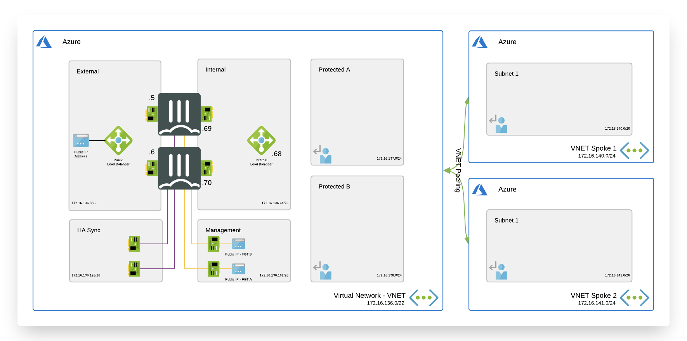

# Cloud security services hub deployment - VNET peering

## Introduction

As organizations grow, and their consumption of the cloud increases and expands, the need to separate security management from application development increases. Different organizational units tend to build applications in different virtual networks and even different clouds and data centers. With each new deployment the complexity of keeping these secure increases.

By moving security functionality to a central hub (transit network) that securely interconnects disperse networks, locations, clouds, and data centers, one can effectively enforce security policies between the different virtual networks and locations as well as offer central security filtering for traffic between these networks and the internet. Thus, organizations can effectively split the role of security management from application development.

## Design

In Microsoft Azure, this central security service hub is commonly implemented using local VNET peering. The central security services hub component will receive, using user-defined routing (UDR), all or specific traffic that needs inspection going to/coming from on-prem networks or the public internet.

This Azure ARM template will automatically deploy a full working environment containing the following components.

- 2 FortiGate firewalls in an active/passive deployment
- 1 external Azure Standard Load Balancer for communication with the internet
- 1 internal Azure Standard Load Balancer to receive all internal traffic and forward it to Azure Gateways, connecting ExpressRoute, or Azure VPNs
- 3 VNETs (1 hub and 2 spoke networks) with each spoke network containing 1 subnet and the hub containing 2 extra protected subnets
- VNET peering between HUB and spoke networks
- User Defined Routes (UDR) for the different protected subnets

This Azure ARM template can also be extended or customized based on your requirements. Additional subnets besides the ones mentioned above are not automatically generated. By extending the Azure ARM templates additional subnets can be added. Additional subnets will require their own routing tables and VNET peering configuration.

## Deployment

For the deployment, you can use the Azure Portal, Azure CLI, Powershell or Azure Cloud Shell. The Azure ARM templates are exclusive to Microsoft Azure and can't be used in other cloud environments. The main template is the `azuredeploy.json` which you can use in the Azure Portal. A `deploy.sh` script is provided to facilitate the deployment. You'll be prompted to provide the 4 required variables:

- PREFIX : This prefix will be added to each of the resources created by the template for ease of use and visibility.
- LOCATION : This is the Azure region where the deployment will be deployed.
- USERNAME : The username used to login to the FortiGate GUI and SSH management UI.
- PASSWORD : The password used for the FortiGate GUI and SSH management UI.

### Azure Portal

### Azure CLI
To fast track the deployment, use the Azure Cloud Shell. The Azure Cloud Shell is an in-browser CLI that contains Terraform and other tools for deployment into Microsoft Azure. It is accessible via the Azure Portal or directly at [https://shell.azure.com/](https://shell.azure.com). You can copy and paste the below one-liner to get started with your deployment.

`cd ~/clouddrive/ && wget -qO- https://github.com/fortinet/azure-templates/archive/main.zip | jar x && cd ~/clouddrive/azure-templates-main/FortiGate/VNET-Peering/ && ./deploy.sh`

After deployment, you will be shown the IP addresses of all deployed components. This information is also stored in the output directory in the 'summary.out' file. You can access both management GUI's using the public management IP addresses using HTTPS on port 443.

## Requirements and limitations

The ARM template deploys different resources and it is required to have the access rights and quota in your Microsoft Azure subscription to deploy the resources.

- The template will deploy Standard F4s VMs for this architecture. Other VM instances are supported as well with a minimum of 2 NICs. A list can be found [here](https://docs.fortinet.com/document/fortigate/6.2.0/azure-cookbook/562841/instance-type-support)
- Licenses for Fortigate
  - BYOL: A demo license can be made available via your Fortinet partner or on our website. These can be injected during deployment or added after deployment.
  - PAYG or OnDemand: These licenses are automatically generated during the deployment of the FortiGate systems.

This architecture uses the Active/Passive building block. More information about configuration can be found [here](../Active-Passive-ELB-ILB/README.md).

## Support
Fortinet-provided scripts in this and other GitHub projects do not fall under the regular Fortinet technical support scope and are not supported by FortiCare Support Services.
For direct issues, please refer to the [Issues](https://github.com/fortinet/azure-templates/issues) tab of this GitHub project.
For other questions related to this project, contact [github@fortinet.com](mailto:github@fortinet.com).

## License
[License](LICENSE) © Fortinet Technologies. All rights reserved.
