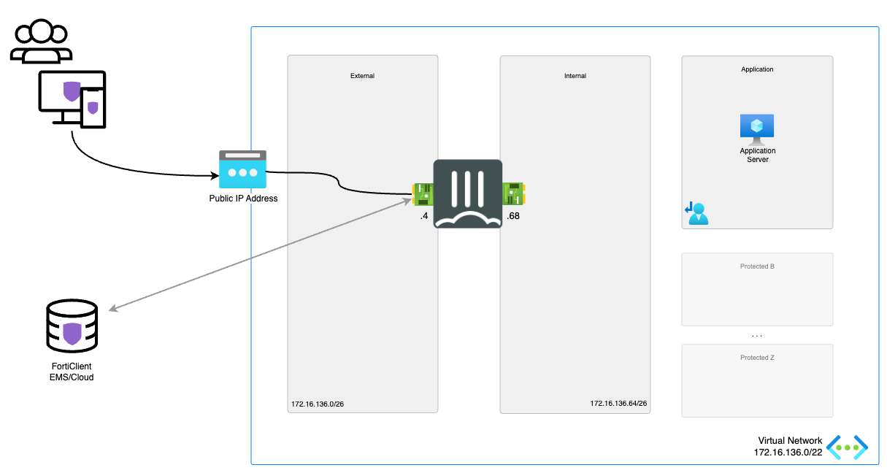

# ZTNA Application Gateway using FortiGate-VM

## Introduction

The Zero-trust network access (ZTNA) solution builds on top of FortiGate and FortiClient technologies to grant access on a per-session basis to individual applications only after devices and users are verified. This ZTNA policy is also applied when users are on the network, which provides the same zero-trust model no matter the user's location. 

This setup provides a easy to deploy, pre-configured FortiGate-VM setup for users to connect to. The solutions connects with FortiClient Cloud or FortiClient EMS server for the endpoint protection policies.

## Design

In Microsoft Azure, this single ZTNA Application Gateway setup provides a basic setup to start exploring the capabilities of Fortinet ZTNA solution.

This Azure ARM template will automatically deploy a full working environment containing the following components.

- 1 standalone FortiGate firewall
- 1 VNETs containing a protected subnet
- User Defined Routes (UDR) for the protected subnets

This Azure ARM template can also be extended or customized based on your requirements. Additional subnets besides the ones mentioned above are not automatically generated. By extending the Azure ARM templates additional subnets can be added. Additional subnets will require their own routing tables.

## Deployment

For the deployment, you can use the Azure Portal, Azure CLI, Powershell or Azure Cloud Shell. The Azure ARM templates are exclusive to Microsoft Azure and can't be used in other cloud environments. The main template is the `azuredeploy.json` which you can use in the Azure Portal. 

Using the 'Deploy to Azure' button you connect into the Azure Portal and in a few steps you can configure solutions in an existing or new VNET.

More information about the Fortinet ZTNA solutions can be found [here](https://docs.fortinet.com/ztna).

### Azure Portal

Azure Portal Wizard:

Custom Deployment:

## Requirements and limitations

More information can be found [here](/FortiGate/A-Single-VM/README.md).

## FortiGate configuration

The FortiGate VMs need a specific configuration to match the deployed environment. This configuration can be injected during provisioning or afterwards via the different options including GUI, CLI, FortiManager or REST API.

This template used the default A Single VM ARM template. This tempalte already configures different aspects of the FortiGate during deployment. This configuration can be found [here](/FortiGate/A-Single-VM/doc/config-provisioning.md). Aditionaly, the below config is injected during provisioning with the correct values in bold replaced for your environment.

<pre><code>
config firewall address
  edit webserver1
    set subnet <b>w.x.y.z</b> 255.255.255.255
  next
end
config firewall addrgrp
  edit "Webserver"
    set member "webserver1"
  next
end
config user local
  edit <b>username</b>
    set type password
    set passwd <b>password</b>
  next
end
config user group
  edit sslvpn_group
    set member <b>username</b>
  next
end
config firewall vip
  edit "ZTNAServer"
    set type access-proxy
    set extip <b>172.16.136.5</b>
    set extintf "port1"
    set server-type https
    set extport 9443
    set ssl-certificate "Fortinet_Factory"
  next
end
config firewall access-proxy
  edit "ZTNAServer"
    set client-cert disable
    set vip "ZTNAServer"
    config api-gateway
      edit 1
        config realservers
          edit 1
            set ip <b>w.x.y.z</b>
          next
        end
      next
    end
  next
end
config firewall proxy-policy
  edit 1
    set name "ZTNA Web Server"
    set proxy access-proxy
    set access-proxy "ZTNAServer"
    set srcintf "port1"
    set srcaddr "all"
    set dstaddr "Webserver"
    set action accept
    set schedule "always"
    set logtraffic all
    set groups "sslvpn_group"
  next
end
config authentication scheme
  edit "ZTNA"
    set method basic
    set user-database "local-user-db"
  next
end
config authentication rule
  edit "ZTNA"
    set srcintf "port1"
    set srcaddr "all"
    set ip-based disable
    set active-auth-method "ZTNA"
  next
end
</code></pre>

If you are select to use FortiClient Cloud. This additional configuration will be passed:

<pre><code>
config endpoint-control fctems
  edit 1
    set name ems-cloud
    set status enable
    set fortinetone-cloud-authentication enable
  next
end
</code></pre>

If you are select to use FortiClient EMS. This additional configuration will be passed:

<pre><code>
config endpoint-control fctems
  edit 1
    set name ems-local
    set status enable
    set server <b>w.x.y.z</b>
    set https-port <b>443</b>
  next
end
</code></pre>

## Support

Fortinet-provided scripts in this and other GitHub projects do not fall under the regular Fortinet technical support scope and are not supported by FortiCare Support Services.
For direct issues, please refer to the [Issues](https://github.com/fortinet/azure-templates/issues) tab of this GitHub project.

## License

[License](LICENSE) © Fortinet Technologies. All rights reserved.
