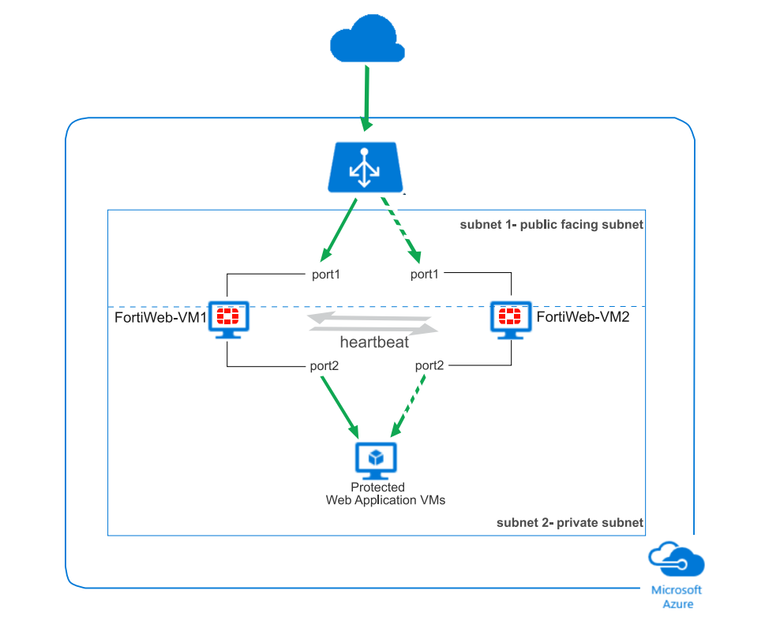

## FortiWeb's High Availability (HA) solution on Azure uses Azure load balancer to achieve Active-Active HA and ActivePassive HA.

## The following resources will be created in the deployment process:
	- A load balancer with public IP address.
	- Two FortiWeb-VM instances. By default, these two VMs are added in the load balancer's backend pool.
	- A public facing subnet connecting the FortiWeb outgoing interface (port1) to the load balancer.
	- A private subnet where one or more web application VMs that FortiWeb protects are located.

	All the web traffic passes through the load balancer first, then it is directed to a collection of VMs called a backend pool.
	In this case, the pool consists of FortiWeb-VM1 and FortiWeb-VM2.
	In the Active-Active HA scenario, the web traffic is distributed between ForiWeb-VM1 and FortiWeb-VM2.
	In the Active-Passive HA scenario, the web traffic is directed only to the master node (the above graph assumes FortiWeb-VM1 is the master node). When FortiWeb-VM1 fails to operate, the load balancer will distribute the traffic to the new master node FortiWeb-VM2.

## For detail, please refer to the document: http://docs2.fortinet.com/vm/azure/fortiweb/6.0/use-case-high-availability-for-fortiweb-on-azure/6.0.2/82738/overview